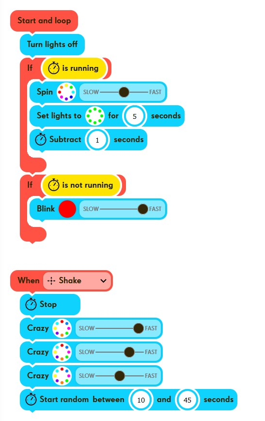

# Creative Coder

## Fitness app

Plank and press the button if flashing. Light will start flashing after some (random time again).
The inspiration comes from this product: <https://blazepod.eu/collections>

GUI



Code

``` sh
gesture activeGestures[3] = { SHAKE, POW, WHEEL };
mover.setActiveGestures(3, activeGestures);


while (mover.hasNotDetectedNewGesture()) {

    mover.turnLedsOff();
    
    if (mover.timerIsRunning() == true) {
    
        unsigned char lights884753[8][3] = {
            { 64, 0, 0 }, { 64, 32, 0 }, { 64, 64, 0 }, 
            { 0, 64, 0 }, { 0, 64, 64 }, { 0, 0, 64 }, 
            { 32, 0, 64 }, { 64, 0, 64 } 
        };
        mover.show(lights884753);
        mover.spin(67, 8, FORWARD);
        
        unsigned char lights973637[8][3] = {
            { 0, 64, 0 }, { 0, 64, 0 }, { 0, 64, 0 }, 
            { 0, 64, 0 }, { 0, 64, 0 }, { 0, 64, 0 }, 
            { 0, 64, 0 }, { 0, 64, 0 } 
        };
        mover.show(lights973637);
        mover.wait(5000);
        mover.turnLedsOff();
        
        mover.decreaseTimer(1000);
    
    }
    
    if (mover.timerIsNotRunning() == true) {
    
        unsigned char blinkColor711496[3] = { 64, 0, 0 };
        mover.blink(blinkColor711496, 200);
    
    }

}

if (mover.hasDetectedGesture(SHAKE)) {

    mover.stopTimer();
    
    unsigned char lights951429[8][3] = {
        { 64, 64, 0 }, { 0, 64, 64 }, { 64, 0, 0 }, 
        { 0, 32, 64 }, { 64, 0, 64 }, { 0, 64, 0 }, 
        { 64, 32, 0 }, { 32, 0, 64 } 
    };
    mover.show(lights951429);
    mover.randomise(40);
    
    unsigned char lights281839[8][3] = {
        { 64, 64, 0 }, { 0, 64, 64 }, { 64, 0, 0 }, 
        { 0, 32, 64 }, { 64, 0, 64 }, { 0, 64, 0 }, 
        { 64, 32, 0 }, { 32, 0, 64 } 
    };
    mover.show(lights281839);
    mover.randomise(50);
    
    unsigned char lights189253[8][3] = {
        { 64, 64, 0 }, { 0, 64, 64 }, { 64, 0, 0 }, 
        { 0, 32, 64 }, { 64, 0, 64 }, { 0, 64, 0 }, 
        { 64, 32, 0 }, { 32, 0, 64 } 
    };
    mover.show(lights189253);
    mover.randomise(66.66666666666667);
    
    mover.startRandomTimer(10000, 45000);

}

if (mover.hasDetectedGesture(POW)) {

    mover.stopTimer();
    
    unsigned char lights299513[8][3] = {
        { 64, 64, 0 }, { 0, 64, 64 }, { 64, 0, 0 }, 
        { 0, 32, 64 }, { 64, 0, 64 }, { 0, 64, 0 }, 
        { 64, 32, 0 }, { 32, 0, 64 } 
    };
    mover.show(lights299513);
    mover.randomise(40);
    
    unsigned char lights212562[8][3] = {
        { 64, 64, 0 }, { 0, 64, 64 }, { 64, 0, 0 }, 
        { 0, 32, 64 }, { 64, 0, 64 }, { 0, 64, 0 }, 
        { 64, 32, 0 }, { 32, 0, 64 } 
    };
    mover.show(lights212562);
    mover.randomise(50);
    
    unsigned char lights607559[8][3] = {
        { 64, 64, 0 }, { 0, 64, 64 }, { 64, 0, 0 }, 
        { 0, 32, 64 }, { 64, 0, 64 }, { 0, 64, 0 }, 
        { 64, 32, 0 }, { 32, 0, 64 } 
    };
    mover.show(lights607559);
    mover.randomise(66.66666666666667);
    
    mover.startRandomTimer(10000, 45000);

}

if (mover.hasDetectedGesture(WHEEL)) {

    unsigned char lights298261[8][3] = {
        { 64, 64, 0 }, { 0, 64, 64 }, { 64, 0, 0 }, 
        { 0, 32, 64 }, { 64, 0, 64 }, { 0, 64, 0 }, 
        { 64, 32, 0 }, { 32, 0, 64 } 
    };
    mover.show(lights298261);
    mover.randomise(40);
    
    unsigned char lights890006[8][3] = {
        { 64, 64, 0 }, { 0, 64, 64 }, { 64, 0, 0 }, 
        { 0, 32, 64 }, { 64, 0, 64 }, { 0, 64, 0 }, 
        { 64, 32, 0 }, { 32, 0, 64 } 
    };
    mover.show(lights890006);
    mover.randomise(50);
    
    unsigned char lights388256[8][3] = {
        { 64, 64, 0 }, { 0, 64, 64 }, { 64, 0, 0 }, 
        { 0, 32, 64 }, { 64, 0, 64 }, { 0, 64, 0 }, 
        { 64, 32, 0 }, { 32, 0, 64 } 
    };
    mover.show(lights388256);
    mover.randomise(66.66666666666667);
    
    mover.stopTimer();
    
    mover.startRandomTimer(10000, 45000);
}
```
