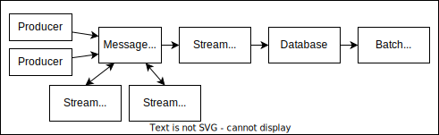

# MQTT broker

In an event-driven architecture, information is exchanged using a central message broker. This adds complexity at the beginning of the project, but allows easier adding of new microservices. The Unified Namespace represents a robust event-driven architecture that facilitates seamless communication among network nodes. It operates on the fundamental principle that all data, irrespective of immediate consumer demand, should be published and readily accessible for consumption. As a result, any node within the network can function as either a producer or a consumer, adapting to the system's requirements at any given moment. Unified Namespace typically harnesses MQTT or Apache Kafka as a central message broker, designed with a focus on high scalability and effortless node integration within the network. This stands in sharp contrast to Industry 3.0 architectures, which often exhibit a more linear data flow and limited connectivity flexibility.

There are three key imperatives for an IT/OT architecture, underscoring the imperative of amalgamating best practices from both domains:

- **Reliability** centers on ensuring faultless system functionality, even in the face of disruptions. It encompasses addressing hardware glitches, such as equipment failures, software issues like bugs or resource constraints, and human errors resulting from improper system usage. Strategies for mitigation encompass employing dependable hardware, introducing redundancy, continuous software monitoring, and implementing self-healing mechanisms.

- **Scalability** spotlights the system's capacity to accommodate heightened workloads, including the incorporation of additional data sources for machine learning models. It underscores the significance of consistently analyzing data in real-time while adapting to varying data characteristics, including message size and frequency.

- **Maintainability** encompasses three sub-objectives: operability (ensuring seamless system operation), simplicity (facilitating comprehension and ease of learning), and evolvability (enabling smooth system modifications, such as the addition of new sensors or data sources). Attaining these sub-goals guarantees effective system management and adaptability over time.

## MQTT Broker

Some MQTT brokers

- [Apache Kafka](https://kafka.apache.org/)
- [EMQx](https://github.com/emqx/emqx)
- [HiveMQ](https://www.hivemq.com/)
- [Mosquitto](https://mosquitto.org/)
- [RabbitMQ](https://www.rabbitmq.com/)
- [VerneMQ](https://vernemq.com/)
- ActiveMQ
- Apollo
- AWS IoT Core
- Google Cloud IoT Core
- IBM Watson IoT Platform
- Microsoft Azure IoT Hub
- Moquette
- VerneMQ
