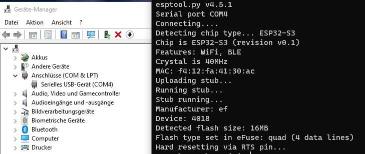

# ESP32

Esptool.py is a Python-based, open source, platform independent utility to communicate with the ROM bootloader in [Espressif SoCs](https://www.espressif.com/en/products/socs).

Get Esptool.py by running this command:

```sh
pip install esptool
```

Run the follwing command to connect with the ESP32 device and get some details on the tpye of hardware:

```sh
esptool.py -p COM4 flash_id
```

Example output:



More information [here](https://docs.espressif.com/projects/esp-idf/en/latest/esp32/get-started/establish-serial-connection.html) and [here](https://docs.espressif.com/projects/esptool/en/latest/esp32/)
