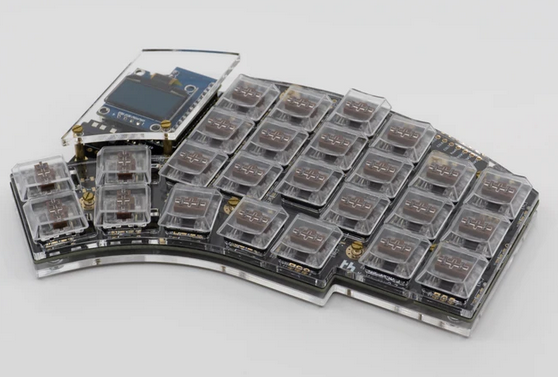
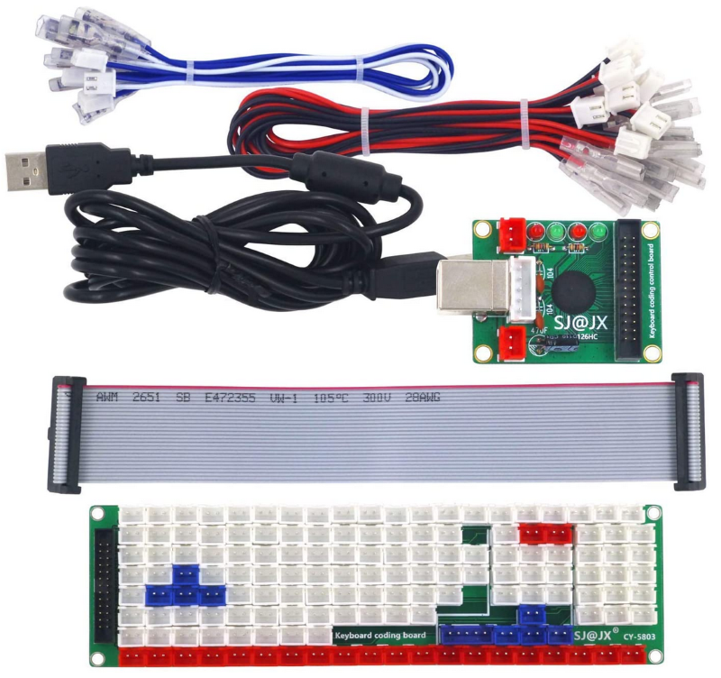

# Keyboards Built

## Pimp old Lenovo Keyboard

TODO

## Kyria Split Keyboard

Kyria by [splitkb.com](https://splitkb.com/)

Components

- 1x Kyria PCB Kit Black Kyria Kit
- 1x Kyria Acrylic Plate Case (Clear / MX and Choc / 6 columns / Full Plate)
- 2x Elite-C Low Profile (rev4) Microcontroller
- 2x SSD1306 OLED Display 128x64
- 50x Kailh Low Profile Choc Switches (Silver, linear)
- 50x Kailh Choc Transparent Keycaps

## Custom Keyboard with SJ@JX CY-1124HC

SJ@JX Development keyboard encoder board

## SJ@JX 126 HC

104 keys development keyboard encoder board by SJ@JX

