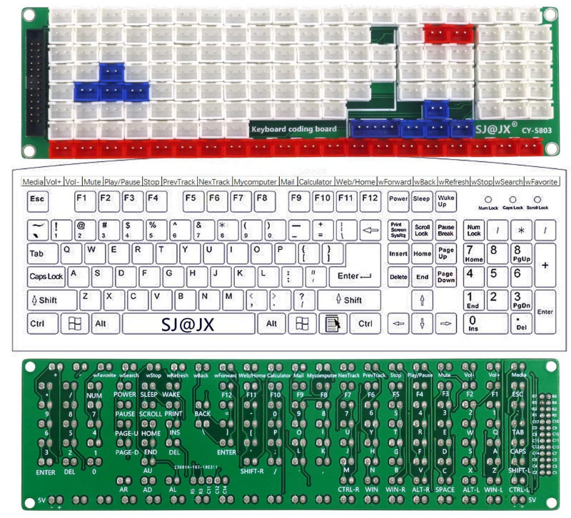
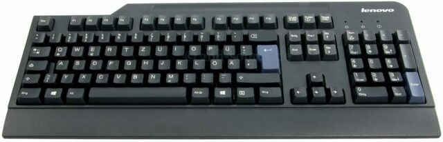

# My Builds

## Kyria Split Keyboard

Kyria by [splitkb.com](https://splitkb.com/)

Components

- 1x Kyria PCB Kit Black Kyria Kit
- 1x Kyria Acrylic Plate Case (Clear / MX and Choc / 6 columns / Full Plate)
- 2x Elite-C Low Profile (rev4) Microcontroller
- 2x SSD1306 OLED Display 128x64
- 50x Kailh Low Profile Choc Switches (Silver, linear)
- 50x Kailh Choc Transparent Keycaps

## Custom Keyboard with SJ@JX CY-1124HC

SJ@JX Development keyboard encoder board

## Custom Keyboard with SJ@JX 126 HC

104 keys development keyboard encoder board by SJ@JX

## Lego Keyboard

Base keyboard is an [EPOMAKER](https://epomaker.com/) [SKYLOONG SK64](https://epomaker.com/products/sk64abs)

I purchased lego key caps from [shapeways](https://www.shapeways.com/):

- [2x2 Cherry MX Key Caps](https://www.shapeways.com/product/PQBFDE5ZA/2x2-set-of-20-building-block-cherry-mx-key-caps?optionId=64245335)
- [Large Building Block Cherry MX Key C](https://www.shapeways.com/product/EAAWYPRN5/0003-set-of-large-building-block-cherry-mx-key-c?optionId=64588160)

I found a small [lego alphabet](https://rebrickable.com/mocs/MOC-48980/nathansonic/smallest-lego-alphabet) template on rebrickable and [tested it for the QWERTZ layout](_lego-dots-alphabet.io). Unfortunantly "W" and "M" are 2x3 spaces and the key caps are only 2x2.

## DZ60 Bambus/Wood Keyboard

Components

- OMO Universal 60% Custom Brass Plate 2U Left Shift
- DZ60/DZ60RGB USB Type-C 60% PCB - DZ60RGB ANSI (Hotswap)
- Everglide V2 Screw-In Stabilizer Set - Black
- Bamboo Wood Case 60%
- TODO: Switches
- TODO: Key caps

## Pimp old Lenovo Keyboard

Original

Pimped

TODO
