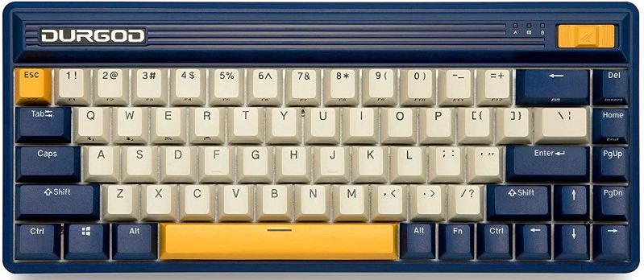
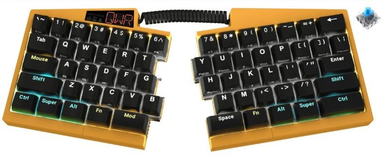
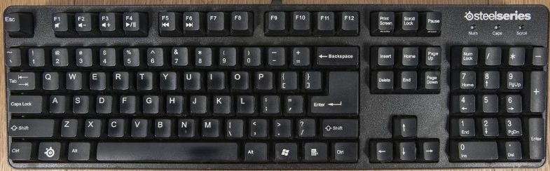

# Keyboards Purchased

## Durgod Fusion Navigator

The [Durgod](https://www.durgodkeyboard.com/) [Fusion Navigator](https://www.youtube.com/watch?v=i-ufQMgYPVI) is a wireless 65% keyboard. I use MX Brown switches in this one.

## Ultimate Hacking Keyboard v2

[Ultimate Hacking Keyboard](https://ultimatehackingkeyboard.com/) v2 Regular with regular blue switches in yellow and with a wooden palm rest.

I am considering adding a track-point module to the right and a key cluster module to the left...

## Ducky One 2 Mini

[Ducky](https://www.duckychannel.com.tw) One 2 Mini with cherry MX mechanical switches

- Dimensions: 302 x 108 x 40 mm
- Weight: 590g

## Logitech G910

[Logitech](https://www.logitech.com/) G910

## Steelseries 6G V2

Steelseries 6G V2

