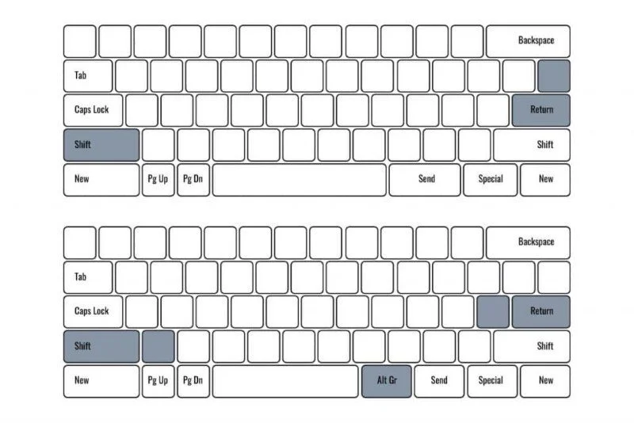
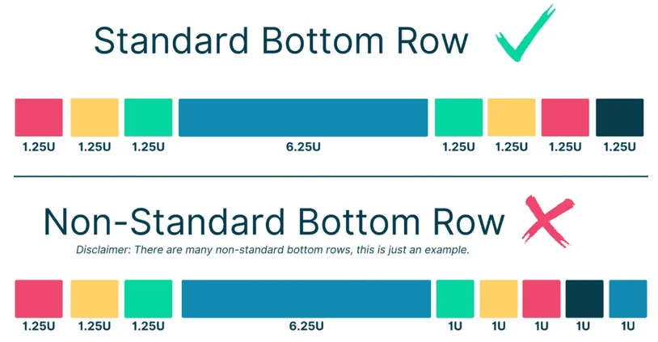
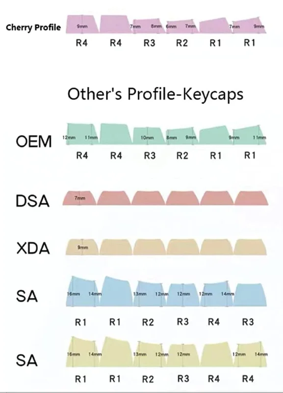
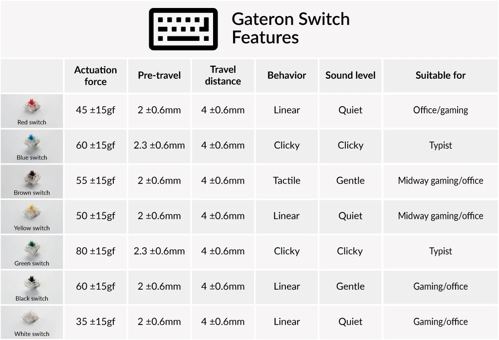
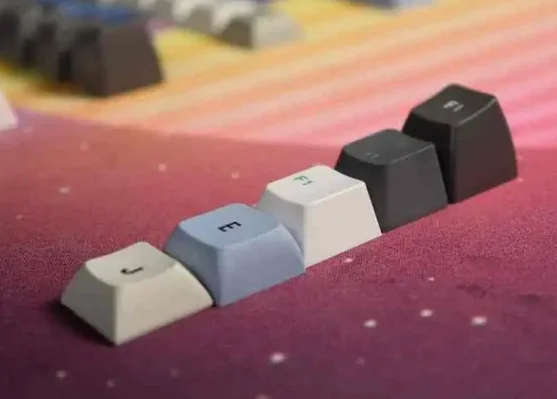
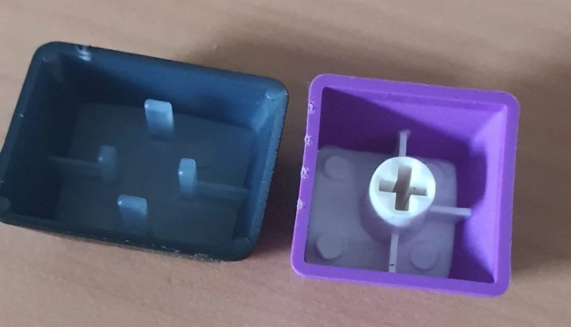

# Keyboard

``` txt
 _    _  _  _  _    _  _  _  _    _  _  _  _   _  _  _
|_|  |_||_||_||_|  |_||_||_||_|  |_||_||_||_| |_||_||_|   * * *
 _  _  _  _  _  _  _  _  _  _  _  _  _  ____   _  _  _   _  _  _  _
|_||_||_||_||_||_||_||_||_||_||_||_||_||____| |_||_||_| |_||_||_||_|
|___||_||_||_||_||_||_||_||_||_||_||_||_||  | |_||_||_| |_||_||_|| |
|____||_||_||_||_||_||_||_||_||_||_||_||____|     _     |_||_||_||_|
|___||_||_||_||_||_||_||_||_||_||_||_||_____|  _ |_| _  |_||_||_|| |
|__||__||__||_______________||__||__||__||__| |_||_||_| |____||_||_|
```

Generally there are few things to say:

- Standards are easier to get caps for

## Keyboard layouts

### Key layout

- [ARTSEY](https://artsey.io/) is a one-handed keyboard system using 8 keys in a 2x4 layout. The system is designed to be easy to learn, comfortable to use, and fast enough for practical use.

### "ISO vs ANSI"



### Bottom Row



### Profile



### 100-40% Keyboards

=== "100% Keyboards"

=== "80% Keyboards"

=== "75% Keyboards"

=== "65% Keyboards"

=== "60% Keyboards"

=== "40% Keyboards"

### Winkeyless (WKS)

A WKL keyboard, also known as a Winkeyless keyboard, is a keyboard that does not have the Windows (between left CTRL and left ALT) and the application (between right CTRL and right ALT) key.

In a standard WKL layout, the places of these keys are left empty with no other key to replace them.

### Tenkeyless (TKL)

While tenkeyless gets its name from 10 number keys on the Numpad, tenkeyless keyboards do not contain a Numpad at all, so they actually have 17 keys less than a full-sized 104-key keyboard.

## Features

### Wireless (WK)

Wireless Keyboard

Bluetooth vs ?

### Backlit keyboard

LED, RGB

On/off vs controlled LED per key

## Switches

### Gateron



## Key Caps

### Form

Rember that depending on the profile the key caps need to be formed differently, depending in which row they are.



Depending on the brand, the key caps may not be standard. In this example there is a logitech cap (left) next to a regular cap (right):



### Printing

Double-Shot vs Laser Engraved

### Material

ABS vs PBT Keycaps

| ABS Keycaps     | PBT Keycaps    |
|-----------------|----------------|
| Cheaper         | More Expensive |
| Shiny/Greasy    | Matte          |
| Smooth          | Textured       |
| Thinner         | Thicker        |
| Quieter         | Louder         |
| Flexible        | Brittle        |
| Wears Over Time | More Durable   |

### Keycap Profile

| Keycap Profile | Description                                                                                       |
|----------------|---------------------------------------------------------------------------------------------------|
| OEM            | The keycap profile you’ll find on most keyboards. Mass produced, considered standard. Angled top. |
| Cherry         | Very similar to OEM profile, but shorter.                                                         |
| DSA            | Slightly shorter profile with spherical top.                                                      |
| XDA            | Medium height profile with spherical top.                                                         |
| SA             | Tall height profile with slightly spherical and angled top.                                       |

**O-rings**

O-rings can be a good option if you want to dampen the noise and make your keyboard more quiet. O-rings can ruin the typing experience of your keyboard if you’re not careful.
