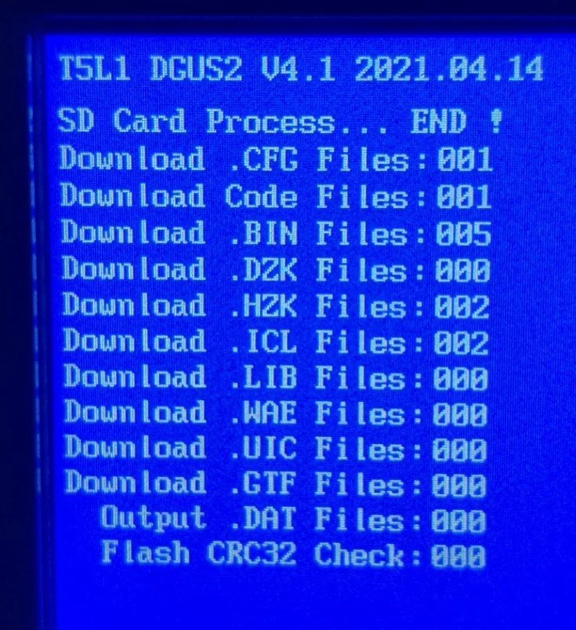
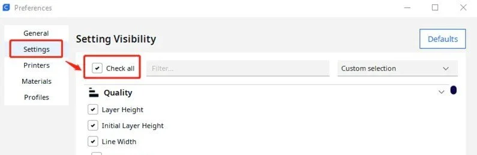
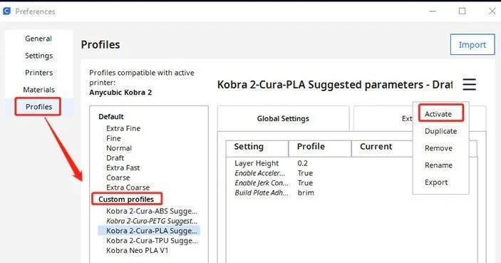
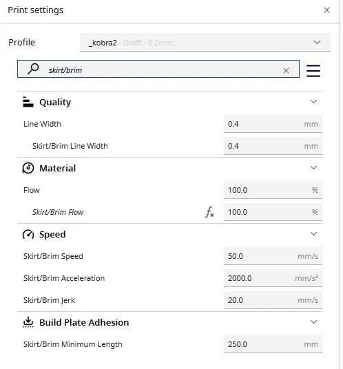
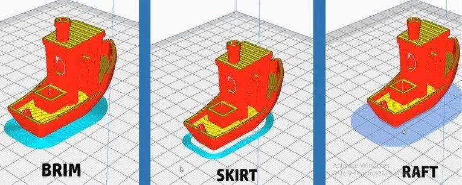

# 3D Printing

## 3d-printer firmware

- <https://github.com/Klipper3d/klipper>
- <https://www.klipper3d.org/>

## G-code generator for 3D printers

- <https://github.com/supermerill/SuperSlicer>

## Anycubic Vyper

[Cura profile](_vyper.curaprofile) for the Anycubic Vyper.

Firmware Upgrade: Don't forget the display :)

## Anycubic Kobra 2

[Cura profile](_kobra2.curaprofile) for the Anycubic Kobra 2.

Set up Anycubic Kobra 2 in Cura:

## Skirt Brim and Raft

When 3D printing, the process of printing some lines around the object before starting the actual print is known as a "skirt" or sometimes a "brim". The purpose of these lines is multifaceted:

- Priming the Nozzle: It helps in priming the nozzle, ensuring that the filament is flowing smoothly before the actual object begins to print. This is especially important if the printer has been idle for some time or if it's the first print of the day.
- Adhesion and Warping Prevention: For a 'brim', which is similar to a skirt but attaches to the edges of the print, it increases the surface area of the first layer, improving bed adhesion. This is particularly useful for materials prone to warping or for prints with small footprints on the build plate.
- Leveling and Calibration Check: These initial lines can also act as a last-minute check for bed leveling. If the skirt is not laying down properly, it's an indication that the bed might need to be re-leveled.
- Cleaning: It can also help in cleaning any residual or burnt filament from the nozzle, ensuring a cleaner start to the print.
- Temperature Stabilization: It allows the printer to stabilize its temperature, particularly for the print bed and the extruder, ensuring a consistent environment for the print.

Setting in Cura:

Different Setting options:

