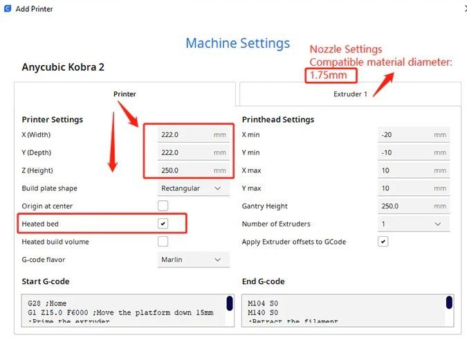
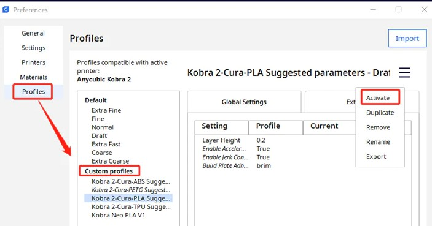

# 3D Printing

## 3d-printer firmware

- <https://github.com/Klipper3d/klipper>
- <https://www.klipper3d.org/>

## G-code generator for 3D printers

- <https://github.com/supermerill/SuperSlicer>

## Anycubic Vyper

[Cura profile](_vyper.curaprofile) for the Anycubic Vyper.

Firmware Upgrade: Don't forget the display :)

## Anycubic Kobra 2

[Cura profile](_kobra2.curaprofile) for the Anycubic Kobra 2.

Set up Anycubic Kobra 2 in Cura:

