# CNC

## Getting Started Hafven CNC

- [ ] **Alles anschalten** nach der Reihenfolge Beschriftung (Reminder: Karte besorgen [Schritt 5])

    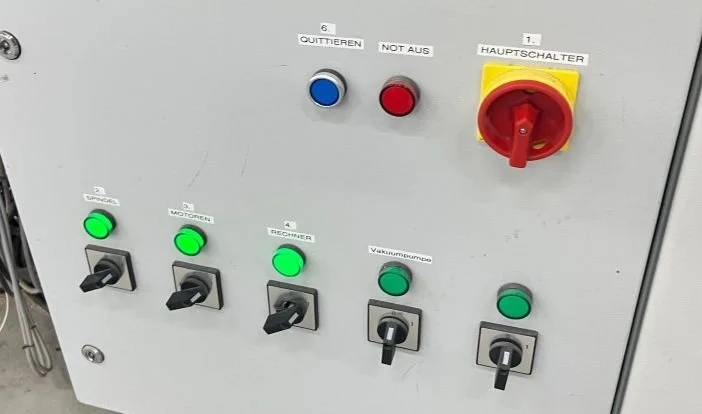

- [ ] **Rechner starten** und in LinuxCNC **Referenzfahrt** durchführen

    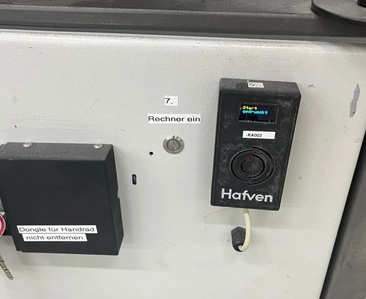

    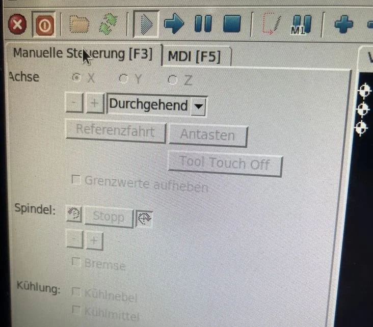

- [ ] **Opferplatte** auflegen und **Werkstück** einspannen

    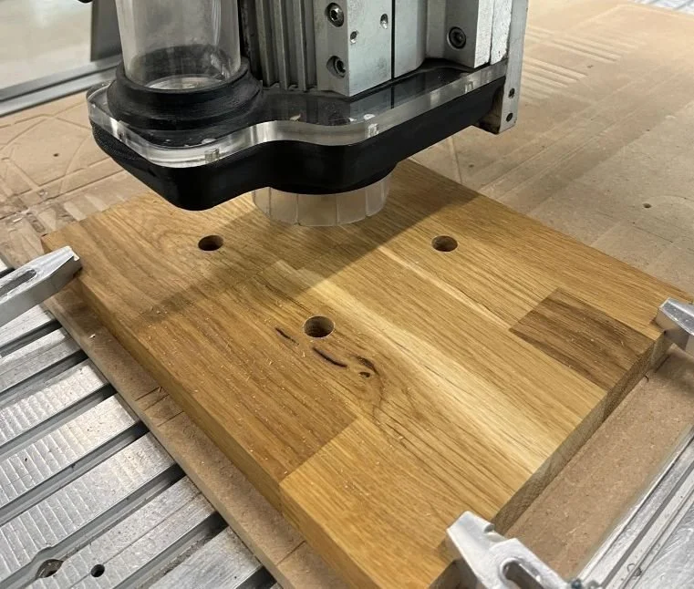

- [ ] **Tastplatte** auflegen und **Messwerkzeug** einspannen (Werkzeug 99)

    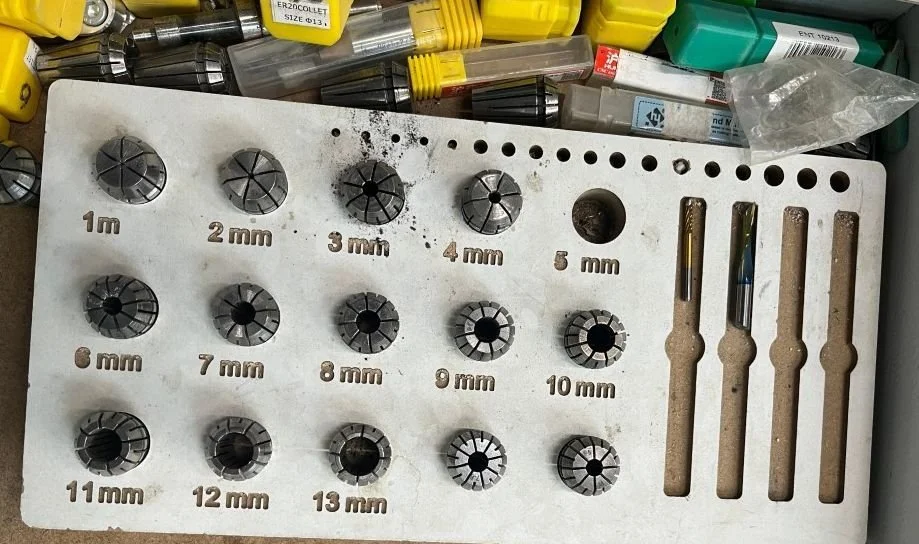

- [ ] Programm **XYZ Tastplatte** laufen lassen

    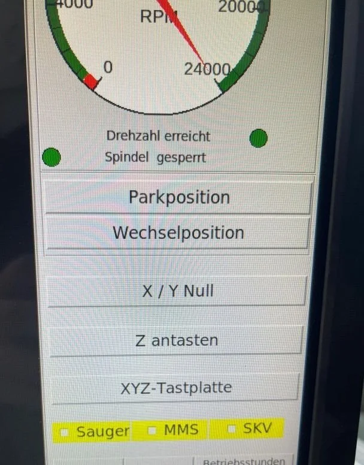

- [ ] NGC **Datei laden** (auf M6 T1 achten und Anleitung folgen)

- [ ] **Notaus** im Blick behalten :D

    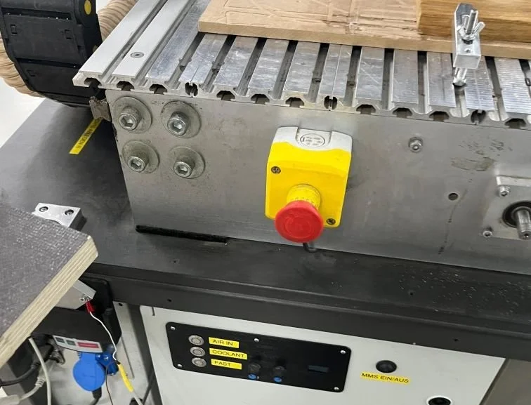

## EstlCAM

Link: <https://www.estlcam.de/>

Vorbereitung für Hafven:

- [ ] In Estlcam unter Einstellungen/Grundeinstellungen LinuxCNC als CNC-Programm auswählen.
- [ ] Unter Einstellungen/CNC Programme auf "Einstellungen öffnen" klicken.
- [ ] CNC-Programm Voreinstellungen bzw. Postprozessor [ohne Werkzeugwechsel](_estlcamV12_Hafven_ohneWerkzeugwechsel.pp) bzw. [mit Werkzeugwechsel](_estlcamV12_Hafven_Werkzeugwechsel.pp) für die CNC-Fräse im Hafven laden.
- [ ] Nun muss sichergestellt werden, dass der Postprozessor auch dauerhaft hinterlegt ist. Hierzu nun auf "Einstellungen speichern" klicken und die Datei unter dem dort vorgeschlagenen
Verzeichnis speichern.

Hinweise:

- Spindel (U/min) = 24.000
- Nullpunkt definieren (werkstück messen)
- Vorschub (mm/min) und Spindel (U/min) pro Werkzeug in der Tabelle festlegen; maximal 80 % des Herstellerwerts als Startwert.
- Tauchtiefe pro Durchgang konservativ wählen (0,5–1× Werkzeug-Ø) und bei harten Materialien reduzieren.
- Immer vor dem Export mit Vorschau und 3D-Darstellung prüfen – verdeckte Bereiche kontrollieren, Kollisionen erkennen.
- Zum Schluss "als CNC-Programm speichern"

Tastenkürzel:

| Taste/Schaltfläche | Funktion                                     |
|--------------------|----------------------------------------------|
| **F2**             | Konturpfad definieren (Innen/Außen)          |
| **F3**             | Taschen-(Pocket)-Pfad anlegen                |
| **F4**             | Bohrzyklen-Menü öffnen                       |
| **F5**             | 3D-Relief Pfad (Konturnachführung)           |
| **STRG + O**       | Projekt öffnen                               |
| **STRG + S**       | Projekt speichern                            |
| **F9**             | G-Code exportieren (Postprozessor-Dialog)    |
| **S**              | Simulation starten/pausieren                 |
| **+ / −**          | Zoom in der Vorschau                         |
| **Rechtsklick**    | Ursprung-/Nullpunkt setzen                   |
| **Hilfe-Button**   | Kontext-Hilfe für Parameter und Pfade öffnen |

## Fräser

Liste alle Fräser, die ich aktuell nutze.

### Schaftfräser

- **Anwendung**: Ideal für präzise Eckrund- bzw. Fasen-Profiles und zum sauberen Entfernen von Graten.
- **Bezichung**: Eckrundung Fräse Schaftfräser 3-12 mm Entgraten CNC Holz Metall Fräser Anfasfräser Ecke Rund über Bit

| Item           | Quantity | D(mm) | L(mm) | R  | Image                                       |
|----------------|----------|-------|-------|----|---------------------------------------------|
| ECP3F-D4.0-R60 | 2        | 4     | 50    | 60 | 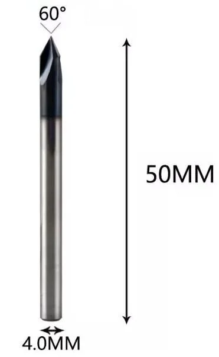  |
| ECP3F-D6.0-R60 | 2        | 6     | 50    | 60 | 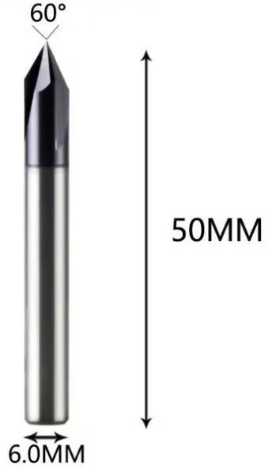 |

### Kugelkopffräser

- **Anwendung**: 3D-Kontur- und Flächen-Finishing mittlerer Detailstufe in Holz, Kunststoffen und NE-Metallen; sanftes Glätten von Konturen und Ecken.
- **Bezichung**: Wolfram-Vollhartmetall-beschichteter Kegel-Kugelkopf-Bit CNC-Fräser Fräser für Holz und Fräser für Metall-Schaftfräser

| Item         | Quantity | D(mm) | L(mm) | R   | L(mm) | Image                                  |
|--------------|----------|-------|-------|-----|-------|----------------------------------------|
| R0.25-15-D4  | 2        | 4     | 15    | N/A | 0,25  | 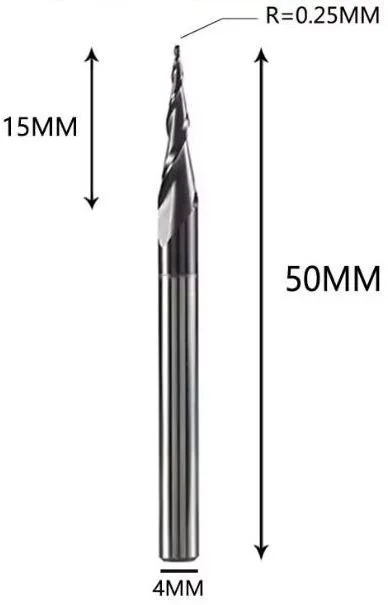   |
| R1.0-30.5-D6 | 2        | 6     | 30    | N/A | 1,00  | 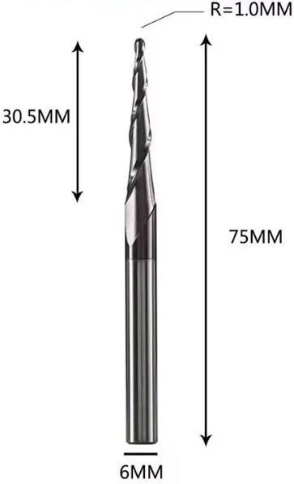 |

### 2-schneidiger Spiralfräser

- **Anwendung**: Universell für Nuten, Taschen und Kantenbearbeitung in Holz, MDF und beschichteten Platten; saubere Spanführung dank Down-Cut.
- **Bezichung**: DLC-Beschichtung Vollhartmetall-Fräser 3.1 4 6 8 6,35 mm 2-schneidiger Spiralfräser Schaftfräser Holz MDF Down Cut

| Item            | Quantity | D(mm) | L(mm) | Image                                        |
|-----------------|----------|-------|-------|----------------------------------------------|
| DWD2F-D4.0-L22  | 2        | 4     | 22    | 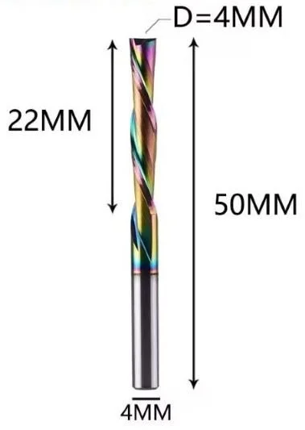   |
| DWD2F-D6.0-L24  | 2        | 6     | 24    | 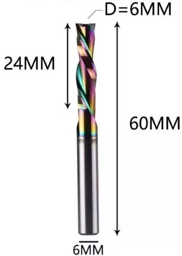   |
| DWD2F-D8.0-L32  | 2        | 8     | 32    | 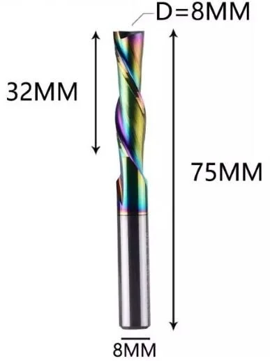  |
| DWD2F-D10.0-L32 | 1        | 10    | 32    | 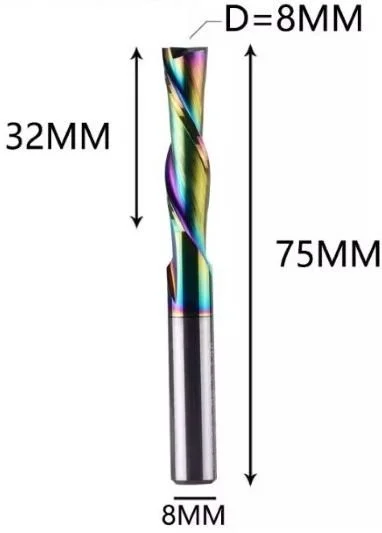 |
| NoName          | 8        | 3,175 | 17    |                                              |

### 4-schneidiger Spiralfräse

- **Anwendung**: Fein- und Schlichtfräsen von Stahl, Edelstahl, Guss und NE-Metallen – glatte Oberflächen durch hohe Schnittkante/Zahnzahl. In Holz/Kunststoff meiste Schneiden überdimensioniert – besser 2–3-Schneider verwenden.

| Item           | Quantity | D(mm) | L(mm) |
|----------------|----------|-------|-------|
| DWD2F-D4.0-L22 | 1        | 6     | 13    |

## G Codes

Wichtige G-Codes & HAL-Befehle

| Befehl             | Beschreibung                     | Beispiel                              |
|--------------------|----------------------------------|---------------------------------------|
| `G0` / `G1`        | Eil-/Arbeitsfahrt                | `G1 X100 Y50 F3000`                   |
| `G17`/`G18`/`G19`  | Arbeitsfläche auswählen          | `G17` XY-Ebene                        |
| `G90` / `G91`      | Absolut / Inkremental            | `G91 G0 Z-5`                          |
| `M6 Txx`           | Werkzeugwechsel (mit Tool-Table) | `M6 T03`                              |
| `G28` / `G30`      | Heimkehr-Positionen              | `G28 X0 Y0`                           |
| `M3` / `M4` / `M5` | Spindel ein (CW/CCW) / Stopp     | `M3 S12000`                           |
| HAL-Scope start    | Live-Monitoring                  | `halrun —interactive`                 |
| `halcmd show pin`  | HAL-Pin-Zustand anzeigen         | `halcmd show pin joint.0.motor-fault` |

## Examples

- [EstlCAM LinuxCNC Tic Tac Toe](_EstlCAM_LinuxCNC_Tic_Tac_Toe.zip)

## Buy stuff

- <https://www.sorotec.de/shop/>
- <https://dreanique.de.aliexpress.com/store/2166082>
