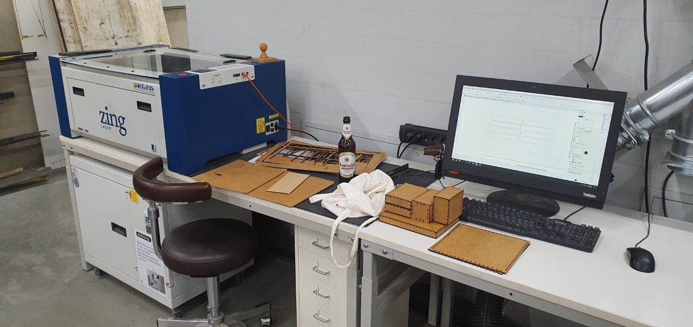
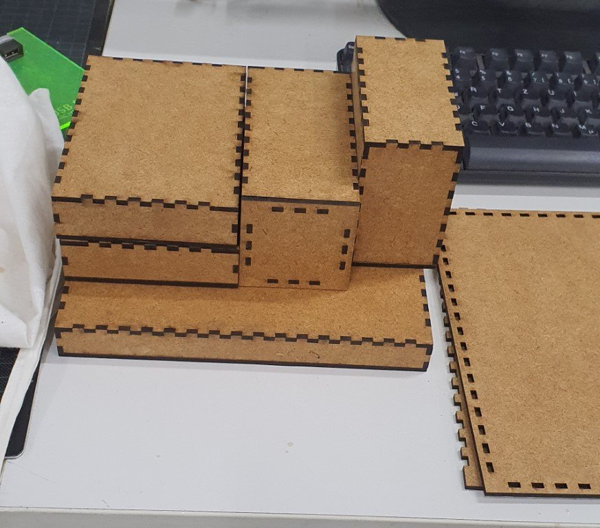

# Laser cutter

My work environment:



Some example results:



## EpilogZing 6040

The Lasercutter [EpilogZing](https://www.epiloglaser.de/) 6030 is a 40 Watt CO2-Laser.

Dimensions: 609 x 304 x 197 mm

### 3mm HDF

| Variable | Engrave (Raster) | Cut (Vektor) |
|----------|------------------|--------------|
| Speed    | 58%              | 50%          |
| Power    | 50%              | 100%         |
| Freq     | 2500 Hz          | 2500 Hz      |

[Example EpilogZing Printer Settings](_epilog-zing-printer-settings.png)

### 4mm fleece

([example cut](_fleece_example_cut.png))

| Variable | Engrave (Raster) | Cut (Vektor) |
|----------|------------------|--------------|
| Speed    | 100%             | 100%         |
| Power    | 36%              | 62%          |
| Freq     | 5000 Hz          | 5000 Hz      |

### Paper

| Variable | Cut thin paper | Cut thick paper |
|----------|----------------|-----------------|
| Speed    | 30%            | 100%            |
| Power    | 6%             | 25%             |
| Freq     | 2500 Hz        | 2500 Hz         |

### Metal

| Variable | Engrave |
|----------|---------|
| Speed    | 24%     |
| Power    | 100%    |
| Freq     | 2500 Hz |

Change "Rastermuster" to "Stucki"!

[Example EpilogZing Printer Settings](_epilog-zing-printer-settings-alu-engrave.jpg)

## Trotec Speedy 360

[Trotec Speedy 360](https://www.troteclaser.com)

Cut MDF

| Variable | Cut 4mm MDF | Cut 5mm MDF |
|----------|-------------|-------------|
| Power    | 80,00       | 100         |
| Velocity | 1           | 3           |
| PPI/Hz   | 1000        | 1000        |
| Runs     | 3           | 2           |

## Tools

### Boxes.py

[Boxes.py](https://github.com/florianfesti/boxes) is an [online](https://www.festi.info/boxes.py/index.html) and [Inkscape plug-in](https://github.com/florianfesti/boxes) with ready-to-use, fully parametrized generators for various boxes.

This script installs all requirements using chocolatey, python-pip and downloads boxes-py to serve it locally on Windows 10:

``` ps1 title="run_boxes-py.ps1"
#Requires -RunAsAdministrator

# Install/Update tools
if (!(Test-Path "$($env:ProgramData)\chocolatey\choco.exe")) { Set-ExecutionPolicy Bypass -Scope Process -Force; [System.Net.ServicePointManager]::SecurityProtocol = [System.Net.ServicePointManager]::SecurityProtocol -bor 3072; iex ((New-Object System.Net.WebClient).DownloadString('https://chocolatey.org/install.ps1')) }
choco install -y python git

# Install/Update boxes
$boxes = "${PSScriptRoot}\boxes" 
if (Test-Path $boxes) { git --work-tree=$boxes --git-dir=$boxes\.git pull }
else { git clone https://github.com/florianfesti/boxes.git $boxes } 

# Install dependencies
python -m pip install --upgrade pip 
pip install -r $boxes\requirements.txt

# Run Boxes
Start-Process python $boxes\scripts\boxesserver
Start-Process http://localhost:8000
```

One-liner executing the code above:

``` ps1
iex ((New-Object System.Net.WebClient).DownloadString('https://raw.githubusercontent.com/FullByte/scripts/main/powershell/boxes.py/start_boxes.ps1'))
```

If you have everything you need in place and just want to start boxes.py run this command from the main folder of boxey.py, then  open <http://localhost:8000>

Windows

``` py
pip install -r "boxes\requirements.txt"
python "boxes\scripts\boxesserver"
```

Linux

``` py
apt-get update
pip install -r "boxes/requirements.txt"
python3 "boxes/scripts/boxesserver"
```

## Project Ideas

Further ressources and links to pages for templates and ideas:

Everything

- Instructables <https://www.instructables.com/>
- Make <https://make.co/>
- Pintrest <https://www.pinterest.de/>
- Hackster <https://www.hackster.io/projects?ref=topnav>

Laser cutter & CNC

- Laser Templates <https://laser-templates.com/>
- Templatemaker <https://www.templatemaker.nl>
- <https://www.dxf-downloads.de/>
- <https://dxf-downloads.com>
- <https://de.makercase.com/>
- <http://jeromeleary.com/laser/>
- maze generator <http://www.mazegenerator.net/>
- Create Puzzle <https://cdn.rawgit.com/Draradech/35d36347312ca6d0887aa7d55f366e30/raw/b04cf9cd63a59571910cb226226ce2b3ed46af46/jigsaw.html>
