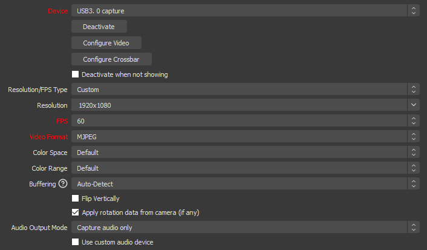

# Video

## Hardware

### Cams

## Software

### OBS

Add GoPro 7 Black

I am using a cheap capture card called "Amozo 4K HDMI Video Capture Card, USB 3.0 Game Capture Card 1080P".

The folloing GoPro settings are setup:

**TODO**

To make this work no drivers need to be installed. The following OBS settings work for me:

- Add a new source, select "video capture device" → "audio and video input capture"
- Sources → Click "+"→ Find the "Video Capture Device"
- Choose "USB Video" as device
- Change the following settings:
  - Click "Deactivate"
  - Resolution/FPS choose "customize" → Resolution select "1920x1080"
  - FPS choose "60"
  - Video format select "MJPEG"

There is some delay which needs to be adjusted to all input is synced properly:

**TODO**
