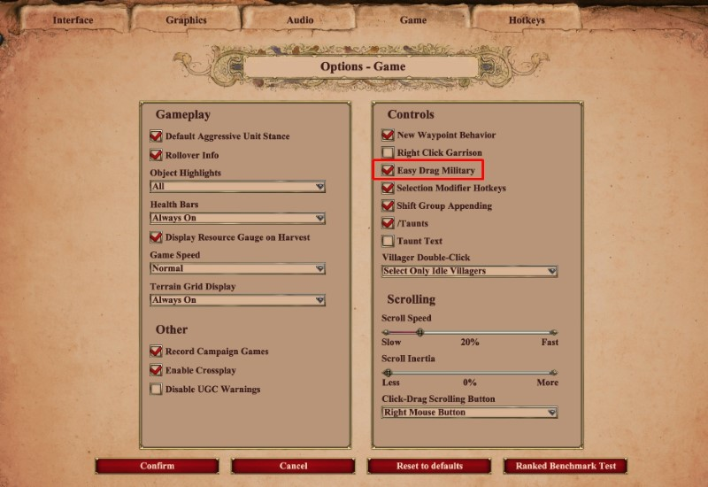
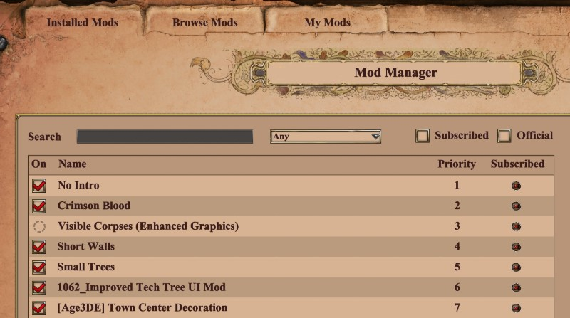
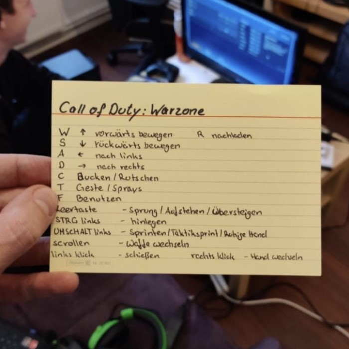

# PC Games Helper

## Trackmania

- Maps: <https://trackmania.exchange/mapsearch2>

## Age of Empires 2 DE

Settings

The mods I use:

### AoE Tetris

- Age of Empires II DE: Tetris: <https://www.ageofempires.com/mods/details/21466/>
- Age of Empires II DE: Tetris Visual Mod: <https://www.ageofempires.com/mods/details/21464/>

Watch:

- Video: <https://www.youtube.com/watch?v=9ZMobR31qdE>

### Bloodpack example

| Before                                          | After                                          |
|-------------------------------------------------|------------------------------------------------|
|  |  |

## Overwatch

- Tier list and most played heroes: <https://www.esportstales.com/overwatch/tier-list-and-most-played-heroes>

Settings

TODO

## RocketLeague

Settings

- FoV: 110
- Distance: 250
- Height: 100
- Angle: -4
- Stiffness: 0,65
- Swivel Speed: 5
- Transition Speed: 1

## Call of Duty

Settings

TODO

Notes

How to win

## Facturio

Online

- [Factory requirements calculator](https://factoriolab.github.io/list)
- [Factorio Blueprints](https://factorioprints.com)

Tools

- [Factorio Blueprint Visualizer](https://github.com/piebro/factorio-blueprint-visualizer)
- [Foreman2](https://github.com/DanielKote/Foreman2) (Visual planning tool for Factorio )
- [verilog2factorio](https://redcrafter.github.io/verilog2factorio/) is a Verilog to Factorio Blueprint compiler.

Mods

- [Rate Calculator](https://mods.factorio.com/mod/RateCalculator)
- [Factory planner](https://mods.factorio.com/mod/factoryplanner)
- [BlueprintLab design](https://mods.factorio.com/mod/BlueprintLab_design)
