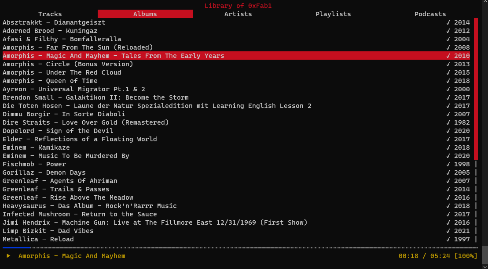

# CLI Tools

## Browser

- w3m Browser: <http://w3m.sourceforge.net/>
- Googler: <https://github.com/jarun/googler>
- DuckDuckGo: <https://github.com/jarun/ddgr> (Browser: <https://duckduckgo.com/tty/>)
- Twitter: [rainbowstream](https://github.com/orakaro/rainbowstream) `sudo apt -y install python3-pip && sudo pip3 install rainbowstream`

## Collaborate

- Chat: <https://weechat.org/> `sudo apt-get install weechat` ([Documentation](https://weechat.org/files/doc/devel/weechat_quickstart.en.html))
- Chat: <https://github.com/irssi/irssi> e.g. `apt install irssi`
- Stream Terminal Session: <https://github.com/miguelmota/streamhut>
- Share Files using QR code: <https://github.com/claudiodangelis/qrcp>
- GPG: <https://github.com/orhun/gpg-tui>
- Video-Chat: <https://github.com/dialup-inc/ascii>

## Dev

- [git interactive rebase tool](https://github.com/MitMaro/git-interactive-rebase-tool)
- System resource monitor: <https://github.com/aristocratos/btop>
- Kanban boards: [kanban.bash](https://github.com/coderofsalvation/kanban.bash), [taskell](https://github.com/smallhadroncollider/taskell)
- JSON Tools: [jless](https://github.com/PaulJuliusMartinez/jless), [ijq](https://sr.ht/~gpanders/ijq), [fx](https://github.com/antonmedv/fx)

## File Transfer

- Sync <https://www.etebase.com/> → <https://www.etesync.com/>
- Sync/Backup <https://syncthing.net/>
- Send Files: <https://github.com/magic-wormhole/magic-wormhole>
- BitTorrect Client: [rtorrent](https://github.com/rakshasa/rtorrent) and [mabel](https://github.com/smmr-software/mabel)
- IPFS: <https://ipfs.io>
- transfer.sh: <https://github.com/dutchcoders/transfer.sh>
- croc: <https://github.com/schollz/croc>

## Games

- nudoku is a ncurses based sudoku game. <https://bronevichok.ru/ttygames/#nudoku>
- Chess: <https://github.com/vinc/littlewing>
- Solitaire: <https://github.com/mpereira/tty-solitaire>

## Work with files

- File Explorer: <https://github.com/sayanarijit/xplr>
- Photo Search Tool: <https://github.com/yurijmikhalevich/rclip>
- Terminal UI for SQLite: <https://github.com/mathaou/termdbms>
- Search in PDFs: <https://pdfgrep.org/>

## Money

- Stocks <https://github.com/achannarasappa/ticker>
- CoinMon <https://github.com/bichenkk/coinmon>

## Music

- Beets: <https://github.com/beetbox/beets> `pip install beets`
- Musikcube (Spotify): <https://github.com/clangen/musikcube>
- Background Noise: <https://github.com/JaDogg/noisebox>
- Spotify: [spotify-tui](https://github.com/Rigellute/spotify-tui) or [ncspot](https://github.com/hrkfdn/ncspot)

Example running ncspot:



Visualize audio in the terminal

paura_lite.py takes no arguments and just records sounds, while visualizing each segment's spectrogram in the console.

Install required tools

``` sh
sudo apt update
sudo apt-get install libasound-dev portaudio19-dev libportaudio2 libportaudiocpp0
sudo apt-get install python3-opencv gnuplot
pip3 install numpy pyaudio termplotlib
cd ~
git clone https://github.com/tyiannak/pyAudioAnalysis.git
cd pyAudioAnalysis
pip3 install -r ./requirements.txt
pip3 install -e .
cd ..
git clone https://github.com/tyiannak/paura
cd paura
python3 paura_lite.py
```

This is how it should look like: <https://www.youtube.com/watch?v=YEi9AmA-07s>

## Read News

- Wikipedia: <https://github.com/yashsinghcodes/fetch>
- Hacker News: <https://github.com/donnemartin/haxor-news>

## Office Tools

- Mail: [aerc](https://aerc-mail.org/) or [mblaze](https://github.com/leahneukirchen/mblaze) or [mutt](http://www.mutt.org/)
- Calendar: [Calcurse](https://www.calcurse.org), ([Calcure](https://github.com/anufrievroman/calcure))
- Charts: <https://github.com/irevenko/tsukae>
- Time Tracker: <https://github.com/jotaen/klog>
- Text Editor: <https://micro-editor.github.io/>
- plaintext accounting tool: <https://github.com/simonmichael/hledger>
- CSV pretty printer: <https://github.com/alexhallam/tv>
- Bits, bytes and address calculator: <https://github.com/jarun/bcal>
- Code Editor: <https://micro-editor.github.io/>

## Pictures

- Catimg: <https://github.com/posva/catimg>

## Video

### Watch Movies in ASCII

``` sh
sudo apt-get install mplayer
wget https://download.blender.org/peach/bigbuckbunny_movies/big_buck_bunny_480p_stereo.ogg
mplayer -vo caca big_buck_bunny_480p_stereo.ogg
```

Using [mpv](https://mpv.io/) with [libcaca](http://caca.zoy.org/wiki/libcaca)

``` sh
mpv --quiet -vo=caca 'https://www.youtube.com/watch?v=dQw4w9WgXcQ'
```

Using [mpv](https://mpv.io/) with tct:

``` sh
mpv --quiet -vo=tct 'https://www.youtube.com/watch?v=dQw4w9WgXcQ'
```

### asciinema

Install

``` sh
sudo apt-get install python3 pip
sudo pip3 install asciinema
```

Record a session

``` sh
asciinema rec
echo "hello world"
exit
```

Play existing recordings (local/online):

``` sh
asciinema play /path/to/asciicast.cast
asciinema play https://asciinema.org/a/237459
```

## Other

- Weather: "curl wttr.in" (<https://github.com/chubin/wttr.in>)
- jmespath: <https://github.com/jmespath/jmespath.terminal>
- Text-based desktop environment: <https://github.com/netxs-group/vtm>

Fun Stuff

| Tool       | Install                    | Use            |
|------------|----------------------------|----------------|
| certstream | pip install certstream     | certstream     |
| nba-go     | sudo npm install -g nba-go | nba-go game -T |
| Mapscii    | npm install -g mapscii     | mapscii        |
