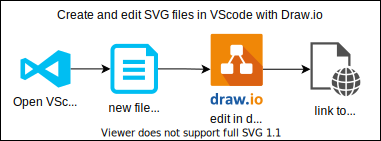

# Draw.io

| What     | Where                                       |
|----------|---------------------------------------------|
| Source   | <https://github.com/jgraph/drawio>          |
| Download | <https://github.com/jgraph/drawio/releases> |
| Online   | <https://app.diagrams.net/>                 |
| Windows  | choco install drawio                        |
| Ubuntu   | ``                                          |

## Create and edit SVG in vscode

Create and edit SVG files nativly in VSCoode with Draw.io with a draw.io extension:

1. [Install](vscode:extension/hediet.vscode-drawio) the [Draw.io Integration](https://marketplace.visualstudio.com/items?itemName=hediet.vscode-drawio) for [Visual Studio Code](https://code.visualstudio.com/) by [Henning Dieterichs](https://marketplace.visualstudio.com/publishers/hediet)
2. Create a new file called whatever.drawio.svg
3. Open the file in VScode and the draw.io extension should pop-up an enable editing.
4. Link the SVG file to e.g. a markdown or web document

Example file showing the process:



## Create a mockup

Draw.io enables quick an easy mockup creation for simple GUI interfaces.
The possiblities are limited but it is an excellent first mockup draft method to figure out what you need.

Add the mockup shapes:

- Open Shapes
- click on "More Shapes"
- Navigate to Software → Mockups
- Add Mockups

Create your first page. Use that design as a template for further pages.
Create a link to other pages for specific buttons.

Export as HTML to demo the mockup online/offline.

## Drawio in VScode

Install using choco: ```choco install vscode-drawio```
