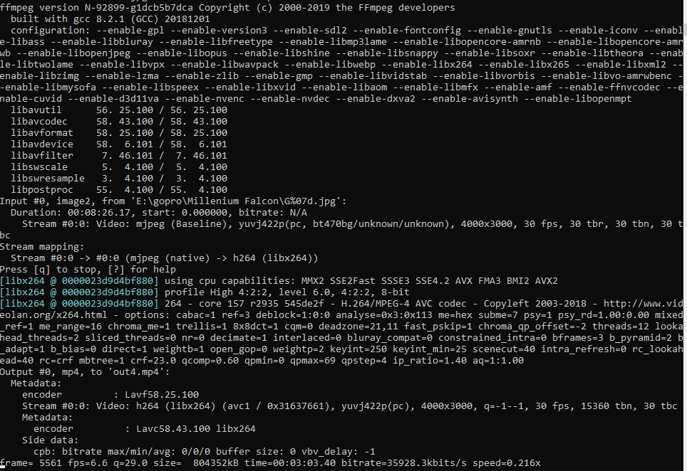

# FFmpeg

FFmpeg is a great tool and here are some examples.

## Info

|What|Where|
|-|-|
|Official Page||
|Source||
|Download||
|Install||

## Get File Information

Get codec details of a given video file e.g. "video.mp4":

```shell
ffprobe -v error -select_streams v:0 -show_entries stream=codec_name -of default=noprint_wrappers=1:nokey=1 video.mp4
```

## Create Time Lapse Video

In my case the files are from a GoPro named "G" followed by seven digits e.g. G0011565.jpg.
The starting number of the series of pictures is 11021 in my example.
Change the start_number value, the filename prefix (in this case "G") and the length of the number if required.
More details: <http://ffmpeg.org/ffmpeg-all.html#image2-1>

```shell
ffmpeg -framerate 30 -start_number 11021 -i "E:\path\G%07d.jpg" -c:v libx264 "E:\path\output.mp4"
```

Example output:



## Compress Video

To compress an avi file you can use H.264 on the output file named e.g. "input.avi" and create a smaller version of the video named "output.mkv"
More details: <https://trac.ffmpeg.org/wiki/Encode/H.264>

```shell
ffmpeg -i input.avi -c:v libx264 -preset slow -crf 15 output.mkv
```

## Save Video optimized for Messenger

This works well for Whatsapp, Signal, Threema, Telegram, etc...
Make sure not to reach current allowed max files size.

With sound:

```shell
ffmpeg -i input.mkv -vf -an scale=960x540 messenger.mp4
```

No sound:

```shell
ffmpeg -i input.mkv -vf -an scale=960x540 messenger.mp4
```

## Save as AV1

```shell
# Pass 1
ffmpeg -i input.mp4 -c:v libaom-av1 -b:v 200k -filter:v scale=720:-1 -strict experimental -cpu-used 1 -tile-columns 2 -row-mt 1 -threads 8 -pass 1 -f mp4 NUL && ^
# Pass 2
ffmpeg -i input.mp4 -pix_fmt yuv420p -movflags faststart -c:v libaom-av1 -b:v 200k -filter:v scale=720:-1 -strict experimental -cpu-used 1 -tile-columns 2 -row-mt 1 -threads 8 -pass 2 output.mp4
```

## Convert from/to GIF

From GIF to MP4

```shell
ffmpeg -i input.gif -filter_complex "[0:v] fps=15" -vsync 0 -f mp4 -pix_fmt yuv420p output.mp4
```

From MP4 to GIF

```shell
ffmpeg -i input.mp4 -filter_complex "[0:v] fps=12,scale=480:-1,split [a][b];[a] palettegen [p];[b][p] paletteuse" output.gif
```

Add e.g. "-ss 5.0 -t 3.2" to only create GIF for 3.2 secounds ot "input.mp4"

```shell
ffmpeg -ss 5.0 -t 3.2 -i input.mp4 -filter_complex "[0:v] fps=12,scale=480:-1,split [a][b];[a] palettegen [p];[b][p] paletteuse" output.gif
```

## Stack Videos in a Grid (Horizontally and Vertically)

2 Videos Horizontally

```shell
ffmpeg -i input0.mp4 -i input1.mp4 -filter_complex hstack=inputs=2 horizontal-stacked-output.mp4
```

2 Videos Vertically

```shell
ffmpeg -i input0.mp4 -i input1.mp4 -filter_complex vstack=inputs=2 vertical-stack-output.mp4
```

Videos of Different Lengths

```shell
ffmpeg -i input0.mp4 -i input1.mp4 -filter_complex hstack=inputs=2:shortest=1 shortest-output.mp4
```

2×2 Grid of Videos

```shell
ffmpeg -i input0.mp4 -i input1.mp4 -i input2.mp4 -i input3.mp4 -filter_complex "[0:v][1:v]hstack=inputs=2[top]; [2:v][3:v]hstack=inputs=2[bottom]; [top][bottom]vstack=inputs=2[v]" -map "[v]" finalOutput.mp4
```

```shell
ffmpeg -i input0.mp4 -i input1.mp4 -i input2.mp4 -i input3.mp4 -i input4.mp4 -i input5.mp4 -filter_complex "[0:v][1:v][2:v]hstack=inputs=3[top]; [3:v][4:v][5:v]hstack=inputs=3[bottom]; [top][bottom]vstack=inputs=2[v]" -map "[v]" finalOutput.mp4
```
