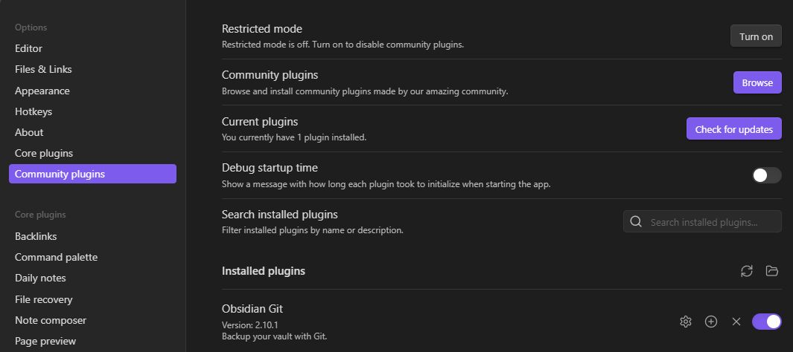
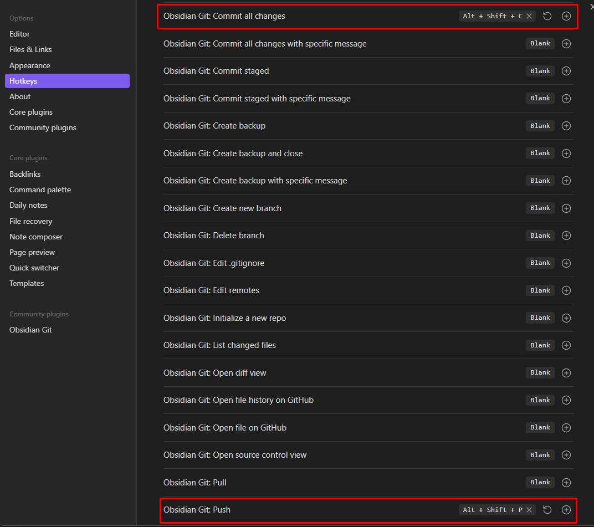
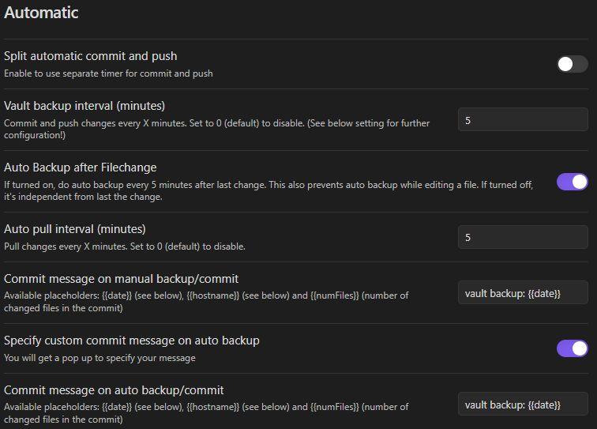
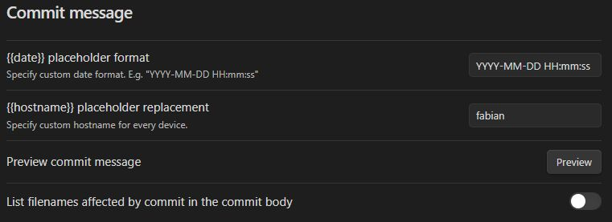
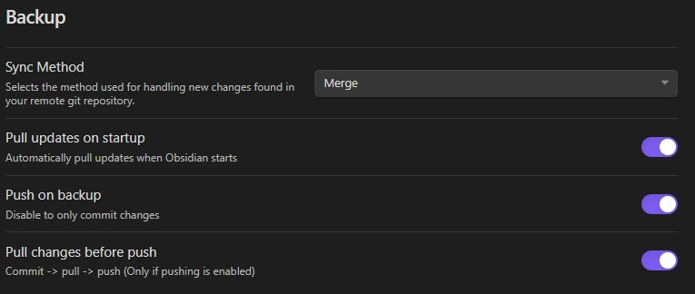
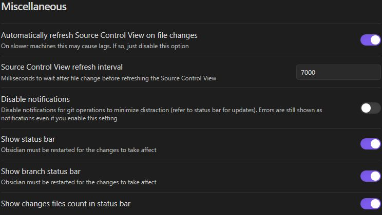
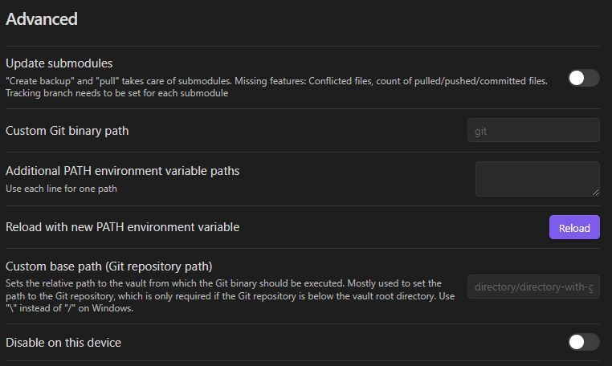

# Obsidian

| What          | Where                                       |
| ------------- | ------------------------------------------- |
| Official Page | <https://obsidian.md/>                   |
| Docs          | <https://help.obsidian.md>        |

## Community Plugins

### Obisidan Git

Open the Obisidan settings, enable comminity plugins and search for [Obisidan Git](https://github.com/denolehov/obsidian-git) to install it.



I use shortcuts for commit and push as follows:



These are my Obisidan Git settings:

Automatic settings:



Commit message settings:



Backup settings:



Miscellaneous settings



Advanced settings



### Templater

Create obsidian template files with [Templater](https://github.com/SilentVoid13/Templater).

## Static Website

There are plenty of solutions to generate a static website from markdown files. [Quartz](https://quartz.jzhao.xyz/) is based on [Hugo](https://gohugo.io/) and supports Obsidian Vault Integration. In fact Obsidian is the preferred way to use Quartz.

Clone or fork quartz and open it with obsidian.

In Obsidian settings:

- Under Options > Files and Links, set the New link format to always use Absolute Path in Vault.
- Go to Settings > Files & Links > Turn “on” automatically update internal links.
- Options > Core Plugins and enable the Templates plugin.
- Options > Hotkeys and set a hotkey for ‘Insert Template’ to create a new note

To build the web site you need Hugo with “extended” Sass/SCSS version.

Run ```make serve``` to locally test the website.
