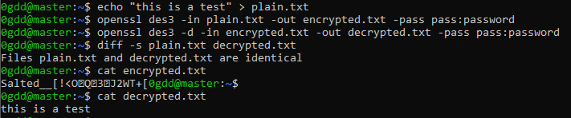

# OpenSSL

Examples using OpenSSL

## Info

|What|Where|
|-|-|
|Official Page||
|Source||
|Download||
|Install||

## Create certificates and keys

Generate a new private key and Certificate Signing Request

```shell
openssl req -out CSR.csr -new -newkey rsa:2048 -nodes -keyout privateKey.key
```

Generate a self-signed certificate (see How to Create and Install an Apache Self Signed Certificate for more info)

```shell
openssl req -x509 -sha256 -nodes -days 365 -newkey rsa:2048 -keyout privateKey.key -out certificate.crt
```

Generate a certificate signing request (CSR) for an existing private key

```shell
openssl req -out CSR.csr -key privateKey.key -new
```

Generate a certificate signing request based on an existing certificate

```shell
openssl x509 -x509toreq -in certificate.crt -out CSR.csr -signkey privateKey.key
```

Remove a passphrase from a private key

```shell
openssl rsa -in privateKey.pem -out newPrivateKey.pem
```

## Validate Certificates and Keys

Check an MD5 hash of the public key to ensure that it matches with what is in a CSR or private key

```shell
openssl x509 -noout -modulus -in certificate.crt | openssl md5
openssl rsa -noout -modulus -in privateKey.key | openssl md5
openssl req -noout -modulus -in CSR.csr | openssl md5
```

Check an SSL connection: This displays all (including Intermediates) certificates of a given website.

```shell
openssl s_client -connect www.google.com:443
```

Check Certificate

```shell
openssl x509 -in certificate.crt -text -noout
```

Check CSR of Certificate

Decode your Certificate Signing Request (CSR) and and verify that it contains the correct information:

```shell
openssl req -in mycsr.csr -noout -text
```

Check a private key

```shell
openssl rsa -in private.key -check
```

Check a PKCS#12 file (.pfx or .p12)

```shell
openssl pkcs12 -info -in keyStore.p12
```

## Converting Using OpenSSL

Convert certificates and keys to different formats to make them compatible with OS/software required.

Convert a DER file (.crt .cer .der) to PEM

```shell
openssl x509 -inform der -in certificate.cer -out certificate.pem
```

Convert a PEM file to DER

```shell
openssl x509 -outform der -in certificate.pem -out certificate.der
```

Convert a PKCS#12 file (.pfx .p12) containing a private key and certificates to PEM

You can add -nocerts to only output the private key or add -nokeys to only output the certificates.

```shell
openssl pkcs12 -in keyStore.pfx -out keyStore.pem -nodes
```

Convert a PEM certificate file and a private key to PKCS#12 (.pfx .p12)

```shell
openssl pkcs12 -export -out certificate.pfx -inkey privateKey.key -in certificate.crt -certfile CACert.crt
```

## How to encrypt and decrypt files with OpenSSL

Install openssl and the associated development libraries'

Run **openssl version -a** to check if openssl is installed or just run this command to install all requirements for this demo:

```shell
sudo apt-get install libssl-dev openssl
```

Create a test file named **"plain.txt"** which we shall encrypt & decrypt in the next step.

```shell
echo "this is a test" > plain.txt
```

Encrypt and Decrypt example via Triple Data Encryption Standard

The following lines will create the encrypted file **"encrypted.txt"** and decrypted file **"decrypted.txt"**.

```shell
openssl des3 -in plain.txt -out encrypted.txt -pass pass:password
openssl des3 -d -in encrypted.txt -out decrypted.txt -pass pass:password
```

The file **"decrypted.txt"** should match with our test file **"plain.txt"**.

```shell
diff -s plain.txt decrypted.txt
```

Encrypt and Decrypt example via AES-256 with CBC

There are plenty of ciphers availble. Run **openssl help** to see the cipher commands available too you. Here is another example using AES-256 with CBC.

```shell
openssl aes-256-cbc -a -salt -in plain.txt -out encrypted.txt -k password
openssl aes-256-cbc -d -a -in encrypted.txt -out decrypted.txt -k password
```

Encrypt images using a key and IV

```shell
openssl aes-128-cbc -K "55555555555555555555555555555555" -iv "83deccd3f93b37c70d37297f319cf367" -in WRxFKdq.png -out OMG_SAME_IMAGE.png
```

Example screenshot:



## HTTPS webserver

```shell
openssl req -x509 -newkey rsa:4096 -keyout /tmp/key.pem -out /tmp/cert.pem -nodes && openssl s_server -WWW -port 8443 -cert /tmp/cert.pem -key /tmp/key.pem
```

```shell
openssl req -newkey rsa:2048 -nodes -x509 -subj '/CN=name-you-want.example.com' -days 3650 -out server.cert -keyout server.key
```

```shell
openssl s_server -accept 7781 -cert server.cert -key server.key -WWW
```
