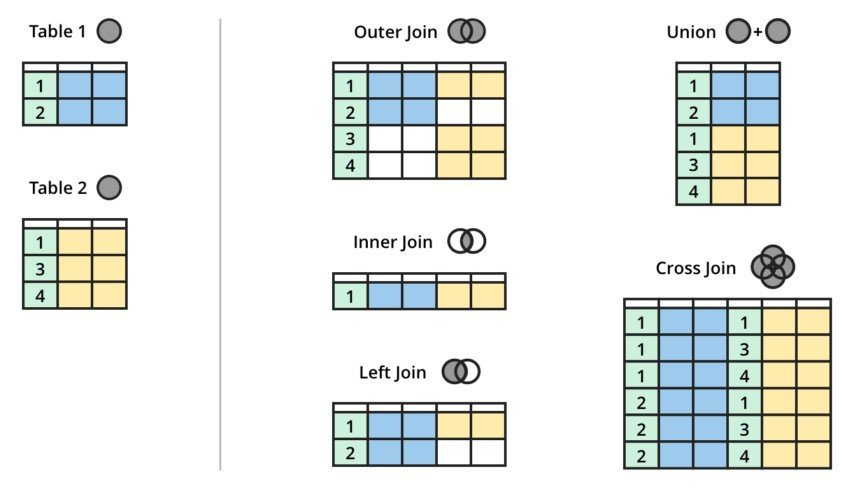

# MS SQL

```txt
   _..------.._
.-~            ~-.
|                |
|"-..________..-"|
|                |  ____   ___  _
|                | / ___| / _ \| |
|"-..________..-"| \___ \| | | | |
|                |  ___) | |_| | |___
|                | |____/ \__\_|_____|
|"-..________..-"|
|                |
|                |
 "-..________..-"
```

## Admin

### Create User

This creates a new SQL Server login and a corresponding user in a specific database, and then grants that user full permissions on the database by adding them to the db_owner role:

```SQL
USE master;
CREATE LOGIN YourLoginName WITH PASSWORD = 'YourStrongPassword';
USE YourDatabaseName;
CREATE USER YourLoginName FOR LOGIN YourLoginName;
EXEC sp_addrolemember 'db_owner', 'YourLoginName';
```

## Commands

### JOIN

Assume table1 has the following columns and data:

- id (unique identifier)
- name (name of an individual)

| id | name    |
|----|---------|
| 1  | Alice   |
| 2  | Bob     |
| 3  | Charlie |

And table2 has the following columns and data:

- id (unique identifier)
- table1_id (foreign key referencing id in table1)
- hobby (hobby of the individual)

| id | table1_id | hobby    |
|----|-----------|----------|
| 1  | 1         | Reading  |
| 2  | 2         | Swimming |
| 3  | 3         | Painting |
| 4  | 3         | Dancing  |



#### INNER JOIN

This join returns rows when there is a match in both tables.

```SQL
SELECT table1.id, table1.name, table2.hobby
FROM dbo.table1
INNER JOIN dbo.table2 ON table1.id = table2.table1_id;
```

#### LEFT JOIN (or LEFT OUTER JOIN)

This join returns all rows from the left table, and the matched rows from the right table. If there is no match, NULLs are returned for columns of the right table.

```SQL
SELECT table1.id, table1.name, table2.hobby
FROM dbo.table1
LEFT JOIN dbo.table2 ON table1.id = table2.table1_id;
```

#### RIGHT JOIN (or RIGHT OUTER JOIN)

This join returns all rows from the right table, and the matched rows from the left table. If there is no match, NULLs are returned for columns of the left table.

```SQL
SELECT table1.id, table1.name, table2.hobby
FROM dbo.table1
RIGHT JOIN dbo.table2 ON table1.id = table2.table1_id;
```

#### FULL OUTER JOIN

This join returns rows when there is a match in one of the tables. It combines the result of both LEFT and RIGHT joins.

```SQL
SELECT table1.id, table1.name, table2.hobby
FROM dbo.table1
FULL OUTER JOIN dbo.table2 ON table1.id = table2.table1_id;
```

#### CROSS JOIN

This join returns the Cartesian product of the two tables, meaning every combination of rows from the two tables.

```SQL
SELECT table1.id, table1.name, table2.hobby
FROM dbo.table1
CROSS JOIN dbo.table2;
```

### CASE

This example translates```[table1].[statusID]``` into a given text value.

```SQL
SELECT [Table] =
CASE [Table].[statusID]
    WHEN 0 THEN 'Created'
    WHEN 200 THEN 'Running'
    WHEN 300 THEN 'HALTED'
    WHEN 400 THEN 'Canceled'
    WHEN 500 THEN 'Finished'
    ELSE '-undefined-'
END
FROM [dbo].[table1]
```

### COALESCE

```SQL
COALESCE((SELECT [...] option1), (SELECT [...] option2), (SELECT [...] option3))
```

### UPSERT

UPSERT is an operation that inserts new records into the database and updates existing ones. This operation is particularly useful for maintaining data integrity and ensuring efficient data manipulation.

- Check for Existence: The operation first checks if a record with a specified key (usually a primary key or a unique key) already exists in the table.
- Update or Insert:
  - If the record exists: The operation updates the existing record. Typically, this involves modifying one or more fields with new values.
  - If the record does not exist: The operation inserts a new record into the table with the given values.

The specific behavior and implementation of an UPSERT operation can vary between different SQL database systems, but the core concept remains the same. Here are some databases and when they introduced UPSERT, if at all:

- PostgreSQL: Uses the ON CONFLICT clause as part of an INSERT statement. The UPSERT functionality was introduced in PostgreSQL 9.5, which was released in January 2016. It uses the ON CONFLICT clause.
- MySQL: Offers the INSERT ON DUPLICATE KEY UPDATE statement. MySQL has had a form of UPSERT since version 4.1 through the INSERT ON DUPLICATE KEY UPDATE syntax.
- SQLite: SQLite supports UPSERT as of version 3.24.0, released in June 2018.
- SQL Server: Microsoft SQL Server doesn't have a specific UPSERT command but uses the MERGE statement to achieve similar functionality. The MERGE statement was introduced in SQL Server 2008.
- Oracle: Oracle Database uses the MERGE statement, like SQL Server, to perform UPSERT operations.

## Random stuff

### Receive XML as query result

```SQL
FOR XML AUTO, TYPE, XMLSCHEMA, ELEMENTS XSINIL
```

### Enter Ids manually (bad!)

```SQL
SET IDENTITY_INSERT [dbo].[Table] ON
\-- DO STUFF
SET IDENTITY_INSERT [dbo].[Table] OFF
```

### Builtin functions

```SQL
SELECT HOST_NAME() -- GET Local System Name
SELECT GETUTCDATE() -- GET Local Time (UTC - Zone)
SELECT SUSER_NAME() -- GET SuperUser Name of DB
```
