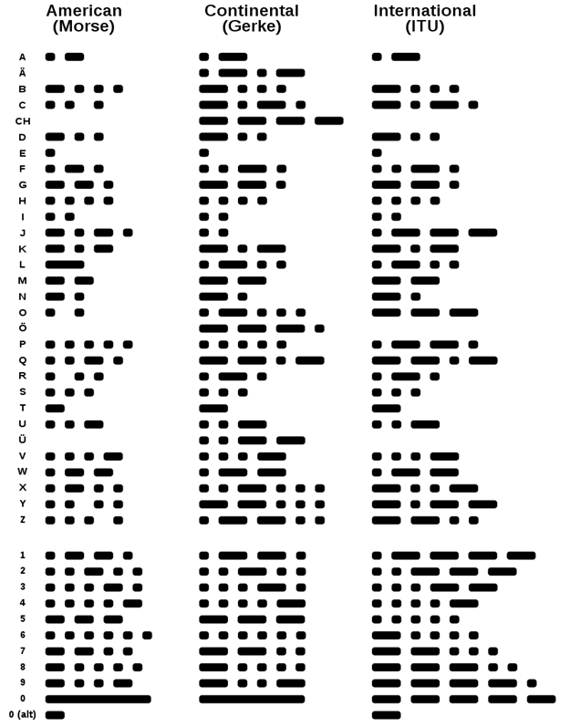

# Codes

Yet another not complete list of random codes.

## GTIN

GTIN is the umbrella term for globally standardized product identifiers used to uniquely identify trade items. There are different types based on length:

- GTIN-13 (13 digits) → same as EAN-13*
- GTIN-12 (12 digits) → same as UPC-A**
- GTIN-14 (14 digits) → used for packaging levels or logistics
- GTIN-8 (8 digits) → for small products

*EAN is an older term, originally used mainly in Europe. EAN-13 (or GTIN-13) is the most common EAN form. Although the term EAN is still commonly used, it has been officially replaced by GTIN in global standards.

**UPC-A (Universal Product Code) or GTIN-12 is a 12-digit code widely used in the United States and Canada. There's also a shortened version called UPC-E (8 digits) used for small packages.

### GTIN structure

A GTIN is a numeric code (8, 12, 13, or 14 digits long) with this general structure:

[Country Code] + [Company Prefix] + [Item Reference] + [Check Digit]

- Company Prefix: Assigned by GS1 (the global standards organization). Identifies the brand owner.
- Item Reference: Assigned by the company to identify a specific product.
- Check Digit: A single digit at the end, used to verify that the number was correctly composed or scanned.

??? info "GTIN Prefixes"
        | Prefix        | Country / Use                      | Prefix       | Country / Use                          |
        |---------------|------------------------------------|--------------|----------------------------------------|
        | 00–13         | USA & Canada                       | 20–29        | Internal numbering                     |
        | 30–37         | France                             | 380          | Bulgaria                               |
        | 383           | Slovenia                           | 385          | Croatia                                |
        | 387           | Bosnia and Herzegovina             | 400–440      | Germany                                |
        | 45, 49        | Japan                              | 460–469      | Russia                                 |
        | 471           | Taiwan                             | 474          | Estonia                                |
        | 475           | Latvia                             | 476          | Azerbaijan                             |
        | 477           | Lithuania                          | 478          | Uzbekistan                             |
        | 479           | Sri Lanka                          | 480          | Philippines                            |
        | 481           | Belarus                            | 482          | Ukraine                                |
        | 484           | Moldova                            | 485          | Armenia                                |
        | 486           | Georgia                            | 487          | Kazakhstan                             |
        | 489           | Hong Kong                          | 50           | United Kingdom                         |
        | 520           | Greece                             | 528          | Lebanon                                |
        | 529           | Cyprus                             | 531          | North Macedonia                        |
        | 535           | Malta                              | 539          | Ireland                                |
        | 54            | Belgium and Luxembourg             | 560          | Portugal                               |
        | 569           | Iceland                            | 57           | Denmark                                |
        | 590           | Poland                             | 594          | Romania                                |
        | 599           | Hungary                            | 600, 601     | South Africa                           |
        | 608           | Bahrain                            | 609          | Mauritius                              |
        | 611           | Morocco                            | 613          | Algeria                                |
        | 616           | Kenya                              | 619          | Tunisia                                |
        | 621           | Syria                              | 622          | Egypt                                  |
        | 624           | Libya                              | 625          | Jordan                                 |
        | 626           | Iran                               | 627          | Kuwait                                 |
        | 628           | Saudi Arabia                       | 629          | United Arab Emirates                   |
        | 64            | Finland                            | 690–695      | China                                  |
        | 70            | Norway                             | 729          | Israel                                 |
        | 73            | Sweden                             | 740          | Guatemala                              |
        | 741           | El Salvador                        | 742          | Honduras                               |
        | 743           | Nicaragua                          | 744          | Costa Rica                             |
        | 745           | Panama                             | 746          | Dominican Republic                     |
        | 750           | Mexico                             | 76           | Switzerland and Liechtenstein          |
        | 770           | Colombia                           | 773          | Uruguay                                |
        | 775           | Peru                               | 777          | Bolivia                                |
        | 779           | Argentina                          | 780          | Chile                                  |
        | 784           | Paraguay                           | 786          | Ecuador                                |
        | 789–790       | Brazil                             | 80–83        | Italy                                  |
        | 84            | Spain                              | 850          | Cuba                                   |
        | 858           | Slovakia                           | 859          | Czech Republic                         |
        | 860           | Yugoslavia                         | 867          | North Korea                            |
        | 869           | Turkey                             | 87           | Netherlands                            |
        | 880           | South Korea                        | 885          | Thailand                               |
        | 888           | Singapore                          | 890          | India                                  |
        | 893           | Vietnam                            | 899          | Indonesia                              |
        | 90, 91        | Austria                            | 93           | Australia                              |
        | 94            | New Zealand                        | 955          | Malaysia                               |
        | 958           | Macau                              | 977          | Magazines (ISSN)                       |
        | 978–979       | Books (ISBN)                       | 980          | Refund receipts, voucher codes         |
        | 981–983       | Common Currency Coupons            | 990–999      | Coupon codes                           |

The check digit is calculated using the modulo 10 algorithm, also known as the Luhn algorithm variant for GTINs. Here is a python code example that uses the check digit to validate a GTIN-8, GTIN-12, GTIN-13, or GTIN-14 code:

??? info "GTIN code validation"
        One-liner:

        ```py
        is_valid_gtin=lambda g:g.isdigit()and len(g)in[8,12,13,14]and(10-sum(int(d)*(3 if i%2 else 1)for i,d in enumerate(reversed(g[:-1])))%10)%10==int(g[-1])
        ```

        Readable and with example:

        ```py
        def is_valid_gtin(gtin):
            if not gtin.isdigit() or len(gtin) not in [8, 12, 13, 14]:
                return False
            digits = list(map(int, gtin))
            total = sum(d * (3 if i % 2 else 1) for i, d in enumerate(reversed(digits[:-1])))
            check = (10 - total % 10) % 10
            return check == digits[-1]

        # Example
        print(is_valid_gtin("4006381333931"))  # True
        print(is_valid_gtin("1234567890128"))  # False
        ```

## Morse code

a: .-
B: -...
C: -.-.
E: .
F: ..-.
G: --.
H: ....
I: ..
J: .---
K: -.-
L: .-..
M: --
N: -.
O: ---
P: .--.
Q: --.-
R: .-.
S: ...
T: -
U: ..-
V: ...-
W: .--
X: -..-
Y: -.--
Z: --..
1: .---
2: ..---
3: ...--
4: ....-
5: .....
6: -....
7: --...
8: ---..
9: ----.
0: -----



## Ten-Code

| Ten-Code) |                     Procedure Word                     |
|:---------:|:------------------------------------------------------:|
|   10-0    |                      Use Caution                       |
|   10-1    |            Unable to copy – change location            |
|   10-3    |                   Stop transmitting                    |
|   10-4    |                         Roger                          |
|   10-5    |                         Relay                          |
|   10-6    |                          Busy                          |
|   10-7    |                       Out at...                        |
|   10-8    |                         Clear                          |
|   10-9    |                       Say again                        |
|   10-12   |                        Stand by                        |
|   10-13   |               Weather report/road report               |
|   10-15   |                      Disturbance                       |
|  10-17A   |                         Theft                          |
|  10-17B   |                       Vandalism                        |
|  10-17C   |                      Shoplifting                       |
|   10-18   |                         Urgent                         |
|   10-19   |                      Return to...                      |
|   10-20   |                        Location                        |
|   10-21   |                        Call...                         |
|   10-22   |                       Disregard                        |
|   10-23   |                        On scene                        |
|   10-25   |                  Meet...or contact...                  |
|   10-26   |              Detaining subject, expedite               |
|   10-27   |           Drivers License information on...            |
|   10-28   |             Registration information on...             |
|   10-29   |                 Check for wanted on...                 |
|  10-31A   |                        Burglary                        |
|  10-31B   |                        Robbery                         |
|  10-31C   |                        Homicide                        |
|  10-31D   |                       Kidnapping                       |
|  10-31E   |                        Shooting                        |
|   10-38   |                   Traffic stop on...                   |
|   10-42   |                        Off duty                        |
|   10-44   |                     Request for...                     |
|   10-46   |                    Assist motorist                     |
|   10-49   |           East bound green light out (etc.)            |
|   10-56   |                    Drunk pedestrian                    |
|   10-63   |                    Prepare to copy                     |
|   10-70   |                          Fire                          |
|   10-74   |                        Negative                        |
|   10-76   |                      En route...                       |
|   10-77   |            ETA (Estimated time of arrival)             |
|   10-78   |                   Request assistance                   |
|   10-79   | Notify coroner (to be done by phone whenever possible) |
|   10-80   |                         Chase                          |
|   10-89   |                      Bomb threat                       |
|   10-90   |                 Alarm (type of alarm)                  |
|   10-91   |                    Pick up prisoner                    |
|   10-92   |                   Parking complaint                    |
|   10-95   |                  Prisoner in custody                   |
|   10-97   |                  Check traffic signal                  |
|   10-98   |                   Prison/jail break                    |
|   10-99   |                     Wanted/stolen                      |

## ICD-10

The International Classification of Diseases (ICD) is a globally used diagnostic tool for epidemiology, health management and clinical purposes maintained by the World Health Organization (WHO). Here are some interesting ICD-10 codes:

- V96.15 - Accident due to hang glider explosion
- V95.43 - Accident due to spacecraft collision
- V80.920 - Occupant of animal-drawn vehicle injured in transport accident with military vehicle
- W58.12 - Struck by crocodile
- W56.12 - Struck by sea lion
- W59.22 - Struck by turtle, subsequent encounter
- W61.33 - Pecked by chicken
- W18.11 - Fall from or off toilet without subsequent striking against object
- W56.32XA - Struck by other marine mammals, initial encounter
- Y35.113 - Legal intervention involving injury by dynamite, suspect injured
- W16.22 - Fall in (into) bucket of water
- S30.870 - Superficial bite of left buttock
- Z62.1 - Parental overprotection during upbringing
- Z62.898 - Loss of love relationship in childhood
- F22 - Delusional disorder: Lycanthropy
- B04 - Monkeypox
- D29.0 - Gutartige Neubildung der männlichen Genitalorgane (Penis)
- V9107XA - Burn due to water-skis on fire
- Y92146 - Hurt at swimming pool of prison as the place of occurrence
- Y92253 - Hurt at the opera
- X52 - Prolonged stay in weightless environment
- W2202XA - Hurt walking into a lamppost
- Y93D1 - Stabbed while crocheting
- A20.0 - Bubonic plague
- S10.87 - Other superficial bite of other specified part of neck, initial encounter aka vampire
- W55.2 - Bitten by a cow

## PGP word list

| Hex | Even Word | Odd Word    |
|-----|-----------|-------------|
| 00  | aardvark  | adroitness  |
| 01  | absurd    | adviser     |
| 02  | accrue    | aftermath   |
| 03  | acme      | aggregate   |
| 04  | adrift    | alkali      |
| 05  | adult     | almighty    |
| 06  | afflict   | amulet      |
| 07  | ahead     | amusement   |
| 08  | aimless   | antenna     |
| 09  | Algol     | applicant   |
| 0A  | allow     | Apollo      |
| 0B  | alone     | armistice   |
| 0C  | ammo      | article     |
| 0D  | ancient   | asteroid    |
| 0E  | apple     | Atlantic    |
| 0F  | artist    | atmosphere  |
| 10  | assume    | autopsy     |
| 11  | Athens    | Babylon     |
| 12  | atlas     | backwater   |
| 13  | Aztec     | barbecue    |
| 14  | baboon    | belowground |
| 15  | backfield | bifocals    |
| 16  | backward  | bodyguard   |
| 17  | banjo     | bookseller  |
| 18  | beaming   | borderline  |
| 19  | bedlamp   | bottomless  |
| 1A  | beehive   | Bradbury    |
| 1B  | beeswax   | bravado     |
| 1C  | befriend  | Brazilian   |
| 1D  | Belfast   | breakaway   |
| 1E  | berserk   | Burlington  |
| 1F  | billiard  | businessman |
| 20  | bison     | butterfat   |
| 21  | blackjack | Camelot     |
| 22  | blockade  | candidate   |
| 23  | blowtorch | cannonball  |
| 24  | bluebird  | Capricorn   |
| 25  | bombast   | caravan     |
| 26  | bookshelf | caretaker   |
| 27  | brackish  | celebrate   |
| 28  | breadline | cellulose   |
| 29  | breakup   | certify     |
| 2A  | brickyard | chambermaid |
| 2B  | briefcase | Cherokee    |
| 2C  | Burbank   | Chicago     |
| 2D  | button    | clergyman   |
| 2E  | buzzard   | coherence   |
| 2F  | cement    | combustion  |
| 30  | chairlift | commando    |
| 31  | chatter   | company     |
| 32  | checkup   | component   |
| 33  | chisel    | concurrent  |
| 34  | choking   | confidence  |
| 35  | chopper   | conformist  |
| 36  | Christmas | congregate  |
| 37  | clamshell | consensus   |
| 38  | classic   | consulting  |
| 39  | classroom | corporate   |
| 3A  | cleanup   | corrosion   |
| 3B  | clockwork | councilman  |
| 3C  | cobra     | crossover   |
| 3D  | commence  | crucifix    |
| 3E  | concert   | cumbersome  |
| 3F  | cowbell   | customer    |
| 40  | crackdown | Dakota      |
| 41  | cranky    | decadence   |
| 42  | crowfoot  | December    |
| 43  | crucial   | decimal     |
| 44  | crumpled  | designing   |
| 45  | crusade   | detector    |
| 46  | cubic     | detergent   |
| 47  | dashboard | determine   |
| 48  | deadbolt  | dictator    |
| 49  | deckhand  | dinosaur    |
| 4A  | dogsled   | direction   |
| 4B  | dragnet   | disable     |
| 4C  | drainage  | disbelief   |
| 4D  | dreadful  | disruptive  |
| 4E  | drifter   | distortion  |
| 4F  | dropper   | document    |
| 50  | drumbeat  | embezzle    |
| 51  | drunken   | enchanting  |
| 52  | Dupont    | enrollment  |
| 53  | dwelling  | enterprise  |
| 54  | eating    | equation    |
| 55  | edict     | equipment   |
| 56  | egghead   | escapade    |
| 57  | eightball | Eskimo      |
| 58  | endorse   | everyday    |
| 59  | endow     | examine     |
| 5A  | enlist    | existence   |
| 5B  | erase     | exodus      |
| 5C  | escape    | fascinate   |
| 5D  | exceed    | filament    |
| 5E  | eyeglass  | finicky     |
| 5F  | eyetooth  | forever     |
| 60  | facial    | fortitude   |
| 61  | fallout   | frequency   |
| 62  | flagpole  | gadgetry    |
| 63  | flatfoot  | Galveston   |
| 64  | flytrap   | getaway     |
| 65  | fracture  | glossary    |
| 66  | framework | gossamer    |
| 67  | freedom   | graduate    |
| 68  | frighten  | gravity     |
| 69  | gazelle   | guitarist   |
| 6A  | Geiger    | hamburger   |
| 6B  | glitter   | Hamilton    |
| 6C  | glucose   | handiwork   |
| 6D  | goggles   | hazardous   |
| 6E  | goldfish  | headwaters  |
| 6F  | gremlin   | hemisphere  |
| 70  | guidance  | hesitate    |
| 71  | hamlet    | hideaway    |
| 72  | highchair | holiness    |
| 73  | hockey    | hurricane   |
| 74  | indoors   | hydraulic   |
| 75  | indulge   | impartial   |
| 76  | inverse   | impetus     |
| 77  | involve   | inception   |
| 78  | island    | indigo      |
| 79  | jawbone   | inertia     |
| 7A  | keyboard  | infancy     |
| 7B  | kickoff   | inferno     |
| 7C  | kiwi      | informant   |
| 7D  | klaxon    | insincere   |
| 7E  | locale    | insurgent   |
| 7F  | lockup    | integrate   |
| 80  | merit     | intention   |
| 81  | minnow    | inventive   |
| 82  | miser     | Istanbul    |
| 83  | Mohawk    | Jamaica     |
| 84  | mural     | Jupiter     |
| 85  | music     | leprosy     |
| 86  | necklace  | letterhead  |
| 87  | Neptune   | liberty     |
| 88  | newborn   | maritime    |
| 89  | nightbird | matchmaker  |
| 8A  | Oakland   | maverick    |
| 8B  | obtuse    | Medusa      |
| 8C  | offload   | megaton     |
| 8D  | optic     | microscope  |
| 8E  | orca      | microwave   |
| 8F  | payday    | midsummer   |
| 90  | peachy    | millionaire |
| 91  | pheasant  | miracle     |
| 92  | physique  | misnomer    |
| 93  | playhouse | molasses    |
| 94  | Pluto     | molecule    |
| 95  | preclude  | Montana     |
| 96  | prefer    | monument    |
| 97  | preshrunk | mosquito    |
| 98  | printer   | narrative   |
| 99  | prowler   | nebula      |
| 9A  | pupil     | newsletter  |
| 9B  | puppy     | Norwegian   |
| 9C  | python    | October     |
| 9D  | quadrant  | Ohio        |
| 9E  | quiver    | onlooker    |
| 9F  | quota     | opulent     |
| A0  | ragtime   | Orlando     |
| A1  | ratchet   | outfielder  |
| A2  | rebirth   | Pacific     |
| A3  | reform    | pandemic    |
| A4  | regain    | Pandora     |
| A5  | reindeer  | paperweight |
| A6  | rematch   | paragon     |
| A7  | repay     | paragraph   |
| A8  | retouch   | paramount   |
| A9  | revenge   | passenger   |
| AA  | reward    | pedigree    |
| AB  | rhythm    | Pegasus     |
| AC  | ribcage   | penetrate   |
| AD  | ringbolt  | perceptive  |
| AE  | robust    | performance |
| AF  | rocker    | pharmacy    |
| B0  | ruffled   | phonetic    |
| B1  | sailboat  | photograph  |
| B2  | sawdust   | pioneer     |
| B3  | scallion  | pocketful   |
| B4  | scenic    | politeness  |
| B5  | scorecard | positive    |
| B6  | Scotland  | potato      |
| B7  | seabird   | processor   |
| B8  | select    | provincial  |
| B9  | sentence  | proximate   |
| BA  | shadow    | puberty     |
| BB  | shamrock  | publisher   |
| BC  | showgirl  | pyramid     |
| BD  | skullcap  | quantity    |
| BE  | skydive   | racketeer   |
| BF  | slingshot | rebellion   |
| C0  | slowdown  | recipe      |
| C1  | snapline  | recover     |
| C2  | snapshot  | repellent   |
| C3  | snowcap   | replica     |
| C4  | snowslide | reproduce   |
| C5  | solo      | resistor    |
| C6  | southward | responsive  |
| C7  | soybean   | retraction  |
| C8  | spaniel   | retrieval   |
| C9  | spearhead | retrospect  |
| CA  | spellbind | revenue     |
| CB  | spheroid  | revival     |
| CC  | spigot    | revolver    |
| CD  | spindle   | sandalwood  |
| CE  | spyglass  | sardonic    |
| CF  | stagehand | Saturday    |
| D0  | stagnate  | savagery    |
| D1  | stairway  | scavenger   |
| D2  | standard  | sensation   |
| D3  | stapler   | sociable    |
| D4  | steamship | souvenir    |
| D5  | sterling  | specialist  |
| D6  | stockman  | speculate   |
| D7  | stopwatch | stethoscope |
| D8  | stormy    | stupendous  |
| D9  | sugar     | supportive  |
| DA  | surmount  | surrender   |
| DB  | suspense  | suspicious  |
| DC  | sweatband | sympathy    |
| DD  | swelter   | tambourine  |
| DE  | tactics   | telephone   |
| DF  | talon     | therapist   |
| E0  | tapeworm  | tobacco     |
| E1  | tempest   | tolerance   |
| E2  | tiger     | tomorrow    |
| E3  | tissue    | torpedo     |
| E4  | tonic     | tradition   |
| E5  | topmost   | travesty    |
| E6  | tracker   | trombonist  |
| E7  | transit   | truncated   |
| E8  | trauma    | typewriter  |
| E9  | treadmill | ultimate    |
| EA  | Trojan    | undaunted   |
| EB  | trouble   | underfoot   |
| EC  | tumor     | unicorn     |
| ED  | tunnel    | unify       |
| EE  | tycoon    | universe    |
| EF  | uncut     | unravel     |
| F0  | unearth   | upcoming    |
| F1  | unwind    | vacancy     |
| F2  | uproot    | vagabond    |
| F3  | upset     | vertigo     |
| F4  | upshot    | Virginia    |
| F5  | vapor     | visitor     |
| F6  | village   | vocalist    |
| F7  | virus     | voyager     |
| F8  | Vulcan    | warranty    |
| F9  | waffle    | Waterloo    |
| FA  | wallet    | whimsical   |
| FB  | watchword | Wichita     |
| FC  | wayside   | Wilmington  |
| FD  | willow    | Wyoming     |
| FE  | woodlark  | yesteryear  |
| FF  | Zulu      | Yucatan     |

## NATO

Letters

| Symbol | Code word      | DIN 5009 (2022) IPA | ICAO (1950) IPA                | respelling                  |
|--------|----------------|---------------------|--------------------------------|-----------------------------|
| A      | Alfa  [sic]    | ˈalfa               | ˈælfa                          | AL fah                      |
| B      | Bravo          | ˈbravo              | ˈbraːˈvo  [sic]                | BRAH voh                    |
| C      | Charlie        | ˈtʃali or ˈʃali     | ˈtʃɑːli or ˈʃɑːli              | CHAR lee or SHAR lee        |
| D      | Delta          | ˈdɛlta              | ˈdeltɑ                         | DELL tah                    |
| E      | Echo           | ˈɛko                | ˈeko                           | ECK oh                      |
| F      | Foxtrot        | ˈfɔkstrɔt           | ˈfɔkstrɔt                      | FOKS trot                   |
| G      | Golf           | ˈɡɔlf               | ɡʌlf  [sic]                    | golf                        |
| H      | Hotel          | hoˈtɛl              | hoːˈtel                        | ho TELL                     |
| I      | India          | ˈɪndia              | ˈindi.ɑ                        | IN dee ah                   |
| J      | Juliett  [sic] | ˈdʒuliˈɛt           | ˈdʒuːli.ˈet                    | JEW lee ETT                 |
| K      | Kilo           | ˈkilo               | ˈkiːlo                         | KEY loh                     |
| L      | Lima           | ˈlima               | ˈliːmɑ                         | LEE mah                     |
| M      | Mike           | ˈmai̯k              | mɑik                           | mike                        |
| N      | November       | noˈvɛmba            | noˈvembə                       | no VEM ber                  |
| O      | Oscar          | ˈɔska               | ˈɔskɑ                          | OSS cah                     |
| P      | Papa           | paˈpa               | pəˈpɑ                          | pah PAH                     |
| Q      | Quebec         | keˈbɛk  [sic]       | keˈbek                         | keh BECK                    |
| R      | Romeo          | ˈromio              | ˈroːmi.o                       | ROW me oh                   |
| S      | Sierra         | siˈɛra              | siˈerɑ                         | see AIR rah                 |
| T      | Tango          | ˈtaŋɡo              | ˈtænɡo                         | TANG go                     |
| U      | Uniform        | ˈjunifɔm or ˈunifɔm | ˈjuːnifɔːm or ˈuːnifɔrm  [sic] | YOU nee form or OO nee form |
| V      | Victor         | ˈvɪkta              | ˈviktɑ                         | VIK tah                     |
| W      | Whiskey        | ˈwɪski              | ˈwiski                         | WISS key                    |
| X      | Xray, x-ray    | ˈɛksrei̯            | ˈeksˈrei  [sic]                | ECKS ray                    |
| Y      | Yankee         | ˈjaŋki              | ˈjænki                         | YANG key                    |
| Z      | Zulu           | ˈzulu               | ˈzuːluː                        | ZOO loo                     |

Numbers

| Symbol          | Code word            | English                        | French                 | CCEB 2016        | FAA            | ITU-R 2007 (WRC-07)     | IMO (French)        | U.S. Navy 1957 | U.S. Army           |
|-----------------|----------------------|--------------------------------|------------------------|------------------|----------------|-------------------------|---------------------|----------------|---------------------|
| 1               | One, unaone          | WUN /'wʌn/                     | OUANN [ˈwan]           | wun              | wun            | OO-NAH-WUN              | OUNA-OUANN          | wun            | wun, won (USMC)[24] |
| 2               | Two, bissotwo        | TOO /ˈtuː/                     | TOU [ˈtu]              | too              | too            | BEES-SOH-TOO            | BIS-SO-TOU          | too            | too                 |
| 3               | Three, terrathree    | TREE /ˈtriː/                   | TRI [ˈtri]             | tree             | tree           | TAY-RAH-TREE            | TÉ-RA-TRI           | thuh-ree       | tree                |
| 4               | Four, kartefour      | FOW-er /ˈfoʊ.ə/                | FO eur [ˈfo.ør]        | FOW-er           | fow-er         | KAR-TAY-FOWER           | KAR-TÉ-FO-EUR       | fo-wer         | fow-er              |
| 5               | Five, pantafive      | FIFE /ˈfaɪf/                   | FA ÏF  [sic] [ˈfaif]   | fife             | fife           | PAN-TAH-FIVE            | PANN-TA-FAIF        | fi-yiv         | fife                |
| 6               | Six, soxisix         | SIX /ˈsɪks/                    | SIKS [ˈsiks]           | six              | six            | SOK-SEE-SIX             | SO-XI-SICKS         | six            | six                 |
| 7               | Seven, setteseven    | SEV-en /ˈsɛv(ə)n/              | SÈV n [ˈsɛv.n]         | SEV-en           | sev-en         | SAY-TAY-SEVEN           | SÉT-TÉ-SEV'N  [sic] | seven          | sev-en              |
| 8               | Eight, oktoeight     | AIT /ˈeɪt/                     | EÏT [ˈeit]             | ait              | ait            | OK-TOH-AIT              | OK-TO-EIT           | ate            | ait                 |
| 9               | Nine, novenine[25]   | NIN-er /ˈnaɪnə/                | NAÏ neu [ˈnainø]       | NINE-er          | nin-er         | NO-VAY-NINER            | NO-VÉ-NAI-NEU       | niner          | nin-er              |
| 0               | Zero, nadazero       | ZE-RO[26] /ˈziːˈroʊ/           | ZI RO [ˈziˈro]         | ZE-ro            | ze-ro / zee-ro | NAH-DAH-ZAY-ROH[27][28] | NA-DA-ZE-RO[27][28] | zero           | ze-ro               |
| 00              | Hundred              | HUN-dred /ˈhʌndrɛd/            | HUN-dred [ˈhœ̃drɛd]    | (zero zero)      | (hundred)      |                         |                     | hun-dred       |                     |
| 000             | Thousand             | TOU-SAND[26] /ˈtaʊˈzænd/       | TAOU ZEND [ˈtauˈzɑ̃d]  | (zero zero zero) | (thousand)     |                         |                     | thow-zand      | tou-sand            |
| (decimal point) | Decimal, (FAA) point | DAY-SEE-MAL[26] /ˈdeɪˈsiːˈmæl/ | DÈ SI MAL [ˈdɛˈsiˈmal] | (decimal)        | (point)        | DAY-SEE-MAL             | DÉ-SI-MAL           |                |                     |

## Timezone Codes

| Time zone name     | Degrees longitude  | Designation  letter | Zone description | Offset              |
|--------------------|--------------------|---------------------|------------------|---------------------|
| Alfa Time Zone     | 7.5 E to 22.5 E    | A                   | -1               | UTC+01:00           |
| Bravo Time Zone    | 22.5 E to 37.5 E   | B                   | -2               | UTC+02:00           |
| Charlie Time Zone  | 37.5 E to 52.5 E   | C                   | -3               | UTC+03:00           |
| Delta Time Zone    | 52.5 E to 67.5 E   | D                   | -4               | UTC+04:00           |
| Echo Time Zone     | 67.5 E to 82.5 E   | E                   | -5               | UTC+05:00           |
| Foxtrot Time Zone  | 82.5 E to 97.5 E   | F                   | -6               | UTC+06:00           |
| Golf Time Zone     | 97.5 E to 112.5 E  | G                   | -7               | UTC+07:00           |
| Hotel Time Zone    | 112.5 E to 127.5 E | H                   | -8               | UTC+08:00           |
| India Time Zone    | 127.5 E to 142.5 E | I                   | -9               | UTC+09:00           |
| Kilo Time Zone     | 142.5 E to 157.5 E | K                   | -10              | UTC+10:00           |
| Lima Time Zone     | 157.5 E to 172.5 E | L                   | -11              | UTC+11:00           |
| Mike Time Zone     | 172.5 E to 180     | M                   | -12              | UTC+12:00           |
| November Time Zone | 7.5 W to 22.5 W    | N                   | +1 or -13        | UTC−01:00 UTC+13:00 |
| Oscar Time Zone    | 22.5 W to 37.5 W   | O                   | +2               | UTC−02:00           |
| Papa Time Zone     | 37.5 W to 52.5 W   | P                   | +3               | UTC−03:00           |
| Quebec Time Zone   | 52.5 W to 67.5 W   | Q                   | +4               | UTC−04:00           |
| Romeo Time Zone    | 67.5 W to 82.5 W   | R                   | +5               | UTC−05:00           |
| Sierra Time Zone   | 82.5 W to 97.5 W   | S                   | +6               | UTC−06:00           |
| Tango Time Zone    | 97.5 W to 112.5 W  | T                   | +7               | UTC−07:00           |
| Uniform Time Zone  | 112.5 W to 127.5 W | U                   | +8               | UTC−08:00           |
| Victor Time Zone   | 127.5 W to 142.5 W | V                   | +9               | UTC−09:00           |
| Whiskey Time Zone  | 142.5 W to 157.5 W | W                   | +10              | UTC−10:00           |
| X-ray Time Zone    | 157.5 W to 172.5 W | X                   | +11              | UTC−11:00           |
| Yankee Time Zone   | 172.5 W to 180     | Y                   | +12              | UTC−12:00           |
| Zulu Time Zone     | 7.5 W to 7.5 E     | Z                   | 0                | UTC+00:00           |

## Phone Codes

Android

- Testmenü öffnen: `*#0*#`
- Erweitertes Testmenü öffnen: `*#*#4636*#*#`
- Akkuinformationen anzeigen: `*#0228#`
- Servicemenü aufrufen: `*#197328640#`
- Firmware- Version abfragen: `*#1234#`
- Hardware- Version abfragen: `*#2222#`
- USB- Einstellungen: `*#0808#`
- Spezialeinstellungen: `3845#*855#`
- Spezialeinstellungen (D855): `*#546368#*855#`

iPhone

- Eigene Rufnummer abfragen (nur Telekom): `*135#`
- Eigene Rufnummer von SIM- Karte abfragen: `*#5005*74663#`
- SMS- Zentrale abfragen: `*#5005*7672#`
- Enhanced Full Rate- Modus aktivieren: `*3370#`
- Enhanced Full Rate- Modus deaktivieren: `#3370#`
- Half Rate- Modus aktivieren: `*4720#`
- Half Rate- Modus deaktivieren: `#4720#`
- Feldtestmodus aktivieren: `*3001#12345#*`
- SIM Clock Stop- Modus Status: `*#746025625#`
- Gerätedetails abfragen: `*#*#4636#*#*`
- internen Gerätenamen abfragen: `*#1111#`
- Hardware- Revision abfragen: `*#2222#`
- schnelles Herunterfahren aktivieren: `*#7594#`
- Mailboxeinstellungen abfragen: `*#5005*86#`

GSM Codes

- Auslesen der Handy- Seriennummer IMEI: `*#06#`
- PIN ändern: `**04*(alter PIN)*(neuer PIN)*(neuer PIN)#`
- SIM- Karte mit PUK entsperren: `**05*(PUK)*(neuer PIN)*(neuer PIN)#`
- PIN2 ändern: `**042*(alter PIN2)*(neuer PIN2)*(neuer PIN2)#`
- PIN2 mit PUK entsperren: `**052*(PUK)*(neuer PIN2)*(neuer PIN2)#`
