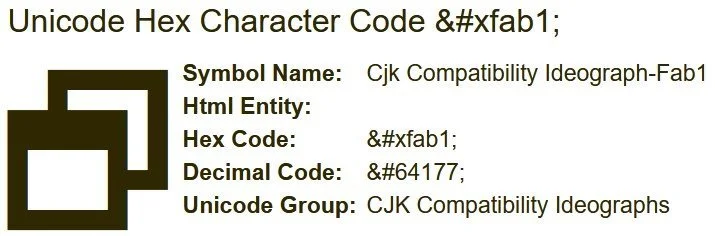

# Character encoding

## ASCII

Fix this

| Nah | ok |
|-----|----|
| ü  | ü  |
| ö  | ö  |
| é  | é  |
| ß  | ß  |
| ä  | ä  |
| Ö  | Ö  |

### ASCII Table

| Dec | Hex | Oct |  Binary  | HTML Code | HTML Name | Character |                                Description                                |
|:---:|:---:|:---:|:--------:|:---------:|:---------:|:---------:|:-------------------------------------------------------------------------:|
| 0   | 00  | 000 | 00000000 | �      |           | NUL       | Null                                                                      |
| 1   | 01  | 001 | 00000001 |       |           | SOH       | Start of Heading                                                          |
| 2   | 02  | 002 | 00000010 |       |           | STX       | Start of Text                                                             |
| 3   | 03  | 003 | 00000011 |       |           | ETX       | End of Text                                                               |
| 4   | 04  | 004 | 00000100 |       |           | EOT       | End of Transmission                                                       |
| 5   | 05  | 005 | 00000101 |       |           | ENQ       | Enquiry                                                                   |
| 6   | 06  | 006 | 00000110 |       |           | ACK       | Acknowledge                                                               |
| 7   | 07  | 007 | 00000111 |       |           | BEL       | Bell                                                                      |
| 8   | 08  | 010 | 00001000 |       |           | BS        | Backspace                                                                 |
| 9   | 09  | 011 | 00001001 | 	      |           | HT        | Horizontal Tab                                                            |
| 10  | 0A  | 012 | 00001010 | 
     |           | LF        | NL Line Feed, New Line                                                    |
| 11  | 0B  | 013 | 00001011 |      |           | VT        | Vertical Tab                                                              |
| 12  | 0C  | 014 | 00001100 |      |           | FF        | NP Form Feed, New Page                                                    |
| 13  | 0D  | 015 | 00001101 | 
     |           | CR        | Carriage Return                                                           |
| 14  | 0E  | 016 | 00001110 |      |           | SO        | Shift Out                                                                 |
| 15  | 0F  | 017 | 00001111 |      |           | SI        | Shift In                                                                  |
| 16  | 10  | 020 | 00010000 |      |           | DLE       | Data Link Escape                                                          |
| 17  | 11  | 021 | 00010001 |      |           | DC1       | Device Control 1                                                          |
| 18  | 12  | 022 | 00010010 |      |           | DC2       | Device Control 2                                                          |
| 19  | 13  | 023 | 00010011 |      |           | DC3       | Device Control 3                                                          |
| 20  | 14  | 024 | 00010100 |      |           | DC4       | Device Control 4                                                          |
| 21  | 15  | 025 | 00010101 |      |           | NAK       | Negative Acknowledge                                                      |
| 22  | 16  | 026 | 00010110 |      |           | SYN       | Synchronous Idle                                                          |
| 23  | 17  | 027 | 00010111 |      |           | ETB       | End of Transmission Block                                                 |
| 24  | 18  | 030 | 00011000 |      |           | CAN       | Cancel                                                                    |
| 25  | 19  | 031 | 00011001 |      |           | EM        | End of Medium                                                             |
| 26  | 1A  | 032 | 00011010 |      |           | SUB       | Substitute                                                                |
| 27  | 1B  | 033 | 00011011 |      |           | ESC       | Escape                                                                    |
| 28  | 1C  | 034 | 00011100 |      |           | FS        | File Separator                                                            |
| 29  | 1D  | 035 | 00011101 |      |           | GS        | Group Separator                                                           |
| 30  | 1E  | 036 | 00011110 |      |           | RS        | Record Separator                                                          |
| 31  | 1F  | 037 | 00011111 |      |           | US        | Unit Separator                                                            |
| 32  | 20  | 040 | 00100000 |       |           | (Space)   | Space                                                                     |
| 33  | 21  | 041 | 00100001 | !     | !    | !         | Exclamation Mark                                                          |
| 34  | 22  | 042 | 00100010 | "     | "    | "         | Double Quote                                                              |
| 35  | 23  | 043 | 00100011 | #     | #     | #         | Hash or Number                                                            |
| 36  | 24  | 044 | 00100100 | $     | $  | $         | Dollar Sign                                                               |
| 37  | 25  | 045 | 00100101 | %     | %  | %         | Percentage                                                                |
| 38  | 26  | 046 | 00100110 | &     | &     | &         | Ampersand                                                                 |
| 39  | 27  | 047 | 00100111 | '     | '    | '         | Single Quote                                                              |
| 40  | 28  | 050 | 00101000 | (     | (    | (         | Left Parenthesis                                                          |
| 41  | 29  | 051 | 00101001 | )     | )    | )         | Right Parenthesis                                                         |
| 42  | 2A  | 052 | 00101010 | *     | *     | *         | Asterisk                                                                  |
| 43  | 2B  | 053 | 00101011 | +     | +    | +         | Plus Sign                                                                 |
| 44  | 2C  | 054 | 00101100 | ,     | ,   | ,         | Comma                                                                     |
| 45  | 2D  | 055 | 00101101 | -     | −   | -         | Minus Sign                                                                |
| 46  | 2E  | 056 | 00101110 | .     | .  | .         | Period                                                                    |
| 47  | 2F  | 057 | 00101111 | /     | /     | /         | Slash                                                                     |
| 48  | 30  | 060 | 00110000 | 0     |           | 0         | Zero                                                                      |
| 49  | 31  | 061 | 00110001 | 1     |           | 1         | Number One                                                                |
| 50  | 32  | 062 | 00110010 | 2     |           | 2         | Number Two                                                                |
| 51  | 33  | 063 | 00110011 | 3     |           | 3         | Number Three                                                              |
| 52  | 34  | 064 | 00110100 | 4     |           | 4         | Number Four                                                               |
| 53  | 35  | 065 | 00110101 | 5     |           | 5         | Number Five                                                               |
| 54  | 36  | 066 | 00110110 | 6     |           | 6         | Number Six                                                                |
| 55  | 37  | 067 | 00110111 | 7     |           | 7         | Number Seven                                                              |
| 56  | 38  | 070 | 00111000 | 8     |           | 8         | Number Eight                                                              |
| 57  | 39  | 071 | 00111001 | 9     |           | 9         | Number Nine                                                               |
| 58  | 3A  | 072 | 00111010 | :     | :   | :         | Colon                                                                     |
| 59  | 3B  | 073 | 00111011 | &#59;     | ;    | ;         | Semicolon                                                                 |
| 60  | 3C  | 074 | 00111100 | &#60;     | &lt;      | <         | Less Than                                                                 |
| 61  | 3D  | 075 | 00111101 | &#61;     | &equals;  | =         | Equals Sign                                                               |
| 62  | 3E  | 076 | 00111110 | &#62;     | &gt;      | >         | Greater Than                                                              |
| 63  | 3F  | 077 | 00111111 | &#63;     | &quest;   | ?         | Question Mark                                                             |
| 64  | 40  | 100 | 01000000 | &#64;     | &commat;  | @         | At Sign                                                                   |
| 65  | 41  | 101 | 01000001 | &#65;     |           | A         | Upper Case Letter A                                                       |
| 66  | 42  | 102 | 01000010 | &#66;     |           | B         | Upper Case Letter B                                                       |
| 67  | 43  | 103 | 01000011 | &#67;     |           | C         | Upper Case Letter C                                                       |
| 68  | 44  | 104 | 01000100 | &#68;     |           | D         | Upper Case Letter D                                                       |
| 69  | 45  | 105 | 01000101 | &#69;     |           | E         | Upper Case Letter E                                                       |
| 70  | 46  | 106 | 01000110 | &#70;     |           | F         | Upper Case Letter F                                                       |
| 71  | 47  | 107 | 01000111 | &#71;     |           | G         | Upper Case Letter G                                                       |
| 72  | 48  | 110 | 01001000 | &#72;     |           | H         | Upper Case Letter H                                                       |
| 73  | 49  | 111 | 01001001 | &#73;     |           | I         | Upper Case Letter I                                                       |
| 74  | 4A  | 112 | 01001010 | &#74;     |           | J         | Upper Case Letter J                                                       |
| 75  | 4B  | 113 | 01001011 | &#75;     |           | K         | Upper Case Letter K                                                       |
| 76  | 4C  | 114 | 01001100 | &#76;     |           | L         | Upper Case Letter L                                                       |
| 77  | 4D  | 115 | 01001101 | &#77;     |           | M         | Upper Case Letter M                                                       |
| 78  | 4E  | 116 | 01001110 | &#78;     |           | N         | Upper Case Letter N                                                       |
| 79  | 4F  | 117 | 01001111 | &#79;     |           | O         | Upper Case Letter O                                                       |
| 80  | 50  | 120 | 01010000 | &#80;     |           | P         | Upper Case Letter P                                                       |
| 81  | 51  | 121 | 01010001 | &#81;     |           | Q         | Upper Case Letter Q                                                       |
| 82  | 52  | 122 | 01010010 | &#82;     |           | R         | Upper Case Letter R                                                       |
| 83  | 53  | 123 | 01010011 | &#83;     |           | S         | Upper Case Letter S                                                       |
| 84  | 54  | 124 | 01010100 | &#84;     |           | T         | Upper Case Letter T                                                       |
| 85  | 55  | 125 | 01010101 | &#85;     |           | U         | Upper Case Letter U                                                       |
| 86  | 56  | 126 | 01010110 | &#86;     |           | V         | Upper Case Letter V                                                       |
| 87  | 57  | 127 | 01010111 | &#87;     |           | W         | Upper Case Letter W                                                       |
| 88  | 58  | 130 | 01011000 | &#88;     |           | X         | Upper Case Letter X                                                       |
| 89  | 59  | 131 | 01011001 | &#89;     |           | Y         | Upper Case Letter Y                                                       |
| 90  | 5A  | 132 | 01011010 | &#90;     |           | Z         | Upper Case Letter Z                                                       |
| 91  | 5B  | 133 | 01011011 | &#91;     | &lsqb;    | [         | Left Square Bracket                                                       |
| 92  | 5C  | 134 | 01011100 | &#92;     | &bsol;    | \         | Backslash                                                                 |
| 93  | 5D  | 135 | 01011101 | &#93;     | &rsqb;    | ]         | Right Square Bracket                                                      |
| 94  | 5E  | 136 | 01011110 | &#94;     | &hat;     | ^         | Caret or Circumflex                                                       |
| 95  | 5F  | 137 | 01011111 | &#95;     | &lowbar;  | _         | Underscore                                                                |
| 96  | 60  | 140 | 01100000 | &#96;     | &grave;   | `         | Grave Accent                                                              |
| 97  | 61  | 141 | 01100001 | &#97;     |           | a         | Lower Case Letter a                                                       |
| 98  | 62  | 142 | 01100010 | &#98;     |           | b         | Lower Case Letter b                                                       |
| 99  | 63  | 143 | 01100011 | &#99;     |           | c         | Lower Case Letter c                                                       |
| 100 | 64  | 144 | 01100100 | &#100;    |           | d         | Lower Case Letter d                                                       |
| 101 | 65  | 145 | 01100101 | &#101;    |           | e         | Lower Case Letter e                                                       |
| 102 | 66  | 146 | 01100110 | &#102;    |           | f         | Lower Case Letter f                                                       |
| 103 | 67  | 147 | 01100111 | &#103;    |           | g         | Lower Case Letter g                                                       |
| 104 | 68  | 150 | 01101000 | &#104;    |           | h         | Lower Case Letter h                                                       |
| 105 | 69  | 151 | 01101001 | &#105;    |           | i         | Lower Case Letter i                                                       |
| 106 | 6A  | 152 | 01101010 | &#106;    |           | j         | Lower Case Letter j                                                       |
| 107 | 6B  | 153 | 01101011 | &#107;    |           | k         | Lower Case Letter k                                                       |
| 108 | 6C  | 154 | 01101100 | &#108;    |           | l         | Lower Case Letter l                                                       |
| 109 | 6D  | 155 | 01101101 | &#109;    |           | m         | Lower Case Letter m                                                       |
| 110 | 6E  | 156 | 01101110 | &#110;    |           | n         | Lower Case Letter n                                                       |
| 111 | 6F  | 157 | 01101111 | &#111;    |           | o         | Lower Case Letter o                                                       |
| 112 | 70  | 160 | 01110000 | p         |           | p         | Lower Case Letter p                                                       |
| 113 | 71  | 161 | 01110001 | &#113;    |           | q         | Lower Case Letter q                                                       |
| 114 | 72  | 162 | 01110010 | &#114;    |           | r         | Lower Case Letter r                                                       |
| 115 | 73  | 163 | 01110011 | &#115;    |           | s         | Lower Case Letter s                                                       |
| 116 | 74  | 164 | 01110100 | &#116;    |           | t         | Lower Case Letter t                                                       |
| 117 | 75  | 165 | 01110101 | &#117;    |           | u         | Lower Case Letter u                                                       |
| 118 | 76  | 166 | 01110110 | &#118;    |           | v         | Lower Case Letter v                                                       |
| 119 | 77  | 167 | 01110111 | &#119;    |           | w         | Lower Case Letter w                                                       |
| 120 | 78  | 170 | 01111000 | &#120;    |           | x         | Lower Case Letter x                                                       |
| 121 | 79  | 171 | 01111001 | &#121;    |           | y         | Lower Case Letter y                                                       |
| 122 | 7A  | 172 | 01111010 | &#122;    |           | z         | Lower Case Letter z                                                       |
| 123 | 7B  | 173 | 01111011 | &#123;    | &lcub;    | {         | Left Curly Bracket                                                        |
| 124 | 7C  | 174 | 01111100 | &#124;    | &verbar;  | \|        | Vertical Bar                                                              |
| 125 | 7D  | 175 | 01111101 | &#125;    | &rcub;    | }         | Right Curly Bracket                                                       |
| 126 | 7E  | 176 | 01111110 | &#126;    | &tilde;   | ~         | Tilde                                                                     |
| 127 | 7F  | 177 | 01111111 | &#127;    |           | DEL       | Delete                                                                    |
| 128 | 80  | 200 | 10000000 | &#128;    |           | Ç         | Latin Capital   Letter C With Cedilla                                     |
| 129 | 81  | 201 | 10000001 | &#129;    |           | ü         | Latin   Small Letter U With Diaeresis                                     |
| 130 | 82  | 202 | 10000010 | &#130;    |           | é         | Latin   Small Letter E With Acute                                         |
| 131 | 83  | 203 | 10000011 | &#131;    |           | â         | Latin   Small Letter A With Circumflex                                    |
| 132 | 84  | 204 | 10000100 | &#132;    |           | ä         | Latin   Small Letter A With Diaeresis                                     |
| 133 | 85  | 205 | 10000101 | &#133;    |           | à         | Latin   Small Letter A With Grave                                         |
| 134 | 86  | 206 | 10000110 | &#134;    |           | å         | Latin   Small Letter A With Ring Above                                    |
| 135 | 87  | 207 | 10000111 | &#135;    |           | ç         | Latin   Small Letter C With Cedilla                                       |
| 136 | 88  | 210 | 10001000 | &#136;    |           | ê         | Latin   Small Letter E With Circumflex                                    |
| 137 | 89  | 211 | 10001001 | &#137;    |           | ë         | Latin   Small Letter E With Diaeresis                                     |
| 138 | 8A  | 212 | 10001010 | &#138;    |           | è         | Latin   Small Letter E With Grave                                         |
| 139 | 8B  | 213 | 10001011 | &#139;    |           | ï         | Latin   Small Letter I With Diaeresis                                     |
| 140 | 8C  | 214 | 10001100 | &#140;    |           | î         | Latin   Small Letter I With Circumflex                                    |
| 141 | 8D  | 215 | 10001101 | &#141;    |           | ì         | Latin   Small Letter I With Grave                                         |
| 142 | 8E  | 216 | 10001110 | &#142;    |           | Ä         | Latin   Capital Letter A With Diaeresis                                   |
| 143 | 8F  | 217 | 10001111 | &#143;    |           | Å         | Latin   Capital Letter A With Ring Above                                  |
| 144 | 90  | 220 | 10010000 | &#144;    |           | É         | Latin   Capital Letter E With Acute                                       |
| 145 | 91  | 221 | 10010001 | &#145;    |           | §         | Latin   Small Letter Ae                                                   |
| 146 | 92  | 222 | 10010010 | &#146;    |           | Æ         | Latin   Capital Letter Ae                                                 |
| 147 | 93  | 223 | 10010011 | &#147;    |           | ô         | Latin   Small Letter O With Circumflex                                    |
| 148 | 94  | 224 | 10010100 | &#148;    |           | ö         | Latin   Small Letter O With Diaeresis                                     |
| 149 | 95  | 225 | 10010101 | &#149;    |           | ò         | Latin   Small Letter O With Grave                                         |
| 150 | 96  | 226 | 10010110 | &#150;    |           | û         | Latin   Small Letter U With Circumflex                                    |
| 151 | 97  | 227 | 10010111 | &#151;    |           | ù         | Latin   Small Letter U With Grave                                         |
| 152 | 98  | 230 | 10011000 | &#152;    |           | ÿ         | Latin   Small Letter Y With Diaeresis                                     |
| 153 | 99  | 231 | 10011001 | &#153;    |           | Ö         | Latin   Capital Letter O With Diaeresis                                   |
| 154 | 9A  | 232 | 10011010 | &#154;    |           | Ü         | Latin   Capital Letter U With Diaeresis                                   |
| 155 | 9B  | 233 | 10011011 | &#155;    |           | ¢         | Cent   Sign                                                               |
| 156 | 9C  | 234 | 10011100 | &#156;    |           | £         | Pound   Sign, Pound Sterling, Irish Punt, Lira Sign                       |
| 157 | 9D  | 235 | 10011101 | &#157;    |           | ¥         | Yen   Sign, Yuan Sign                                                     |
| 158 | 9E  | 236 | 10011110 | &#158;    |           | ₧         | Peseta   Sign                                                             |
| 159 | 9F  | 237 | 10011111 | &#159;    |           | ƒ         | Latin   Small Letter F With Hook, Florin Currency Symbol, Function Symbol |
| 160 | A0  | 240 | 10100000 | &#160;    |           | á         | Latin   Small Letter A With Acute                                         |
| 161 | A1  | 241 | 10100001 | &#161;    |           | í         | Latin   Small Letter I With Acute                                         |
| 162 | A2  | 242 | 10100010 | &#162;    |           | ó         | Latin   Small Letter O With Acute                                         |
| 163 | A3  | 243 | 10100011 | &#163;    |           | ú         | Latin   Small Letter U With Acute                                         |
| 164 | A4  | 244 | 10100100 | &#164;    |           | ñ         | Latin   Small Letter N With Tilde, Small Letter Enye                      |
| 165 | A5  | 245 | 10100101 | &#165;    |           | Ñ         | Latin   Capital Letter N With Tilde, Capital Letter Enye                  |
| 166 | A6  | 246 | 10100110 | &#166;    |           | ª         | Feminine   Ordinal Indicator                                              |
| 167 | A7  | 247 | 10100111 | &#167;    |           | º         | Masculine   Ordinal Indicator                                             |
| 168 | A8  | 250 | 10101000 | &#168;    |           | ¿         | Inverted   Question Mark, Turned Question Mark                            |
| 169 | A9  | 251 | 10101001 | &#169;    |           | ⌐         | Reversed   Not Sign, Beginning Of Line                                    |
| 170 | AA  | 252 | 10101010 | &#170;    |           | ¬         | Not   Sign, Angled Dash                                                   |
| 171 | AB  | 253 | 10101011 | &#171;    |           | ½         | Vulgar   Fraction One Half                                                |
| 172 | AC  | 254 | 10101100 | &#172;    |           | ¼         | Vulgar   Fraction One Quarter                                             |
| 173 | AD  | 255 | 10101101 | &#173;    |           | ¡         | Inverted   Exclamation Mark                                               |
| 174 | AE  | 256 | 10101110 | &#174;    |           | «         | Left-Pointing   Double Angle Quotation Mark, Left Guillemet, Chevrons     |
| 175 | AF  | 257 | 10101111 | &#175;    |           | »         | Right-Pointing   Double Angle Quotation Mark, Right Guillemet             |
| 176 | B0  | 260 | 10110000 | &#176;    |           | ░         | Light   Shade                                                             |
| 177 | B1  | 261 | 10110001 | &#177;    |           | ▒         | Medium   Shade, Speckles Fill, Dotted Fill                                |
| 178 | B2  | 262 | 10110010 | &#178;    |           | ▓         | Dark   Shade                                                              |
| 179 | B3  | 263 | 10110011 | &#179;    |           | │         | Box   Drawings Light Vertical                                             |
| 180 | B4  | 264 | 10110100 | &#180;    |           | ┤         | Box   Drawings Light Vertical And Left                                    |
| 181 | B5  | 265 | 10110101 | &#181;    |           | ╡         | Box   Drawings Vertical Single And Left Double                            |
| 182 | B6  | 266 | 10110110 | &#182;    |           | ╢         | Box   Drawings Vertical Double And Left Single                            |
| 183 | B7  | 267 | 10110111 | &#183;    |           | ╖         | Box   Drawings Down Double And Left Single                                |
| 184 | B8  | 270 | 10111000 | &#184;    |           | ╕         | Box   Drawings Down Single And Left Double                                |
| 185 | B9  | 271 | 10111001 | &#185;    |           | ╣         | Box   Drawings Double Vertical And Left                                   |
| 186 | BA  | 272 | 10111010 | &#186;    |           | ║         | Box   Drawings Double Vertical                                            |
| 187 | BB  | 273 | 10111011 | &#187;    |           | ╗         | Box   Drawings Double Down And Left                                       |
| 188 | BC  | 274 | 10111100 | &#188;    |           | ╝         | Box   Drawings Double Up And Left                                         |
| 189 | BD  | 275 | 10111101 | &#189;    |           | ╜         | Box   Drawings Up Double And Left Single                                  |
| 190 | BE  | 276 | 10111110 | &#190;    |           | ╛         | Box   Drawings Up Single And Left Double                                  |
| 191 | BF  | 277 | 10111111 | &#191;    |           | ┐         | Box   Drawings Light Down And Left                                        |
| 192 | C0  | 300 | 11000000 | &#192;    |           | └         | Box   Drawings Light Up And Right                                         |
| 193 | C1  | 301 | 11000001 | &#193;    |           | ┴         | Box   Drawings Light Up And Horizontal                                    |
| 194 | C2  | 302 | 11000010 | &#194;    |           | ├         | Box   Drawings Light Down And Horizontal                                  |
| 195 | C3  | 303 | 11000011 | &#195;    |           | ├         | Box   Drawings Light Vertical And Right                                   |
| 196 | C4  | 304 | 11000100 | &#196;    |           | ─         | Box   Drawings Light Horizontal                                           |
| 197 | C5  | 305 | 11000101 | &#197;    |           | ┼         | Box   Drawings Light Vertical And Horizontal                              |
| 198 | C6  | 306 | 11000110 | &#198;    |           | ╞         | Box   Drawings Vertical Single And Right Double                           |
| 199 | C7  | 307 | 11000111 | &#199;    |           | ╟         | Box   Drawings Vertical Double And Right Single                           |
| 200 | C8  | 310 | 11001000 | &#200;    |           | ╚         | Box   Drawings Double Up And Right                                        |
| 201 | C9  | 311 | 11001001 | &#201;    |           | ╔         | Box   Drawings Double Down And Right                                      |
| 202 | CA  | 312 | 11001010 | &#202;    |           | ╩         | Box   Drawings Double Up And Horizontal                                   |
| 203 | CB  | 313 | 11001011 | &#203;    |           | ╦         | Box   Drawings Double Down And Horizontal                                 |
| 204 | CC  | 314 | 11001100 | &#204;    |           | ╠         | Box   Drawings Double Vertical And Right                                  |
| 205 | CD  | 315 | 11001101 | &#205;    |           | ═         | Box   Drawings Double Horizontal                                          |
| 206 | CE  | 316 | 11001110 | &#206;    |           | ╬         | Box   Drawings Double Vertical And Horizontal                             |
| 207 | CF  | 317 | 11001111 | &#207;    |           | ╧         | Box   Drawings Up Single And Horizontal Double                            |
| 208 | D0  | 320 | 11010000 | &#208;    |           | ╨         | Box   Drawings Up Double And Horizontal Single                            |
| 209 | D1  | 321 | 11010001 | &#209;    |           | ╤         | Box   Drawings Down Single And Horizontal Double                          |
| 210 | D2  | 322 | 11010010 | &#210;    |           | ╥         | Box   Drawings Down Double And Horizontal Single                          |
| 211 | D3  | 323 | 11010011 | &#211;    |           | ╙         | Box   Drawings Up Double And Right Single                                 |
| 212 | D4  | 324 | 11010100 | &#212;    |           | ╘         | Box   Drawings Up Single And Right Double                                 |
| 213 | D5  | 325 | 11010101 | &#213;    |           | ╒         | Box   Drawings Down Single And Right Double                               |
| 214 | D6  | 326 | 11010110 | &#214;    |           | ╓         | Box   Drawings Down Double And Right Single                               |
| 215 | D7  | 327 | 11010111 | &#215;    |           | ╫         | Box   Drawings Vertical Double And Horizontal Single                      |
| 216 | D8  | 330 | 11011000 | &#216;    |           | ╪         | Box   Drawings Vertical Single And Horizontal Double                      |
| 217 | D9  | 331 | 11011001 | &#217;    |           | ┘         | Box   Drawings Light Up And Left                                          |
| 218 | DA  | 332 | 11011010 | &#218;    |           | ┌         | Box   Drawings Light Down And Right                                       |
| 219 | DB  | 333 | 11011011 | &#219;    |           | █         | Full   Block, Solid Block                                                 |
| 220 | DC  | 334 | 11011100 | &#220;    |           | ▄         | Lower   Half Block                                                        |
| 221 | DD  | 335 | 11011101 | &#221;    |           | ▌         | Left   Half Block                                                         |
| 222 | DE  | 336 | 11011110 | &#222;    |           | ▐         | Right   Half Block                                                        |
| 223 | DF  | 337 | 11011111 | &#223;    |           | ▀         | Upper   Half Block                                                        |
| 224 | E0  | 340 | 11100000 | &#224;    |           | α         | Greek   Small Letter Alpha                                                |
| 225 | E1  | 341 | 11100001 | &#225;    |           | ß         | Latin   Small Letter Sharp S, Eszett                                      |
| 226 | E2  | 342 | 11100010 | &#226;    |           | Γ         | Greek   Capital Letter Gamma                                              |
| 227 | E3  | 343 | 11100011 | &#227;    |           | π         | Greek   Small Letter Pi                                                   |
| 228 | E4  | 344 | 11100100 | &#228;    |           | Σ         | Greek   Capital Letter Sigma                                              |
| 229 | E5  | 345 | 11100101 | &#229;    |           | σ         | Greek   Small Letter Sigma                                                |
| 230 | E6  | 346 | 11100110 | &#230;    |           | µ         | Micro   Sign                                                              |
| 231 | E7  | 347 | 11100111 | &#231;    |           | τ         | Greek   Capital Letter Tau                                                |
| 232 | E8  | 350 | 11101000 | &#232;    |           | Φ         | Greek   Capital Letter Phi                                                |
| 233 | E9  | 351 | 11101001 | &#233;    |           | Θ         | Greek   Capital Letter Theta                                              |
| 234 | EA  | 352 | 11101010 | &#234;    |           | Ω         | Greek   Capital Letter Omega                                              |
| 235 | EB  | 353 | 11101011 | &#235;    |           | δ         | Greek   Small Letter Delta                                                |
| 236 | EC  | 354 | 11101100 | &#236;    |           | ∞         | Infinity                                                                  |
| 237 | ED  | 355 | 11101101 | &#237;    |           | φ         | Greek   Small Letter Phi                                                  |
| 238 | EE  | 356 | 11101110 | &#238;    |           | ε         | Greek   Small Letter Epsilon                                              |
| 239 | EF  | 357 | 11101111 | &#239;    |           | ∩         | Intersection                                                              |
| 240 | F0  | 360 | 11110000 | &#240;    |           | ≡         | Identical   To                                                            |
| 241 | F1  | 361 | 11110001 | &#241;    |           | ±         | Plus-Minus   Sign                                                         |
| 242 | F2  | 362 | 11110010 | &#242;    |           | ≥         | Greater-Than   Or Equal To                                                |
| 243 | F3  | 363 | 11110011 | &#243;    |           | ≤         | Less-Than   Or Equal To                                                   |
| 244 | F4  | 364 | 11110100 | &#244;    |           | ⌠         | Top   Half Integral                                                       |
| 245 | F5  | 365 | 11110101 | &#245;    |           | ⌡         | Bottom   Half Integral                                                    |
| 246 | F6  | 366 | 11110110 | &#246;    |           | ÷         | Division   Sign, Obelus                                                   |
| 247 | F7  | 367 | 11110111 | &#247;    |           | ≈         | Almost   Equal To, Asymptotic To                                          |
| 248 | F8  | 370 | 11111000 | &#248;    |           | °         | Degree   Sign                                                             |
| 249 | F9  | 371 | 11111001 | &#249;    |           | ∙         | Bullet   Operator                                                         |
| 250 | FA  | 372 | 11111010 | &#250;    |           | ·         | Middle   Dot, Interpunct                                                  |
| 251 | FB  | 373 | 11111011 | &#251;    |           | √         | Square   Root, Radical Sign                                               |
| 252 | FC  | 374 | 11111100 | &#252;    |           | ⁿ         | Superscript   Latin Small Letter N                                        |
| 253 | FD  | 375 | 11111101 | &#253;    |           | ²         | Superscript   Two, Squared                                                |
| 254 | FE  | 376 | 11111110 | &#254;    |           | ■         | Black   Square                                                            |
| 255 | FF  | 377 | 11111111 | &#255;    |           |           | Non-Breaking   Space, NBSP                                                |

### ALT Codes

Some characters are not present on the keyboard.

To be able to type them:

- Make sure Num Lock is ON
- Hold down the ALT Key
- Type the relevant number on the numeric keypad
- Release the ALT key

| ALT Code | Char |                               Description                               |
|:--------:|:----:|:-----------------------------------------------------------------------:|
| ALT 1    | ☺    | White Smiley Face                                                       |
| ALT 2    | ☻    | Black Smiley Face                                                       |
| ALT 3    | ♥    | Black Heart Suit                                                        |
| ALT 4    | ♦    | Black Diamond Suit                                                      |
| ALT 5    | ♣    | Black Club Suit                                                         |
| ALT 6    | ♠    | Black Spade Suit                                                        |
| ALT 7    | •    | Bullet                                                                  |
| ALT 8    | ◘    | Inverse Bullet                                                          |
| ALT 9    | ○    | White Circle                                                            |
| ALT 10   | ◙    | Inverse White Circle                                                    |
| ALT 11   | ♂    | Male Sign, Mars                                                         |
| ALT 12   | ♀    | Female Sign, Venus                                                      |
| ALT 13   | ♪    | Eighth Note, Quaver                                                     |
| ALT 14   | ♫    | Beamed Eighth Notes, Barred Eighth Notes, Beamed Quavers                |
| ALT 15   | ☼    | White Sun With Rays                                                     |
| ALT 16   | ►    | Black Right-Pointing Pointer                                            |
| ALT 17   | ◄    | Black Left-Pointing Pointer                                             |
| ALT 18   | ↕    | Up Down Arrow                                                           |
| ALT 19   | ‼    | Double Exclamation Mark                                                 |
| ALT 20   | ¶    | Pilcrow Sign, Paragraph Sign                                            |
| ALT 21   | §    | Section Sign                                                            |
| ALT 22   | ▬    | Black Rectangle                                                         |
| ALT 23   | ↨    | Up Down Arrow With Base                                                 |
| ALT 24   | ↑    | Upwards Arrow                                                           |
| ALT 25   | ↓    | Downwards Arrow                                                         |
| ALT 26   | →    | Rightwards Arrow, Z Notation Total Function                             |
| ALT 27   | ←    | Leftwards Arrow                                                         |
| ALT 28   | ∟    | Right Angle                                                             |
| ALT 29   | ↔    | Left Right Arrow, Z Notation Relation                                   |
| ALT 30   | ▲    | Black Up-Pointing Triangle                                              |
| ALT 31   | ▼    | Black Down-Pointing Triangle                                            |
| ALT 32   |      | Space                                                                   |
| ALT 33   | !    | Exclamation Mark, Factorial                                             |
| ALT 34   | “    | Quotation Mark                                                          |
| ALT 35   | #    | Number Sign, Pound Sign, Hash, Crosshatch, Octothorpe                   |
| ALT 36   | $    | Dollar Sign, Milréis, Escudo                                            |
| ALT 37   | %    | Percent Sign                                                            |
| ALT 38   | &    | Ampersand                                                               |
| ALT 39   | ‘    | Apostrophe                                                              |
| ALT 40   | (    | Left Parenthesis, Opening Parenthesis                                   |
| ALT 41   | )    | Right Parenthesis, Closing Parenthesis                                  |
| ALT 42   | *    | Asterisk, Star                                                          |
| ALT 43   | +    | Plus Sign                                                               |
| ALT 44   | ,    | Comma, Decimal Separator                                                |
| ALT 45   | –    | Hyphen, Minus Sign                                                      |
| ALT 46   | .    | Full Stop, Period, Dot, Decimal Point                                   |
| ALT 47   | /    | Solidus, Slash, Forward Slash, Virgule                                  |
| ALT 48   | 0    | Digit Zero                                                              |
| ALT 49   | 1    | Digit One                                                               |
| ALT 50   | 2    | Digit Two                                                               |
| ALT 51   | 3    | Digit Three                                                             |
| ALT 52   | 4    | Digit Four                                                              |
| ALT 53   | 5    | Digit Five                                                              |
| ALT 54   | 6    | Digit Six                                                               |
| ALT 55   | 7    | Digit Seven                                                             |
| ALT 56   | 8    | Digit Eight                                                             |
| ALT 57   | 9    | Digit Nine                                                              |
| ALT 58   | :    | Colon                                                                   |
| ALT 59   | ;    | Semicolon                                                               |
| ALT 60   | <    | Less-Than Sign                                                          |
| ALT 61   | =    | Equals Sign                                                             |
| ALT 62   | >    | Greater-Than Sign                                                       |
| ALT 63   | ?    | Question Mark                                                           |
| ALT 64   | @    | Commercial At, At Sign                                                  |
| ALT 65   | A    | Latin Capital Letter A                                                  |
| ALT 66   | B    | Latin Capital Letter B                                                  |
| ALT 67   | C    | Latin Capital Letter C                                                  |
| ALT 68   | D    | Latin Capital Letter D                                                  |
| ALT 69   | E    | Latin Capital Letter E                                                  |
| ALT 70   | F    | Latin Capital Letter F                                                  |
| ALT 71   | G    | Latin Capital Letter G                                                  |
| ALT 72   | H    | Latin Capital Letter H                                                  |
| ALT 73   | I    | Latin Capital Letter I                                                  |
| ALT 74   | J    | Latin Capital Letter J                                                  |
| ALT 75   | K    | Latin Capital Letter K                                                  |
| ALT 76   | L    | Latin Capital Letter L                                                  |
| ALT 77   | M    | Latin Capital Letter M                                                  |
| ALT 78   | N    | Latin Capital Letter N                                                  |
| ALT 79   | O    | Latin Capital Letter O                                                  |
| ALT 80   | P    | Latin Capital Letter P                                                  |
| ALT 81   | Q    | Latin Capital Letter Q                                                  |
| ALT 82   | R    | Latin Capital Letter R                                                  |
| ALT 83   | S    | Latin Capital Letter S                                                  |
| ALT 84   | T    | Latin Capital Letter T                                                  |
| ALT 85   | U    | Latin Capital Letter U                                                  |
| ALT 86   | V    | Latin Capital Letter V                                                  |
| ALT 87   | W    | Latin Capital Letter W                                                  |
| ALT 88   | X    | Latin Capital Letter X                                                  |
| ALT 89   | Y    | Latin Capital Letter Y                                                  |
| ALT 90   | Z    | Latin Capital Letter Z                                                  |
| ALT 91   | [    | Left Square Bracket, Opening Square Bracket                             |
| ALT 92   | \    | Reverse Solidus, Back Slash                                             |
| ALT 93   | ]    | Right Square Bracket, Closing Square Bracket                            |
| ALT 94   | ^    | Circumflex Accent                                                       |
| ALT 95   | _    | Low Line, Underscore                                                    |
| ALT 96   | `    | Grave Accent                                                            |
| ALT 97   | a    | Latin Small Letter A                                                    |
| ALT 98   | b    | Latin Small Letter B                                                    |
| ALT 99   | c    | Latin Small Letter C                                                    |
| ALT 100  | d    | Latin Small Letter D                                                    |
| ALT 101  | e    | Latin Small Letter E                                                    |
| ALT 102  | f    | Latin Small Letter F                                                    |
| ALT 103  | g    | Latin Small Letter G                                                    |
| ALT 104  | h    | Latin Small Letter H                                                    |
| ALT 105  | i    | Latin Small Letter I                                                    |
| ALT 106  | j    | Latin Small Letter J                                                    |
| ALT 107  | k    | Latin Small Letter K                                                    |
| ALT 108  | l    | Latin Small Letter L                                                    |
| ALT 109  | m    | Latin Small Letter M                                                    |
| ALT 110  | n    | Latin Small Letter N                                                    |
| ALT 111  | o    | Latin Small Letter O                                                    |
| ALT 112  | p    | Latin Small Letter P                                                    |
| ALT 113  | q    | Latin Small Letter Q                                                    |
| ALT 114  | r    | Latin Small Letter R                                                    |
| ALT 115  | s    | Latin Small Letter S                                                    |
| ALT 116  | t    | Latin Small Letter T                                                    |
| ALT 117  | u    | Latin Small Letter U                                                    |
| ALT 118  | v    | Latin Small Letter V                                                    |
| ALT 119  | w    | Latin Small Letter W                                                    |
| ALT 120  | x    | Latin Small Letter X                                                    |
| ALT 121  | y    | Latin Small Letter Y                                                    |
| ALT 122  | z    | Latin Small Letter Z                                                    |
| ALT 123  | {    | Left Curly Bracket, Opening Curly Bracket, Left Brace                   |
| ALT 124  | \|   | Vertical Line, Vertical Bar                                             |
| ALT 125  | }    | Right Curly Bracket, Closing Curly Bracket, Right Brace                 |
| ALT 126  | ~    | Tilde                                                                   |
| ALT 127  | ⌂    | House                                                                   |
| ALT 128  | Ç    | Latin Capital Letter C With Cedilla                                     |
| ALT 129  | ü    | Latin Small Letter U With Diaeresis                                     |
| ALT 130  | é    | Latin Small Letter E With Acute                                         |
| ALT 131  | â    | Latin Small Letter A With Circumflex                                    |
| ALT 132  | ä    | Latin Small Letter A With Diaeresis                                     |
| ALT 133  | à    | Latin Small Letter A With Grave                                         |
| ALT 134  | å    | Latin Small Letter A With Ring Above                                    |
| ALT 135  | ç    | Latin Small Letter C With Cedilla                                       |
| ALT 136  | ê    | Latin Small Letter E With Circumflex                                    |
| ALT 137  | ë    | Latin Small Letter E With Diaeresis                                     |
| ALT 138  | è    | Latin Small Letter E With Grave                                         |
| ALT 139  | ï    | Latin Small Letter I With Diaeresis                                     |
| ALT 140  | î    | Latin Small Letter I With Circumflex                                    |
| ALT 141  | ì    | Latin Small Letter I With Grave                                         |
| ALT 142  | Ä    | Latin Capital Letter A With Diaeresis                                   |
| ALT 143  | Å    | Latin Capital Letter A With Ring Above                                  |
| ALT 144  | É    | Latin Capital Letter E With Acute                                       |
| ALT 145  | §    | Latin Small Letter Ae                                                   |
| ALT 146  | Æ    | Latin Capital Letter Ae                                                 |
| ALT 147  | ô    | Latin Small Letter O With Circumflex                                    |
| ALT 148  | ö    | Latin Small Letter O With Diaeresis                                     |
| ALT 149  | ò    | Latin Small Letter O With Grave                                         |
| ALT 150  | û    | Latin Small Letter U With Circumflex                                    |
| ALT 151  | ù    | Latin Small Letter U With Grave                                         |
| ALT 152  | ÿ    | Latin Small Letter Y With Diaeresis                                     |
| ALT 153  | Ö    | Latin Capital Letter O With Diaeresis                                   |
| ALT 154  | Ü    | Latin Capital Letter U With Diaeresis                                   |
| ALT 155  | ¢    | Cent Sign                                                               |
| ALT 156  | £    | Pound Sign, Pound Sterling, Irish Punt, Lira Sign                       |
| ALT 157  | ¥    | Yen Sign, Yuan Sign                                                     |
| ALT 158  | ₧    | Peseta Sign                                                             |
| ALT 159  | ƒ    | Latin Small Letter F With Hook, Florin Currency Symbol, Function Symbol |
| ALT 160  | á    | Latin Small Letter A With Acute                                         |
| ALT 161  | í    | Latin Small Letter I With Acute                                         |
| ALT 162  | ó    | Latin Small Letter O With Acute                                         |
| ALT 163  | ú    | Latin Small Letter U With Acute                                         |
| ALT 164  | ñ    | Latin Small Letter N With Tilde, Small Letter Enye                      |
| ALT 165  | Ñ    | Latin Capital Letter N With Tilde, Capital Letter Enye                  |
| ALT 166  | ª    | Feminine Ordinal Indicator                                              |
| ALT 167  | º    | Masculine Ordinal Indicator                                             |
| ALT 168  | ¿    | Inverted Question Mark, Turned Question Mark                            |
| ALT 169  | ⌐    | Reversed Not Sign, Beginning Of Line                                    |
| ALT 170  | ¬    | Not Sign, Angled Dash                                                   |
| ALT 171  | ½    | Vulgar Fraction One Half                                                |
| ALT 172  | ¼    | Vulgar Fraction One Quarter                                             |
| ALT 173  | ¡    | Inverted Exclamation Mark                                               |
| ALT 174  | «    | Left-Pointing Double Angle Quotation Mark, Left Guillemet, Chevrons     |
| ALT 175  | »    | Right-Pointing Double Angle Quotation Mark, Right Guillemet             |
| ALT 176  | ░    | Light Shade                                                             |
| ALT 177  | ▒    | Medium Shade, Speckles Fill, Dotted Fill                                |
| ALT 178  | ▓    | Dark Shade                                                              |
| ALT 179  | │    | Box Drawings Light Vertical                                             |
| ALT 180  | ┤    | Box Drawings Light Vertical And Left                                    |
| ALT 181  | ╡    | Box Drawings Vertical Single And Left Double                            |
| ALT 182  | ╢    | Box Drawings Vertical Double And Left Single                            |
| ALT 183  | ╖    | Box Drawings Down Double And Left Single                                |
| ALT 184  | ╕    | Box Drawings Down Single And Left Double                                |
| ALT 185  | ╣    | Box Drawings Double Vertical And Left                                   |
| ALT 186  | ║    | Box Drawings Double Vertical                                            |
| ALT 187  | ╗    | Box Drawings Double Down And Left                                       |
| ALT 188  | ╝    | Box Drawings Double Up And Left                                         |
| ALT 189  | ╜    | Box Drawings Up Double And Left Single                                  |
| ALT 190  | ╛    | Box Drawings Up Single And Left Double                                  |
| ALT 191  | ┐    | Box Drawings Light Down And Left                                        |
| ALT 192  | └    | Box Drawings Light Up And Right                                         |
| ALT 193  | ┴    | Box Drawings Light Up And Horizontal                                    |
| ALT 194  | ├    | Box Drawings Light Down And Horizontal                                  |
| ALT 195  | ├    | Box Drawings Light Vertical And Right                                   |
| ALT 196  | ─    | Box Drawings Light Horizontal                                           |
| ALT 197  | ┼    | Box Drawings Light Vertical And Horizontal                              |
| ALT 198  | ╞    | Box Drawings Vertical Single And Right Double                           |
| ALT 199  | ╟    | Box Drawings Vertical Double And Right Single                           |
| ALT 200  | ╚    | Box Drawings Double Up And Right                                        |
| ALT 201  | ╔    | Box Drawings Double Down And Right                                      |
| ALT 202  | ╩    | Box Drawings Double Up And Horizontal                                   |
| ALT 203  | ╦    | Box Drawings Double Down And Horizontal                                 |
| ALT 204  | ╠    | Box Drawings Double Vertical And Right                                  |
| ALT 205  | ═    | Box Drawings Double Horizontal                                          |
| ALT 206  | ╬    | Box Drawings Double Vertical And Horizontal                             |
| ALT 207  | ╧    | Box Drawings Up Single And Horizontal Double                            |
| ALT 208  | ╨    | Box Drawings Up Double And Horizontal Single                            |
| ALT 209  | ╤    | Box Drawings Down Single And Horizontal Double                          |
| ALT 210  | ╥    | Box Drawings Down Double And Horizontal Single                          |
| ALT 211  | ╙    | Box Drawings Up Double And Right Single                                 |
| ALT 212  | ╘    | Box Drawings Up Single And Right Double                                 |
| ALT 213  | ╒    | Box Drawings Down Single And Right Double                               |
| ALT 214  | ╓    | Box Drawings Down Double And Right Single                               |
| ALT 215  | ╫    | Box Drawings Vertical Double And Horizontal Single                      |
| ALT 216  | ╪    | Box Drawings Vertical Single And Horizontal Double                      |
| ALT 217  | ┘    | Box Drawings Light Up And Left                                          |
| ALT 218  | ┌    | Box Drawings Light Down And Right                                       |
| ALT 219  | █    | Full Block, Solid Block                                                 |
| ALT 220  | ▄    | Lower Half Block                                                        |
| ALT 221  | ▌    | Left Half Block                                                         |
| ALT 222  | ▐    | Right Half Block                                                        |
| ALT 223  | ▀    | Upper Half Block                                                        |
| ALT 224  | α    | Greek Small Letter Alpha                                                |
| ALT 225  | ß    | Latin Small Letter Sharp S, Eszett                                      |
| ALT 226  | Γ    | Greek Capital Letter Gamma                                              |
| ALT 227  | π    | Greek Small Letter Pi                                                   |
| ALT 228  | Σ    | Greek Capital Letter Sigma                                              |
| ALT 229  | σ    | Greek Small Letter Sigma                                                |
| ALT 230  | µ    | Micro Sign                                                              |
| ALT 231  | τ    | Greek Capital Letter Tau                                                |
| ALT 232  | Φ    | Greek Capital Letter Phi                                                |
| ALT 233  | Θ    | Greek Capital Letter Theta                                              |
| ALT 234  | Ω    | Greek Capital Letter Omega                                              |
| ALT 235  | δ    | Greek Small Letter Delta                                                |
| ALT 236  | ∞    | Infinity                                                                |
| ALT 237  | φ    | Greek Small Letter Phi                                                  |
| ALT 238  | ε    | Greek Small Letter Epsilon                                              |
| ALT 239  | ∩    | Intersection                                                            |
| ALT 240  | ≡    | Identical To                                                            |
| ALT 241  | ±    | Plus-Minus Sign                                                         |
| ALT 242  | ≥    | Greater-Than Or Equal To                                                |
| ALT 243  | ≤    | Less-Than Or Equal To                                                   |
| ALT 244  | ⌠    | Top Half Integral                                                       |
| ALT 245  | ⌡    | Bottom Half Integral                                                    |
| ALT 246  | ÷    | Division Sign, Obelus                                                   |
| ALT 247  | ≈    | Almost Equal To, Asymptotic To                                          |
| ALT 248  | °    | Degree Sign                                                             |
| ALT 249  | ∙    | Bullet Operator                                                         |
| ALT 250  | ·    | Middle Dot, Interpunct                                                  |
| ALT 251  | √    | Square Root, Radical Sign                                               |
| ALT 252  | ⁿ    | Superscript Latin Small Letter N                                        |
| ALT 253  | ²    | Superscript Two, Squared                                                |
| ALT 254  | ■    | Black Square                                                            |
| ALT 255  |      | Non-Breaking Space, NBSP                                                |
| ALT 0128 | €    | Euro Sign                                                               |
| ALT 0130 | ‚    | Single Low-9 Quotation Mark                                             |
| ALT 0131 | ƒ    | Latin Small Letter F With Hook, Florin Currency Symbol, Function        |
| ALT 0132 | „    | Double Low-9 Quotation Mark                                             |
| ALT 0133 | …    | Horizontal Ellipsis, Three Dot Leader                                   |
| ALT 0134 | †    | Dagger, Obelisk, Cross                                                  |
| ALT 0135 | ‡    | Double Dagger, Double Obelisk, Diesis                                   |
| ALT 0136 | ˆ    | Modifier Letter Circumflex Accent                                       |
| ALT 0137 | ‰    | Per Mille Sign, Per Thousand                                            |
| ALT 0138 | Š    | Latin Capital Letter S With Caron, S Hacek                              |
| ALT 0139 | ‹    | Single Left-Pointing Angle Quotation Mark, Left Guillemet               |
| ALT 0140 | Π   | Latin Capital Ligature Oe                                               |
| ALT 0142 | Ž    | Latin Capital Letter Z With Caron, Z Hacek                              |
| ALT 0145 | ‘    | Left Single Quotation Mark                                              |
| ALT 0146 | ’    | Right Single Quotation Mark                                             |
| ALT 0147 | “    | Left Double Quotation Mark                                              |
| ALT 0148 | ”    | Right Double Quotation Mark                                             |
| ALT 0149 | •    | Bullet                                                                  |
| ALT 0150 | –    | En Dash                                                                 |
| ALT 0151 | —    | Em Dash                                                                 |
| ALT 0152 | ˜    | Small Tilde                                                             |
| ALT 0153 | ™    | Trade Mark Sign                                                         |
| ALT 0154 | š    | Latin Small Letter S With Caron, S Hacek                                |
| ALT 0155 | ›    | Single Right-Pointing Angle Quotation Mark, Right Guillemet             |
| ALT 0156 | œ    | Latin Small Ligature Oe                                                 |
| ALT 0158 | ž    | Latin Small Letter Z With Caron, Z Hacek                                |
| ALT 0159 | Ÿ    | Latin Capital Letter Y With Diaeresis                                   |
| ALT 0160 |      | No-Break Space, Non-Breaking Space, Nbsp                                |
| ALT 0161 | ¡    | Inverted Exclamation Mark                                               |
| ALT 0162 | ¢    | Cent Sign                                                               |
| ALT 0163 | ¥    | Pound Sign, Pound Sterling, Irish Punt, Lira Sign                       |
| ALT 0164 | ¤    | Currency Sign                                                           |
| ALT 0165 | ¥    | Yen Sign, Yuan Sign                                                     |
| ALT 0166 | ¦    | Broken Bar, Parted Rule                                                 |
| ALT 0167 | §    | Section Sign                                                            |
| ALT 0168 | ¨    | Diaeresis                                                               |
| ALT 0169 | ©    | Copyright Sign                                                          |
| ALT 0170 | ª    | Feminine Ordinal Indicator                                              |
| ALT 0171 | «    | Left-Pointing Double Angle Quotation Mark, Left Guillemet, Chevrons     |
| ALT 0172 | ¬    | Not Sign, Angled Dash                                                   |
| ALT 0173 | ­    | Soft Hyphen, Discretionary Hyphen                                       |
| ALT 0174 | ®    | Registered Sign                                                         |
| ALT 0175 | ¯    | Macron, Overline, Overbar                                               |
| ALT 0176 | °    | Degree Sign                                                             |
| ALT 0177 | ±    | Plus-Minus Sign                                                         |
| ALT 0178 | ²    | Superscript Two, Squared                                                |
| ALT 0179 | ³    | Superscript Three, Cubed                                                |
| ALT 0180 | ´    | Acute Accent                                                            |
| ALT 0181 | µ    | Micro Sign                                                              |
| ALT 0182 | ¶    | Pilcrow Sign, Paragraph Sign                                            |
| ALT 0183 | ·    | Middle Dot, Midpoint, Georgian Comma, Greek Ano Teleia                  |
| ALT 0184 | ¸    | Cedilla                                                                 |
| ALT 0185 | ¹    | Superscript One                                                         |
| ALT 0186 | º    | Masculine Ordinal Indicator                                             |
| ALT 0187 | »    | Right-Pointing Double Angle Quotation Mark, Right Guillemet             |
| ALT 0188 | ¼    | Vulgar Fraction One Quarter                                             |
| ALT 0189 | ½    | Vulgar Fraction One Half                                                |
| ALT 0190 | ¾    | Vulgar Fraction Three Quarters                                          |
| ALT 0191 | ¿    | Inverted Question Mark, Turned Question Mark                            |
| ALT 0192 | À    | Latin Capital Letter A With Grave                                       |
| ALT 0193 | Á    | Latin Capital Letter A With Acute                                       |
| ALT 0194 | Â    | Latin Capital Letter A With Circumflex                                  |
| ALT 0195 | Ã    | Latin Capital Letter A With Tilde                                       |
| ALT 0196 | Ä    | Latin Capital Letter A With Diaeresis                                   |
| ALT 0197 | Å    | Latin Capital Letter A With Ring Above                                  |
| ALT 0198 | Æ    | Latin Capital Letter Ae                                                 |
| ALT 0199 | Ç    | Latin Capital Letter C With Cedilla                                     |
| ALT 0200 | È    | Latin Capital Letter E With Grave                                       |
| ALT 0201 | É    | Latin Capital Letter E With Acute                                       |
| ALT 0202 | Ê    | Latin Capital Letter E With Circumflex                                  |
| ALT 0203 | Ë    | Latin Capital Letter E With Diaeresis                                   |
| ALT 0204 | Ì    | Latin Capital Letter I With Grave                                       |
| ALT 0205 | Í    | Latin Capital Letter I With Acute                                       |
| ALT 0206 | Î    | Latin Capital Letter I With Circumflex                                  |
| ALT 0207 | Ï    | Latin Capital Letter I With Diaeresis                                   |
| ALT 0208 | Ð    | Latin Capital Letter Eth                                                |
| ALT 0209 | Ñ    | Latin Capital Letter N With Tilde, Capital Letter Enye                  |
| ALT 0210 | Ò    | Latin Capital Letter O With Grave                                       |
| ALT 0211 | Ó    | Latin Capital Letter O With Acute                                       |
| ALT 0212 | Ô    | Latin Capital Letter O With Circumflex                                  |
| ALT 0213 | Õ    | Latin Capital Letter O With Tilde                                       |
| ALT 0214 | Ö    | Latin Capital Letter O With Diaeresis                                   |
| ALT 0215 | ×    | Multiplication Sign, Cartesian Product                                  |
| ALT 0216 | Ø    | Latin Capital Letter O With Stroke                                      |
| ALT 0217 | Ù    | Latin Capital Letter U With Grave                                       |
| ALT 0218 | Ú    | Latin Capital Letter U With Acute                                       |
| ALT 0219 | Û    | Latin Capital Letter U With Circumflex                                  |
| ALT 0220 | Ü    | Latin Capital Letter U With Diaeresis                                   |
| ALT 0221 | Ý    | Latin Capital Letter Y With Acute                                       |
| ALT 0222 | Þ    | Latin Capital Letter Thorn                                              |
| ALT 0223 | ß    | Latin Small Letter Sharp S, Eszett                                      |
| ALT 0224 | à    | Latin Small Letter A With Grave                                         |
| ALT 0225 | á    | Latin Small Letter A With Acute                                         |
| ALT 0226 | â    | Latin Small Letter A With Circumflex                                    |
| ALT 0227 | ã    | Latin Small Letter A With Tilde                                         |
| ALT 0228 | ä    | Latin Small Letter A With Diaeresis                                     |
| ALT 0229 | å    | Latin Small Letter A With Ring Above                                    |
| ALT 0230 | æ    | Latin Small Letter Ae, Ash                                              |
| ALT 0231 | ç    | Latin Small Letter C With Cedilla                                       |
| ALT 0232 | è    | Latin Small Letter E With Grave                                         |
| ALT 0233 | é    | Latin Small Letter E With Acute                                         |
| ALT 0234 | ê    | Latin Small Letter E With Circumflex                                    |
| ALT 0235 | ë    | Latin Small Letter E With Diaeresis                                     |
| ALT 0236 | ì    | Latin Small Letter I With Grave                                         |
| ALT 0237 | í    | Latin Small Letter I With Acute                                         |
| ALT 0238 | î    | Latin Small Letter I With Circumflex                                    |
| ALT 0239 | ï    | Latin Small Letter I With Diaeresis                                     |
| ALT 0240 | ð    | Latin Small Letter Eth                                                  |
| ALT 0241 | ñ    | Latin Small Letter N With Tilde, Small Letter Enye                      |
| ALT 0242 | ò    | Latin Small Letter O With Grave                                         |
| ALT 0243 | ó    | Latin Small Letter O With Acute                                         |
| ALT 0244 | ô    | Latin Small Letter O With Circumflex                                    |
| ALT 0245 | õ    | Latin Small Letter O With Tilde                                         |
| ALT 0246 | ö    | Latin Small Letter O With Diaeresis                                     |
| ALT 0247 | ÷    | Division Sign, Obelus                                                   |
| ALT 0248 | ø    | Latin Small Letter O With Stroke                                        |
| ALT 0249 | ù    | Latin Small Letter U With Grave                                         |
| ALT 0250 | ú    | Latin Small Letter U With Acute                                         |
| ALT 0251 | û    | Latin Small Letter U With Circumflex                                    |
| ALT 0252 | ü    | Latin Small Letter U With Diaeresis                                     |
| ALT 0253 | ý    | Latin Small Letter Y With Acute                                         |
| ALT 0254 | þ    | Latin Small Letter Thorn                                                |
| ALT 0255 | ÿ    | Latin Small Letter Y With Diaeresis                                     |

## Unicode

My Unicode Symbol (Hexadecimal "0xFAB1") is ```&#xFAB1;```

If your font supports this it should look like this: &#xFAB1;



### Similar Chars

Unicode look-alikes to "normal" chars :D

| Original Char | Look-Alikes                                                                            |
|---------------|----------------------------------------------------------------------------------------|
| a             | ạ ą ä à á ą α à á â ã ä å ɑ а aａ                                                       |
| b             | ḃ ḅ ḇ Ь b                                                                              |
| c             | ç ć ĉ ċ č c ⅽ с ϲ ḉ                                                                    |
| d             | ɗ ď ḋ ḍ ḏ ḑ  ḓ                                                                         |
| e             | e, é, ê, ë, ē, ĕ, ė, ę, ě, ȅ, ȇ, ȩ, ḕ, ḗ, ḙ, ḛ, ḝ, ẹ, ẻ, ẽ, ế, ề, ể, ễ, ệ, e̳          |
| f             | f ḟ                                                                                    |
| g             | ġ                                                                                      |
| h             | һ                                                                                      |
| i             | і í ï                                                                                  |
| j             | ј ʝ                                                                                    |
| k             | κ                                                                                      |
| l             | ӏ ḷ                                                                                    |
| m             |                                                                                        |
| n             | ո                                                                                      |
| o             | о ο օ ȯ ọ ỏ ơ ó ò ö                                                                    |
| p             | р                                                                                      |
| q             | զ                                                                                      |
| r             |                                                                                        |
| s             | ʂ, s, ś, ŝ, ş, š, ș, ṡ, ṣ, ṥ, ṧ, ṩ                                                     |
| t             |                                                                                        |
| u             | υ ս ü ú ù                                                                              |
| v             | ν ѵ                                                                                    |
| W             |                                                                                        |
| x             | х ҳ                                                                                    |
| y             | у ý                                                                                    |
| z             | ʐ ż                                                                                    |
| A             | A  À Á Â Ã Ä Å  Α  Ꭺ Ａ                                                                 |
| B             | B  ß ʙ Β β В  Ᏼ ᛒ Ｂ ｂ                                                                  |
| C             | C  Ϲ С  Ꮯ Ⅽ  Ｃ ｃ                                                                       |
| D             | D d Ď ď Đ đ ԁ ժ Ꭰ ḍ Ⅾ ⅾ Ｄ ｄ                                                            |
| E             | E e È É Ê Ë é ê ë Ē ē Ĕ ĕ Ė ė Ę Ě ě Ε Е е Ꭼ Ｅ ｅ                                        |
| F             | F f Ϝ Ｆ ｆ                                                                              |
| G             | G g ɡ ɢ Ԍ ն Ꮐ Ｇ ｇ                                                                      |
| H             | H h ʜ Η Н һ Ꮋ Ｈ ｈ                                                                      |
| I             | I i l ɩ Ι І і ا Ꭵ ᛁ Ⅰ ⅰ Ｉ ｉ                                                            |
| J             | J j ϳ Ј ј յ Ꭻ Ｊ ｊ                                                                      |
| K             | K k Κ κ К Ꮶ ᛕ K Ｋ ｋ                                                                    |
| L             | L l ʟ ι ا Ꮮ Ⅼ ⅼ Ｌ ｌ                                                                    |
| M             | M m Μ Ϻ М Ꮇ ᛖ Ⅿ ⅿ Ｍ ｍ                                                                  |
| N             | N n ɴ Ν Ｎ ｎ                                                                            |
| O             | 0 O o Ο ο О о Օ Ｏ ｏ                                                                    |
| P             | P p Ρ ρ Р р Ꮲ Ｐ ｐ                                                                      |
| Q             | Q q Ⴍ Ⴓ Ｑ ｑ                                                                            |
| R             | R r ʀ Ի Ꮢ ᚱ Ｒ ｒ                                                                        |
| S             | S s Ѕ ѕ Տ Ⴝ Ꮪ 𐐠 Ｓ ｓ                                                                   |
| T             | T t Τ τ Т Ꭲ Ｔ ｔ                                                                        |
| U             | Ù, Ú, Û, Ü, Ũ, Ū, Ŭ, Ů, Ű, Ų, Ư, Ǔ, Ǖ, Ǘ, Ǚ, Ǜ, Ụ, Ủ, Ứ, Ừ, Ử, Ữ, Ự, U u μ υ Ա Ս ⋃ Ｕ ｕ |
| V             | V v ν Ѵ ѵ Ꮩ Ⅴ ⅴ Ｖ ｖ                                                                    |
| W             | W w ѡ Ꮃ Ｗ ｗ                                                                            |
| X             | X x Χ χ Х х Ⅹ ⅹ Ｘ ｘ                                                                    |
| Y             | Y y ʏ Υ γ у Ү Ｙ ｙ                                                                      |
| Z             | Z z Ζ Ꮓ Ｚ ｚ                                                                            |
| 0             | 0 O o Ο ο О о Օ Ｏ ｏ                                                                    |
| 1             | 1 I ا １                                                                                |
| 2             | 2 ２                                                                                    |
| 3             | 3 ３                                                                                    |
| 4             | 4 ４                                                                                    |
| 5             | 5 ５                                                                                    |
| 6             | 6 ６                                                                                    |
| 7             | 7                                                                                      |
| 8             | 8 Ց ８                                                                                  |
| 9             | 9 ９                                                                                    |

To get "normalize" or rid of most accents the following can be done:

```py
import unicodedata
s=u'U, Ù, Ú, Û, Ü, Ũ, Ū, Ŭ, Ů, Ű, Ų, Ư, Ǔ, Ǖ, Ǘ, Ǚ, Ǜ, Ụ, Ủ, Ứ, Ừ, Ử, Ữ, Ự'
print(unicodedata.normalize('NFD',s).encode('ascii','ignore'))
```

 | Short | Long                                           | Description                                                                                                             |
 |-------|------------------------------------------------|-------------------------------------------------------------------------------------------------------------------------|
 | NFD   | Normalization Form Canonical Decomposition     | Characters are decomposed by canonical equivalence, and multiple combining characters are arranged in a specific order. |
 | NFC   | Normalization Form Canonical Composition       | Characters are decomposed and then recomposed by canonical equivalence.                                                 |
 | NFKD  | Normalization Form Compatibility Decomposition | Characters are decomposed by compatibility, and multiple combining characters are arranged in a specific order.         |
 | NFKC  | Normalization Form Compatibility Composition   | Characters are decomposed by compatibility, then recomposed by canonical equivalence.                                   |

Links:

- [IDN homograph attack](https://en.wikipedia.org/wiki/IDN_homograph_attack)
- <https://www.punycoder.com/>
- <http://www.unicode.org/reports/tr46/>

### Invisible Unicode characters

Tool to view invisible unicode characters: <https://invisible-characters.com/view.html>

| Character | Name                         |
|-----------|------------------------------|
| U+0009    | CHARACTER TABULATION         |
| U+0020    | SPACE                        |
| U+00A0    | NO-BREAK SPACE               |
| U+00AD    | SOFT HYPHEN                  |
| U+034F    | COMBINING GRAPHEME JOINER    |
| U+061C    | ARABIC LETTER MARK           |
| U+115F    | HANGUL CHOSEONG FILLER       |
| U+1160    | HANGUL JUNGSEONG FILLER      |
| U+17B4    | KHMER VOWEL INHERENT AQ      |
| U+17B5    | KHMER VOWEL INHERENT AA      |
| U+180E    | MONGOLIAN VOWEL SEPARATOR    |
| U+2000    | EN QUAD                      |
| U+2001    | EM QUAD                      |
| U+2002    | EN SPACE                     |
| U+2003    | EM SPACE                     |
| U+2004    | THREE-PER-EM SPACE           |
| U+2005    | FOUR-PER-EM SPACE            |
| U+2006    | SIX-PER-EM SPACE             |
| U+2007    | FIGURE SPACE                 |
| U+2008    | PUNCTUATION SPACE            |
| U+2009    | THIN SPACE                   |
| U+200A    | HAIR SPACE                   |
| U+200B    | ZERO WIDTH SPACE             |
| U+200C    | ZERO WIDTH NON-JOINER        |
| U+200D    | ZERO WIDTH JOINER            |
| U+200E    | LEFT-TO-RIGHT MARK           |
| U+200F    | RIGHT-TO-LEFT MARK           |
| U+202F    | NARROW NO-BREAK SPACE        |
| U+205F    | MEDIUM MATHEMATICAL SPACE    |
| U+2060    | WORD JOINER                  |
| U+2061    | FUNCTION APPLICATION         |
| U+2062    | INVISIBLE TIMES              |
| U+2063    | INVISIBLE SEPARATOR          |
| U+2064    | INVISIBLE PLUS               |
| U+206A    | INHIBIT SYMMETRIC SWAPPING   |
| U+206B    | ACTIVATE SYMMETRIC SWAPPING  |
| U+206C    | INHIBIT ARABIC FORM SHAPING  |
| U+206D    | ACTIVATE ARABIC FORM SHAPING |
| U+206E    | NATIONAL DIGIT SHAPES        |
| U+206F    | NOMINAL DIGIT SHAPES         |
| U+3000    | IDEOGRAPHIC SPACE            |
| U+2800    | BRAILLE PATTERN BLANK        |
| U+3164    | HANGUL FILLER                |
| U+FEFF    | ZERO WIDTH NO-BREAK SPACE    |
| U+FFA0    | HALFWIDTH HANGUL FILLER      |
| U+1D159   | MUSICAL SYMBOL NULL NOTEHEAD |
| U+1D173   | MUSICAL SYMBOL BEGIN BEAM    |
| U+1D174   | MUSICAL SYMBOL END BEAM      |
| U+1D175   | MUSICAL SYMBOL BEGIN TIE     |
| U+1D176   | MUSICAL SYMBOL END TIE       |
| U+1D177   | MUSICAL SYMBOL BEGIN SLUR    |
| U+1D178   | MUSICAL SYMBOL END SLUR      |
| U+1D179   | MUSICAL SYMBOL BEGIN PHRASE  |
| U+1D17A   | MUSICAL SYMBOL END PHRASE    |

### List of Unicode characters

Links:

- <https://en.wikipedia.org/wiki/List_of_Unicode_characters>
- <https://www.compart.com/en/unicode/>

|    Block Range    |        Block Name (+Link to Unicode PDF)       |
|:-----------------:|:----------------------------------------------:|
| U0000 - U007F     | Basic Latin                                    |
| U0080 - U00FF     | Latin-1 Supplement                             |
| U0100 - U017F     | Latin Extended-A                               |
| U0180 - U024F     | Latin Extended-B                               |
| U0250 - U02AF     | IPA Extensions                                 |
| U02B0 - U02FF     | Spacing Modifier Letters                       |
| U0300 - U036F     | Combining Diacritical Marks                    |
| U0370 - U03FF     | Greek and Coptic                               |
| U0400 - U04FF     | Cyrillic                                       |
| U0500 - U052F     | Cyrillic Supplement                            |
| U0530 - U058F     | Armenian                                       |
| U0590 - U05FF     | Hebrew                                         |
| U0600 - U06FF     | Arabic                                         |
| U0700 - U074F     | Syriac                                         |
| U0750 - U077F     | Arabic Supplement                              |
| U0780 - U07BF     | Thaana                                         |
| U07C0 - U07FF     | NKo                                            |
| U0800 - U083F     | Samaritan                                      |
| U0840 - U085F     | Mandaic                                        |
| U0860 - U086F     | Syriac Supplement                              |
| U08A0 - U08FF     | Arabic Extended-A                              |
| U0900 - U097F     | Devanagari                                     |
| U0980 - U09FF     | Bengali                                        |
| U0A00 - U0A7F     | Gurmukhi                                       |
| U0A80 - U0AFF     | Gujarati                                       |
| U0B00 - U0B7F     | Oriya                                          |
| U0B80 - U0BFF     | Tamil                                          |
| U0C00 - U0C7F     | Telugu                                         |
| U0C80 - U0CFF     | Kannada                                        |
| U0D00 - U0D7F     | Malayalam                                      |
| U0D80 - U0DFF     | Sinhala                                        |
| U0E00 - U0E7F     | Thai                                           |
| U0E80 - U0EFF     | Lao                                            |
| U0F00 - U0FFF     | Tibetan                                        |
| U1000 - U109F     | Myanmar                                        |
| U10A0 - U10FF     | Georgian                                       |
| U1100 - U11FF     | Hangul Jamo                                    |
| U1200 - U137F     | Ethiopic                                       |
| U1380 - U139F     | Ethiopic Supplement                            |
| U13A0 - U13FF     | Cherokee                                       |
| U1400 - U167F     | Unified Canadian Aboriginal Syllabics          |
| U1680 - U169F     | Ogham                                          |
| U16A0 - U16FF     | Runic                                          |
| U1700 - U171F     | Tagalog                                        |
| U1720 - U173F     | Hanunoo                                        |
| U1740 - U175F     | Buhid                                          |
| U1760 - U177F     | Tagbanwa                                       |
| U1780 - U17FF     | Khmer                                          |
| U1800 - U18AF     | Mongolian                                      |
| U18B0 - U18FF     | Unified Canadian Aboriginal Syllabics Extended |
| U1900 - U194F     | Limbu                                          |
| U1950 - U197F     | Tai Le                                         |
| U1980 - U19DF     | New Tai Lue                                    |
| U19E0 - U19FF     | Khmer Symbols                                  |
| U1A00 - U1A1F     | Buginese                                       |
| U1A20 - U1AAF     | Tai Tham                                       |
| U1AB0 - U1AFF     | Combining Diacritical Marks Extended           |
| U1B00 - U1B7F     | Balinese                                       |
| U1B80 - U1BBF     | Sundanese                                      |
| U1BC0 - U1BFF     | Batak                                          |
| U1C00 - U1C4F     | Lepcha                                         |
| U1C50 - U1C7F     | Ol Chiki                                       |
| U1C80 - U1C8F     | Cyrillic Extended-C                            |
| U1C90 - U1CBF     | Georgian Extended                              |
| U1CC0 - U1CCF     | Sundanese Supplement                           |
| U1CD0 - U1CFF     | Vedic Extensions                               |
| U1D00 - U1D7F     | Phonetic Extensions                            |
| U1D80 - U1DBF     | Phonetic Extensions Supplement                 |
| U1DC0 - U1DFF     | Combining Diacritical Marks Supplement         |
| U1E00 - U1EFF     | Latin Extended Additional                      |
| U1F00 - U1FFF     | Greek Extended                                 |
| U2000 - U206F     | General Punctuation                            |
| U2070 - U209F     | Superscripts and Subscripts                    |
| U20A0 - U20CF     | Currency Symbols                               |
| U20D0 - U20FF     | Combining Diacritical Marks for Symbols        |
| U2100 - U214F     | Letterlike Symbols                             |
| U2150 - U218F     | Number Forms                                   |
| U2190 - U21FF     | Arrows                                         |
| U2200 - U22FF     | Mathematical Operators                         |
| U2300 - U23FF     | Miscellaneous Technical                        |
| U2400 - U243F     | Control Pictures                               |
| U2440 - U245F     | Optical Character Recognition                  |
| U2460 - U24FF     | Enclosed Alphanumerics                         |
| U2500 - U257F     | Box Drawing                                    |
| U2580 - U259F     | Block Elements                                 |
| U25A0 - U25FF     | Geometric Shapes                               |
| U2600 - U26FF     | Miscellaneous Symbols                          |
| U2700 - U27BF     | Dingbats                                       |
| U27C0 - U27EF     | Miscellaneous Mathematical Symbols-A           |
| U27F0 - U27FF     | Supplemental Arrows-A                          |
| U2800 - U28FF     | Braille Patterns                               |
| U2900 - U297F     | Supplemental Arrows-B                          |
| U2980 - U29FF     | Miscellaneous Mathematical Symbols-B           |
| U2A00 - U2AFF     | Supplemental Mathematical Operators            |
| U2B00 - U2BFF     | Miscellaneous Symbols and Arrows               |
| U2C00 - U2C5F     | Glagolitic                                     |
| U2C60 - U2C7F     | Latin Extended-C                               |
| U2C80 - U2CFF     | Coptic                                         |
| U2D00 - U2D2F     | Georgian Supplement                            |
| U2D30 - U2D7F     | Tifinagh                                       |
| U2D80 - U2DDF     | Ethiopic Extended                              |
| U2DE0 - U2DFF     | Cyrillic Extended-A                            |
| U2E00 - U2E7F     | Supplemental Punctuation                       |
| U2E80 - U2EFF     | CJK Radicals Supplement                        |
| U2F00 - U2FDF     | Kangxi Radicals                                |
| U2FF0 - U2FFF     | Ideographic Description Characters             |
| U3000 - U303F     | CJK Symbols and Punctuation                    |
| U3040 - U309F     | Hiragana                                       |
| U30A0 - U30FF     | Katakana                                       |
| U3100 - U312F     | Bopomofo                                       |
| U3130 - U318F     | Hangul Compatibility Jamo                      |
| U3190 - U319F     | Kanbun                                         |
| U31A0 - U31BF     | Bopomofo Extended                              |
| U31C0 - U31EF     | CJK Strokes                                    |
| U31F0 - U31FF     | Katakana Phonetic Extensions                   |
| U3200 - U32FF     | Enclosed CJK Letters and Months                |
| U3300 - U33FF     | CJK Compatibility                              |
| U3400 - U4DBF     | CJK Unified Ideographs Extension A             |
| U4DC0 - U4DFF     | Yijing Hexagram Symbols                        |
| U4E00 - U9FFF     | CJK Unified Ideographs                         |
| UA000 - UA48F     | Yi Syllables                                   |
| UA490 - UA4CF     | Yi Radicals                                    |
| UA4D0 - UA4FF     | Lisu                                           |
| UA500 - UA63F     | Vai                                            |
| UA640 - UA69F     | Cyrillic Extended-B                            |
| UA6A0 - UA6FF     | Bamum                                          |
| UA700 - UA71F     | Modifier Tone Letters                          |
| UA720 - UA7FF     | Latin Extended-D                               |
| UA800 - UA82F     | Syloti Nagri                                   |
| UA830 - UA83F     | Common Indic Number Forms                      |
| UA840 - UA87F     | Phags-pa                                       |
| UA880 - UA8DF     | Saurashtra                                     |
| UA8E0 - UA8FF     | Devanagari Extended                            |
| UA900 - UA92F     | Kayah Li                                       |
| UA930 - UA95F     | Rejang                                         |
| UA960 - UA97F     | Hangul Jamo Extended-A                         |
| UA980 - UA9DF     | Javanese                                       |
| UA9E0 - UA9FF     | Myanmar Extended-B                             |
| UAA00 - UAA5F     | Cham                                           |
| UAA60 - UAA7F     | Myanmar Extended-A                             |
| UAA80 - UAADF     | Tai Viet                                       |
| UAAE0 - UAAFF     | Meetei Mayek Extensions                        |
| UAB00 - UAB2F     | Ethiopic Extended-A                            |
| UAB30 - UAB6F     | Latin Extended-E                               |
| UAB70 - UABBF     | Cherokee Supplement                            |
| UABC0 - UABFF     | Meetei Mayek                                   |
| UAC00 - UD7AF     | Hangul Syllables                               |
| UD7B0 - UD7FF     | Hangul Jamo Extended-B                         |
| UD800 - UDB7F     | High Surrogates                                |
| UDB80 - UDBFF     | High Private Use Surrogates                    |
| UDC00 - UDFFF     | Low Surrogates                                 |
| UE000 - UF8FF     | Private Use Area                               |
| UF900 - UFAFF     | CJK Compatibility Ideographs                   |
| UFB00 - UFB4F     | Alphabetic Presentation Forms                  |
| UFB50 - UFDFF     | Arabic Presentation Forms-A                    |
| UFE00 - UFE0F     | Variation Selectors                            |
| UFE10 - UFE1F     | Vertical Forms                                 |
| UFE20 - UFE2F     | Combining Half Marks                           |
| UFE30 - UFE4F     | CJK Compatibility Forms                        |
| UFE50 - UFE6F     | Small Form Variants                            |
| UFE70 - UFEFF     | Arabic Presentation Forms-B                    |
| UFF00 - UFFEF     | Halfwidth and Fullwidth Forms                  |
| UFFF0 - UFFFF     | Specials                                       |
| U10000 - U1007F   | Linear B Syllabary                             |
| U10080 - U100FF   | Linear B Ideograms                             |
| U10100 - U1013F   | Aegean Numbers                                 |
| U10140 - U1018F   | Ancient Greek Numbers                          |
| U10190 - U101CF   | Ancient Symbols                                |
| U101D0 - U101FF   | Phaistos Disc                                  |
| U10280 - U1029F   | Lycian                                         |
| U102A0 - U102DF   | Carian                                         |
| U102E0 - U102FF   | Coptic Epact Numbers                           |
| U10300 - U1032F   | Old Italic                                     |
| U10330 - U1034F   | Gothic                                         |
| U10350 - U1037F   | Old Permic                                     |
| U10380 - U1039F   | Ugaritic                                       |
| U103A0 - U103DF   | Old Persian                                    |
| U10400 - U1044F   | Deseret                                        |
| U10450 - U1047F   | Shavian                                        |
| U10480 - U104AF   | Osmanya                                        |
| U104B0 - U104FF   | Osage                                          |
| U10500 - U1052F   | Elbasan                                        |
| U10530 - U1056F   | Caucasian Albanian                             |
| U10600 - U1077F   | Linear A                                       |
| U10800 - U1083F   | Cypriot Syllabary                              |
| U10840 - U1085F   | Imperial Aramaic                               |
| U10860 - U1087F   | Palmyrene                                      |
| U10880 - U108AF   | Nabataean                                      |
| U108E0 - U108FF   | Hatran                                         |
| U10900 - U1091F   | Phoenician                                     |
| U10920 - U1093F   | Lydian                                         |
| U10980 - U1099F   | Meroitic Hieroglyphs                           |
| U109A0 - U109FF   | Meroitic Cursive                               |
| U10A00 - U10A5F   | Kharoshthi                                     |
| U10A60 - U10A7F   | Old South Arabian                              |
| U10A80 - U10A9F   | Old North Arabian                              |
| U10AC0 - U10AFF   | Manichaean                                     |
| U10B00 - U10B3F   | Avestan                                        |
| U10B40 - U10B5F   | Inscriptional Parthian                         |
| U10B60 - U10B7F   | Inscriptional Pahlavi                          |
| U10B80 - U10BAF   | Psalter Pahlavi                                |
| U10C00 - U10C4F   | Old Turkic                                     |
| U10C80 - U10CFF   | Old Hungarian                                  |
| U10D00 - U10D3F   | Hanifi Rohingya                                |
| U10E60 - U10E7F   | Rumi Numeral Symbols                           |
| U10E80 - U10EBF   | Yezidi                                         |
| U10F00 - U10F2F   | Old Sogdian                                    |
| U10F30 - U10F6F   | Sogdian                                        |
| U10FB0 - U10FDF   | Chorasmian                                     |
| U10FE0 - U10FFF   | Elymaic                                        |
| U11000 - U1107F   | Brahmi                                         |
| U11080 - U110CF   | Kaithi                                         |
| U110D0 - U110FF   | Sora Sompeng                                   |
| U11100 - U1114F   | Chakma                                         |
| U11150 - U1117F   | Mahajani                                       |
| U11180 - U111DF   | Sharada                                        |
| U111E0 - U111FF   | Sinhala Archaic Numbers                        |
| U11200 - U1124F   | Khojki                                         |
| U11280 - U112AF   | Multani                                        |
| U112B0 - U112FF   | Khudawadi                                      |
| U11300 - U1137F   | Grantha                                        |
| U11400 - U1147F   | Newa                                           |
| U11480 - U114DF   | Tirhuta                                        |
| U11580 - U115FF   | Siddham                                        |
| U11600 - U1165F   | Modi                                           |
| U11660 - U1167F   | Mongolian Supplement                           |
| U11680 - U116CF   | Takri                                          |
| U11700 - U1173F   | Ahom                                           |
| U11800 - U1184F   | Dogra                                          |
| U118A0 - U118FF   | Warang Citi                                    |
| U11900 - U1195F   | Dives Akuru                                    |
| U119A0 - U119FF   | Nandinagari                                    |
| U11A00 - U11A4F   | Zanabazar Square                               |
| U11A50 - U11AAF   | Soyombo                                        |
| U11AC0 - U11AFF   | Pau Cin Hau                                    |
| U11C00 - U11C6F   | Bhaiksuki                                      |
| U11C70 - U11CBF   | Marchen                                        |
| U11D00 - U11D5F   | Masaram Gondi                                  |
| U11D60 - U11DAF   | Gunjala Gondi                                  |
| U11EE0 - U11EFF   | Makasar                                        |
| U11FB0 - U11FBF   | Lisu Supplement                                |
| U11FC0 - U11FFF   | Tamil Supplement                               |
| U12000 - U123FF   | Cuneiform                                      |
| U12400 - U1247F   | Cuneiform Numbers and Punctuation              |
| U12480 - U1254F   | Early Dynastic Cuneiform                       |
| U13000 - U1342F   | Egyptian Hieroglyphs                           |
| U13430 - U1343F   | Egyptian Hieroglyph Format Controls            |
| U14400 - U1467F   | Anatolian Hieroglyphs                          |
| U16800 - U16A3F   | Bamum Supplement                               |
| U16A40 - U16A6F   | Mro                                            |
| U16AD0 - U16AFF   | Bassa Vah                                      |
| U16B00 - U16B8F   | Pahawh Hmong                                   |
| U16E40 - U16E9F   | Medefaidrin                                    |
| U16F00 - U16F9F   | Miao                                           |
| U16FE0 - U16FFF   | Ideographic Symbols and Punctuation            |
| U17000 - U187FF   | Tangut                                         |
| U18800 - U18AFF   | Tangut Components                              |
| U18B00 - U18CFF   | Khitan Small Script                            |
| U18D00 - U18D8F   | Tangut Supplement                              |
| U1B000 - U1B0FF   | Kana Supplement                                |
| U1B100 - U1B12F   | Kana Extended-A                                |
| U1B130 - U1B16F   | Small Kana Extension                           |
| U1B170 - U1B2FF   | Nushu                                          |
| U1BC00 - U1BC9F   | Duployan                                       |
| U1BCA0 - U1BCAF   | Shorthand Format Controls                      |
| U1D000 - U1D0FF   | Byzantine Musical Symbols                      |
| U1D100 - U1D1FF   | Musical Symbols                                |
| U1D200 - U1D24F   | Ancient Greek Musical Notation                 |
| U1D2E0 - U1D2FF   | Mayan Numerals                                 |
| U1D300 - U1D35F   | Tai Xuan Jing Symbols                          |
| U1D360 - U1D37F   | Counting Rod Numerals                          |
| U1D400 - U1D7FF   | Mathematical Alphanumeric Symbols              |
| U1D800 - U1DAAF   | Sutton SignWriting                             |
| U1E000 - U1E02F   | Glagolitic Supplement                          |
| U1E100 - U1E14F   | Nyiakeng Puachue Hmong                         |
| U1E2C0 - U1E2FF   | Wancho                                         |
| U1E800 - U1E8DF   | Mende Kikakui                                  |
| U1E900 - U1E95F   | Adlam                                          |
| U1EC70 - U1ECBF   | Indic Siyaq Numbers                            |
| U1ED00 - U1ED4F   | Ottoman Siyaq Numbers                          |
| U1EE00 - U1EEFF   | Arabic Mathematical Alphabetic Symbols         |
| U1F000 - U1F02F   | Mahjong Tiles                                  |
| U1F030 - U1F09F   | Domino Tiles                                   |
| U1F0A0 - U1F0FF   | Playing Cards                                  |
| U1F100 - U1F1FF   | Enclosed Alphanumeric Supplement               |
| U1F200 - U1F2FF   | Enclosed Ideographic Supplement                |
| U1F300 - U1F5FF   | Miscellaneous Symbols and Pictographs          |
| U1F600 - U1F64F   | Emoticons                                      |
| U1F650 - U1F67F   | Ornamental Dingbats                            |
| U1F680 - U1F6FF   | Transport and Map Symbols                      |
| U1F700 - U1F77F   | Alchemical Symbols                             |
| U1F780 - U1F7FF   | Geometric Shapes Extended                      |
| U1F800 - U1F8FF   | Supplemental Arrows-C                          |
| U1F900 - U1F9FF   | Supplemental Symbols and Pictographs           |
| U1FA00 - U1FA6F   | Chess Symbols                                  |
| U1FA70 - U1FAFF   | Symbols and Pictographs Extended-A             |
| U1FB00 - U1FBFF   | Symbols for Legacy Computing                   |
| U20000 - U2A6DF   | CJK Unified Ideographs Extension B             |
| U2A700 - U2B73F   | CJK Unified Ideographs Extension C             |
| U2B740 - U2B81F   | CJK Unified Ideographs Extension D             |
| U2B820 - U2CEAF   | CJK Unified Ideographs Extension E             |
| U2CEB0 - U2EBEF   | CJK Unified Ideographs Extension F             |
| U2F800 - U2FA1F   | CJK Compatibility Ideographs Supplement        |
| U30000 - U3134F   | CJK Unified Ideographs Extension G             |
| UE0000 - UE007F   | Tags                                           |
| UE0100 - UE01EF   | Variation Selectors Supplement                 |
| UF0000 - UFFFFF   | Supplementary Private Use Area-A               |
| U100000 - U10FFFF | Supplementary Private Use Area-B               |

## HTML Character Codes

To output special characters on an HTML web page, you can use the following values in your HTML code.

Example:

```html
<html>
    <head>
    <meta charset="UTF-8">
    </head>
<body>
<p>use either &#169; or &copy;</p>
<body>
</html>
```

The Unicode Consortium developed the UTF-8 and UTF-16 standards, because the ISO-8859 character-sets are limited, and not compatible a multilingual environment.
Therefore HTML5 specification encourages web developers to use the UTF-8 character set.
The Unicode Standard covers almost all the characters, punctuations, and symbols in the world.
All HTML5 and XML processors support UTF-8, UTF-16, Windows-1252, and ISO-8859.

This is a table with some popular HTML Character Codes:

| Category     | Character |      Entity Name      |   HTML   |  CSS  | Unicode |                                 Description                                 |
|--------------|:---------:|:---------------------:|:--------:|:-----:|:-------:|:---------------------------------------------------------------------------:|
| Popular      | ℵ         | &alefsym;             | &#8501;  | \2135 | U+2135  | Alef Symbol                                                                 |
| Popular      | ✗         | &cross;               | &#10007; | \2717 | U+2717  | Ballot X                                                                    |
| Popular      | ℶ         | &beth;                | &#8502;  | \2136 | U+2136  | Bet Symbol                                                                  |
| Popular      | ♣         | &clubs;               | &#9827;  | \2663 | U+2663  | Black Club Suit                                                             |
| Popular      | ♦         | &diams;               | &#9830;  | \2666 | U+2666  | Black Diamond Suit                                                          |
| Popular      | ♥         | &hearts;              | &#9829;  | \2665 | U+2665  | Black Heart Suit                                                            |
| Popular      | ♠         | &spades;              | &#9824;  | \2660 | U+2660  | Black Spade Suit                                                            |
| Popular      | ★         | &starf;               | &#9733;  | \2605 | U+2605  | Black Star                                                                  |
| Popular      | ☎         | &phone;               | &#9742;  | \260E | U+260E  | Black Telephone                                                             |
| Popular      | ℭ         | &Cfr;                 | &#8493;  | \212D | U+212D  | Black-Letter Capital C                                                      |
| Popular      | ℌ         | &Hfr;                 | &#8460;  | \210C | U+210C  | Black-Letter Capital H                                                      |
| Popular      | ℑ         | &image;               | &#8465;  | \2111 | U+2111  | Black-Letter Capital I                                                      |
| Popular      | ℜ         | &real;                | &#8476;  | \211C | U+211C  | Black-Letter Capital R                                                      |
| Popular      | ℨ         | &Zfr;                 | &#8488;  | \2128 | U+2128  | Black-Letter Capital Z                                                      |
| Popular      | ℅         | &incare;              | &#8453;  | \2105 | U+2105  | Care Of                                                                     |
| Popular      | ✓         | &check;               | &#10003; | \2713 | U+2713  | Check Mark                                                                  |
| Popular      | @         | &commat;              | &#64;    | \0040 | U+0040  | Commercial At                                                               |
| Popular      | ©         | &copy;                | &#169;   | \00A9 | U+00A9  | Copyright Sign                                                              |
| Popular      | ℸ         | &daleth;              | &#8504;  | \2138 | U+2138  | Dalet Symbol                                                                |
| Popular      | ℂ         | &Copf;                | &#8450;  | \2102 | U+2102  | Double-Struck Capital C                                                     |
| Popular      | ℍ         | &Hopf;                | &#8461;  | \210D | U+210D  | Double-Struck Capital H                                                     |
| Popular      | ℕ         | &Nopf;                | &#8469;  | \2115 | U+2115  | Double-Struck Capital N                                                     |
| Popular      | ℙ         | &Popf;                | &#8473;  | \2119 | U+2119  | Double-Struck Capital P                                                     |
| Popular      | ℚ         | &Qopf;                | &#8474;  | \211A | U+211A  | Double-Struck Capital Q                                                     |
| Popular      | ℝ         | &Ropf;                | &#8477;  | \211D | U+211D  | Double-Struck Capital R                                                     |
| Popular      | ℤ         | &Zopf;                | &#8484;  | \2124 | U+2124  | Double-Struck Capital Z                                                     |
| Popular      | ⅅ         | &DD;                  | &#8517;  | \2145 | U+2145  | Double-Struck Italic Capital D                                              |
| Popular      | ⅆ         | &dd;                  | &#8518;  | \2146 | U+2146  | Double-Struck Italic Small D                                                |
| Popular      | ⅇ         | &ee;                  | &#8519;  | \2147 | U+2147  | Double-Struck Italic Small E                                                |
| Popular      | ⅈ         | &ii;                  | &#8520;  | \2148 | U+2148  | Double-Struck Italic Small I                                                |
| Popular      | ♪         | &sung;                | &#9834;  | \266A | U+266A  | Eighth Note                                                                 |
| Popular      | ♀         | &female;              | &#9792;  | \2640 | U+2640  | Female Sign                                                                 |
| Popular      | ℷ         | &gimel;               | &#8503;  | \2137 | U+2137  | Gimel Symbol                                                                |
| Popular      | ℧         | &mho;                 | &#8487;  | \2127 | U+2127  | Inverted Ohm Sign                                                           |
| Popular      | ❲         | &lbbrk;               | &#10098; | \2772 | U+2772  | Light Left Tortoise Shell Bracket Ornament                                  |
| Popular      | ❳         | &rbbrk;               | &#10099; | \2773 | U+2773  | Light Right Tortoise Shell Bracket Ornament                                 |
| Popular      | ❘         | &VerticalSeparator;   | &#10072; | \2758 | U+2758  | Light Vertical Bar                                                          |
| Popular      | ◊         | &loz;                 | &#9674;  | \25CA | U+25CA  | Lozenge                                                                     |
| Popular      | ♂         | &male;                | &#9794;  | \2642 | U+2642  | Male Sign                                                                   |
| Popular      | ✠         | &malt;                | &#10016; | \2720 | U+2720  | Maltese Cross                                                               |
| Popular      | ♭         | &flat;                | &#9837;  | \266D | U+266D  | Music Flat Sign                                                             |
| Popular      | ♮         | &natural;             | &#9838;  | \266E | U+266E  | Music Natural Sign                                                          |
| Popular      | ♯         | &sharp;               | &#9839;  | \266F | U+266F  | Music Sharp Sign                                                            |
| Popular      | №         | &numero;              | &#8470;  | \2116 | U+2116  | Numero Sign                                                                 |
| Popular      | ℎ         | &planckh;             | &#8462;  | \210E | U+210E  | Planck Constant                                                             |
| Popular      | ℏ         | &planck;              | &#8463;  | \210F | U+210F  | Planck Constant Over Two Pi                                                 |
| Popular      | ℞         | &rx;                  | &#8478;  | \211E | U+211E  | Prescription Take                                                           |
| Popular      | ®         | &reg;                 | &#174;   | \00AE | U+00AE  | Registered Sign                                                             |
| Popular      | ℬ         | &bernou;              | &#8492;  | \212C | U+212C  | Script Capital B                                                            |
| Popular      | ℰ         | &Escr;                | &#8496;  | \2130 | U+2130  | Script Capital E                                                            |
| Popular      | ℱ         | &Fscr;                | &#8497;  | \2131 | U+2131  | Script Capital F                                                            |
| Popular      | ℋ         | &hamilt;              | &#8459;  | \210B | U+210B  | Script Capital H                                                            |
| Popular      | ℐ         | &Iscr;                | &#8464;  | \2110 | U+2110  | Script Capital I                                                            |
| Popular      | ℒ         | &Lscr;                | &#8466;  | \2112 | U+2112  | Script Capital L                                                            |
| Popular      | ℳ         | &Mscr;                | &#8499;  | \2133 | U+2133  | Script Capital M                                                            |
| Popular      | ℘         | &weierp;              | &#8472;  | \2118 | U+2118  | Script Capital P                                                            |
| Popular      | ℛ         | &Rscr;                | &#8475;  | \211B | U+211B  | Script Capital R                                                            |
| Popular      | ℯ         | &escr;                | &#8495;  | \212F | U+212F  | Script Small E                                                              |
| Popular      | ℊ         | &gscr;                | &#8458;  | \210A | U+210A  | Script Small G                                                              |
| Popular      | ℓ         | &ell;                 | &#8467;  | \2113 | U+2113  | Script Small L                                                              |
| Popular      | ℴ         | &oscr;                | &#8500;  | \2134 | U+2134  | Script Small O                                                              |
| Popular      | ✶         | &sext;                | &#10038; | \2736 | U+2736  | Six Pointed Black Star                                                      |
| Popular      | ℗         | &copysr;              | &#8471;  | \2117 | U+2117  | Sound Recording Copyright                                                   |
| Popular      | ™         | &trade;               | &#8482;  | \2122 | U+2122  | Trade Mark Sign                                                             |
| Popular      | ℩         | &iiota;               | &#8489;  | \2129 | U+2129  | Turned Greek Small Letter Iota                                              |
| Popular      | ☆         | &star;                | &#9734;  | \2606 | U+2606  | White Star                                                                  |
| Currency     | ¢         | &cent;                | &#162;   | \00A2 | U+00A2  | Cent Sign                                                                   |
| Currency     | ¤         | &curren;              | &#164;   | \00A4 | U+00A4  | Currency Sign                                                               |
| Currency     | $         | &dollar;              | &#36;    | \0024 | U+0024  | Dollar Sign                                                                 |
| Currency     | €         | &euro;                | &#8364;  | \20AC | U+020AC | Euro Sign                                                                   |
| Currency     | £         | &pound;               | &#163;   | \00A3 | U+00A3  | Pound Sign                                                                  |
| Currency     | ¥         | &yen;                 | &#165;   | \00A5 | U+00A5  | Yen Sign                                                                    |
| Punctuation  | ´         | &acute;               | &#180;   | \00B4 | U+00B4  | Acute Accent                                                                |
| Punctuation  | &         | &amp;                 | &#38;    | \0026 | U+0026  | Ampersand                                                                   |
| Punctuation  | *         | &ast;                 | &#42;    | \002A | U+002A  | Asterisk                                                                    |
| Punctuation  | ¦         | &brvbar;              | &#166;   | \00A6 | U+00A6  | Broken Bar                                                                  |
| Punctuation  | •         | &bull;                | &#8226;  | \2022 | U+2022  | Bullet                                                                      |
| Punctuation  | ⁁         | &caret;               | &#8257;  | \2041 | U+2041  | Caret Insertion Point                                                       |
| Punctuation  | ¸         | &cedil;               | &#184;   | \00B8 | U+00B8  | Cedilla                                                                     |
| Punctuation  | ^         | &Hat;                 | &#94;    | \005E | U+005E  | Circumflex Accent                                                           |
| Punctuation  | :         | &colon;               | &#58;    | \003A | U+003A  | Colon                                                                       |
| Punctuation  | ,         | &comma;               | &#44;    | \002C | U+002C  | Comma                                                                       |
| Punctuation  | †         | &dagger;              | &#8224;  | \2020 | U+2020  | Dagger                                                                      |
| Punctuation  | ¨         | &uml;                 | &#168;   | \00A8 | U+00A8  | Diaeresis                                                                   |
| Punctuation  | ‡         | &Dagger;              | &#8225;  | \2021 | U+2021  | Double Dagger                                                               |
| Punctuation  | ″         | &Prime;               | &#8243;  | \2033 | U+2033  | Double Prime                                                                |
| Punctuation  | ‖         | &Vert;                | &#8214;  | \2016 | U+2016  | Double Vertical Line                                                        |
| Punctuation  | —         | &mdash;               | &#8212;  | \2014 | U+2014  | Em Dash                                                                     |
| Punctuation  |           | &emsp;                | &#8195;  | \2003 | U+2003  | Em Space                                                                    |
| Punctuation  | –         | &ndash;               | &#8211;  | \2013 | U+2013  | En Dash                                                                     |
| Punctuation  |           | &ensp;                | &#8194;  | \2002 | U+2002  | En Space                                                                    |
| Punctuation  | !         | &excl;                | &#33;    | \0021 | U+0021  | Exclamation Mark                                                            |
| Punctuation  | ª         | &ordf;                | &#170;   | \00AA | U+00AA  | Feminine Ordinal Indicator                                                  |
| Punctuation  | ⁄         | &frasl;               | &#8260;  | \2044 | U+2044  | Fraction Slash                                                              |
| Punctuation  | .         | &period;              | &#46;    | \002E | U+002E  | Full Stop                                                                   |
| Punctuation  | `         | &grave;               | &#96;    | \0060 | U+0060  | Grave Accent                                                                |
| Punctuation  | ―         | &horbar;              | &#8213;  | \2015 | U+2015  | Horizontal Bar                                                              |
| Punctuation  | …         | &hellip;              | &#8230;  | \2026 | U+2026  | Horizontal Ellipsis                                                         |
| Punctuation  | ‐         | &hyphen;              | &#8208;  | \2010 | U+2010  | Hyphen                                                                      |
| Punctuation  | ⁃         | &hybull;              | &#8259;  | \2043 | U+2043  | Hyphen Bullet                                                               |
| Punctuation  | ¡         | &iexcl;               | &#161;   | \00A1 | U+00A1  | Inverted Exclamation Mark                                                   |
| Punctuation  | ¿         | &iquest;              | &#191;   | \00BF | U+00BF  | Inverted Question Mark                                                      |
| Punctuation  | {         | &lbrace;              | &#123;   | \007B | U+007B  | Left Curly Bracket                                                          |
| Punctuation  | (         | &lpar;                | &#40;    | \0028 | U+0028  | Left Parenthesis                                                            |
| Punctuation  | [         | &lbrack;              | &#91;    | \005B | U+005B  | Left Square Bracket                                                         |
| Punctuation  | ‎          | &lrm;                 | &#8206;  | \200E | U+200E  | Left-To-Right Mark                                                          |
| Punctuation  | _         | &lowbar;              | &#95;    | \005F | U+005F  | Low Line                                                                    |
| Punctuation  | ¯         | &macr;                | &#175;   | \00AF | U+00AF  | Macron                                                                      |
| Punctuation  | º         | &ordm;                | &#186;   | \00BA | U+00BA  | Masculine Ordinal Indicator                                                 |
| Punctuation  | µ         | &micro;               | &#181;   | \00B5 | U+00B5  | Micro Sign                                                                  |
| Punctuation  | ·         | &middot;              | &#183;   | \00B7 | U+00B7  | Middle Dot                                                                  |
| Punctuation  | ˆ         | &circ;                | &#710;   | \02C6 | U+02C6  | Modifier Letter Circumflex Accent                                           |
| Punctuation  |           |                       | &#160;   | \00A0 | U+00A0  | No-Break Space                                                              |
| Punctuation  | ¬         | &not;                 | &#172;   | \00AC | U+00AC  | Not Sign                                                                    |
| Punctuation  | #         | &num;                 | &#35;    | \0023 | U+0023  | Number Sign                                                                 |
| Punctuation  | ‾         | &oline;               | &#8254;  | \203E | U+203E  | Overline                                                                    |
| Punctuation  | &;        | &;                    | &#8240;  | \2030 | U+2030  | Per Mille Sign                                                              |
| Punctuation  | ‱         | &pertenk;             | &#8241;  | \2031 | U+2031  | Per Ten Thousand Sign                                                       |
| Punctuation  | %         | &percnt;              | &#37;    | \0025 | U+0025  | Percent Sign                                                                |
| Punctuation  | ¶         | &para;                | &#182;   | \00B6 | U+00B6  | Pilcrow Sign                                                                |
| Punctuation  | ′         | &prime;               | &#8242;  | \2032 | U+2032  | Prime                                                                       |
| Punctuation  | ⁗         | &qprime;              | &#8279;  | \2057 | U+2057  | Quadruple Prime                                                             |
| Punctuation  | ?         | &quest;               | &#63;    | \003F | U+003F  | Question Mark                                                               |
| Punctuation  | \         | &bsol;                | &#92;    | \005C | U+005C  | Reverse Solidus                                                             |
| Punctuation  | ‵         | &bprime;              | &#8245;  | \2035 | U+2035  | Reversed Prime                                                              |
| Punctuation  | ⁏         | &bsemi;               | &#8271;  | \204F | U+204F  | Reversed Semicolon                                                          |
| Punctuation  | }         | &rbrace;              | &#125;   | \007D | U+007D  | Right Curly Bracket                                                         |
| Punctuation  | )         | &rpar;                | &#41;    | \0029 | U+0029  | Right Parenthesis                                                           |
| Punctuation  | ]         | &rbrack;              | &#93;    | \005D | U+005D  | Right Square Bracket                                                        |
| Punctuation  | ‏          | &rlm;                 | &#8207;  | \200F | U+200F  | Right-To-Left Mark                                                          |
| Punctuation  | §         | &sect;                | &#167;   | \00A7 | U+00A7  | Section Sign                                                                |
| Punctuation  | ;         | &semi;                | &#59;    | \003B | U+003B  | Semicolon                                                                   |
| Punctuation  | ­         | &shy;                 | &#173;   | \00AD | U+00AD  | Soft Hyphen                                                                 |
| Punctuation  | /         | &sol;                 | &#47;    | \002F | U+002F  | Solidus                                                                     |
| Punctuation  | ¹         | &sup1;                | &#185;   | \00B9 | U+00B9  | Superscript One                                                             |
| Punctuation  | ³         | &sup3;                | &#179;   | \00B3 | U+00B3  | Superscript Three                                                           |
| Punctuation  | ²         | &sup2;                | &#178;   | \00B2 | U+00B2  | Superscript Two                                                             |
| Punctuation  |           | &thinsp;              | &#8201;  | \2009 | U+2009  | Thin Space                                                                  |
| Punctuation  | ˜         | &tilde;               | &#126;   | \007E | U+007E  | Tilde                                                                       |
| Punctuation  | ‴         | &tprime;              | &#8244;  | \2034 | U+2034  | Triple Prime                                                                |
| Punctuation  | ‥         | &nldr;                | &#8229;  | \2025 | U+2025  | Two Dot Leader                                                              |
| Punctuation  | \|        | &vert;                | &#124;   | \007C | U+007C  | Vertical Line                                                               |
| Punctuation  | ‍          | &zwj;                 | &#8205;  | \200D | U+200D  | Zero Width Joiner                                                           |
| Punctuation  | ‌          | &zwnj;                | &#8204;  | \200C | U+200C  | Zero Width Non-Joiner                                                       |
| Quotation    | '         | &apos;                | &#39;    | \0027 | U+0027  | Apostrophe                                                                  |
| Quotation    | „         | &bdquo;               | &#8222;  | \201E | U+201E  | Double Low-9 Quotation Mark                                                 |
| Quotation    | “         | &ldquo;               | &#8220;  | \201C | U+201C  | Left Double Quotation Mark                                                  |
| Quotation    | ‘         | &lsquo;               | &#8216;  | \2018 | U+2018  | Left Single Quotation Mark                                                  |
| Quotation    | «         | &laquo;               | &#171;   | \00AB | U+00AB  | Left-Pointing Double Angle Quotation Mark                                   |
| Quotation    | "         | &quot;                | &#34;    | \0022 | U+0022  | Quotation Mark                                                              |
| Quotation    | ”         | &rdquo;               | &#8221;  | \201D | U+201D  | Right Double Quotation Mark                                                 |
| Quotation    | ’         | &rsquo;               | &#8217;  | \2019 | U+2019  | Right Single Quotation Mark                                                 |
| Quotation    | »         | &raquo;               | &#187;   | \00BB | U+00BB  | Right-Pointing Double Angle Quotation Mark                                  |
| Quotation    | ‹         | &lsaquo;              | &#8249;  | \2039 | U+2039  | Single Left-Pointing Angle Quotation Mark                                   |
| Quotation    | ‚         | &sbquo;               | &#8218;  | \201A | U+201A  | Single Low-9 Quotation Mark                                                 |
| Quotation    | ›         | &rsaquo;              | &#8250;  | \203A | U+203A  | Single Right-Pointing Angle Quotation Mark                                  |
| Fractions    | ¼         | &frac14;              | &#188;   | \00BC | U+00BC  | Vulgar Fraction One Quarter                                                 |
| Fractions    | ¾         | &frac34;              | &#190;   | \00BE | U+00BE  | Vulgar Fraction Three Quarters                                              |
| Fractions    | ½         | &frac12;              | &#189;   | \00BD | U+00BD  | Vulgar Fraction One Half                                                    |
| Fractions    | ⅓         | &frac13;              | &#8531;  | \2153 | U+2153  | Vulgar Fraction One Third                                                   |
| Fractions    | ⅔         | &frac23;              | &#8532;  | \2154 | U+2154  | Vulgar Fraction Two Thirds                                                  |
| Fractions    | ⅕         | &frac15;              | &#8533;  | \2155 | U+2155  | Vulgar Fraction One Fifth                                                   |
| Fractions    | ⅖         | &frac25;              | &#8534;  | \2156 | U+2156  | Vulgar Fraction Two Fifths                                                  |
| Fractions    | ⅗         | &frac35;              | &#8535;  | \2157 | U+2157  | Vulgar Fraction Three Fifths                                                |
| Fractions    | ⅘         | &frac45;              | &#8536;  | \2158 | U+2158  | Vulgar Fraction Four Fifths                                                 |
| Fractions    | ⅙         | &frac16;              | &#8537;  | \2159 | U+2159  | Vulgar Fraction One Sixth                                                   |
| Fractions    | ⅚         | &frac56;              | &#8538;  | \215A | U+215A  | Vulgar Fraction Five Sixths                                                 |
| Fractions    | ⅛         | &frac18;              | &#8539;  | \215B | U+215B  | Vulgar Fraction One Eighth                                                  |
| Fractions    | ⅜         | &frac38;              | &#8540;  | \215C | U+215C  | Vulgar Fraction Three Eighths                                               |
| Fractions    | ⅝         | &frac58;              | &#8541;  | \215D | U+215D  | Vulgar Fraction Five Eighths                                                |
| Fractions    | ⅞         | &frac78;              | &#8542;  | \215E | U+215E  | Vulgar Fraction Seven Eighths                                               |
| Arrows       | ↺         | &olarr;               | &#8634;  | \21BA | U+21BA  | Anticlockwise Open Circle Arrow                                             |
| Arrows       | ↻         | &orarr;               | &#8635;  | \21BB | U+21BB  | Clockwise Open Circle Arrow                                                 |
| Arrows       | ↼         | &lharu;               | &#8636;  | \21BC | U+21BC  | Leftwards Harpoon with Barb Upwards                                         |
| Arrows       | ↽         | &lhard;               | &#8637;  | \21BD | U+21BD  | Leftwards Harpoon with Barb Downwards                                       |
| Arrows       | ↾         | &uharr;               | &#8638;  | \21BE | U+21BE  | Upwards Harpoon with Barb Rightwards                                        |
| Arrows       | ↿         | &uharl;               | &#8639;  | \21BF | U+21BF  | Upwards Harpoon with Barb Leftwards                                         |
| Arrows       | ⇀         | &rharu;               | &#8640;  | \21C0 | U+21C0  | Rightwards Harpoon with Barb Upwards                                        |
| Arrows       | ⇁         | &rhard;               | &#8641;  | \21C1 | U+21C1  | Rightwards Harpoon with Barb Downwards                                      |
| Arrows       | ⇂         | &dharr;               | &#8642;  | \21C2 | U+21C2  | Downwards Harpoon with Barb Rightwards                                      |
| Arrows       | ⇃         | &dharl;               | &#8643;  | \21C3 | U+21C3  | Downwards Harpoon with Barb Leftwards                                       |
| Arrows       | ⇄         | &rlarr;               | &#8644;  | \21C4 | U+21C4  | Rightwards Arrow Over Leftwards Arrow                                       |
| Arrows       | ⇅         | &udarr;               | &#8645;  | \21C5 | U+21C5  | Upwards Arrow Leftwards of Downwards Arrow                                  |
| Arrows       | ⇆         | &lrarr;               | &#8646;  | \21C6 | U+21C6  | Leftwards Arrow Over Rightwards Arrow                                       |
| Arrows       | ⇇         | &llarr;               | &#8647;  | \21C7 | U+21C7  | Leftwards Paired Arrows                                                     |
| Arrows       | ⇈         | &uuarr;               | &#8648;  | \21C8 | U+21C8  | Upwards Paired Arrows                                                       |
| Arrows       | ⇉         | &rrarr;               | &#8649;  | \21C9 | U+21C9  | Rightwards Paired Arrows                                                    |
| Arrows       | ⇊         | &ddarr;               | &#8650;  | \21CA | U+21CA  | Downwards Paired Arrows                                                     |
| Arrows       | ⇋         | &lrhar;               | &#8651;  | \21CB | U+21CB  | Leftwards Harpoon Over Rightwards Harpoon                                   |
| Arrows       | ⇌         | &rlhar;               | &#8652;  | \21CC | U+21CC  | Rightwards Harpoon Over Leftwards Harpoon                                   |
| Arrows       | ⇍         | &nlArr;               | &#8653;  | \21CD | U+21CD  | Leftwards Double Arrow with Stroke                                          |
| Arrows       | ⇎         | &nhArr;               | &#8654;  | \21CE | U+21CE  | Left Right Double Arrow with Stroke                                         |
| Arrows       | ⇏         | &nrArr;               | &#8655;  | \21CF | U+21CF  | Rightwards Double Arrow with Stroke                                         |
| Arrows       | ⇐         | &lArr;                | &#8656;  | \21D0 | U+21D0  | Leftwards Double Arrow                                                      |
| Arrows       | ⇑         | &uArr;                | &#8657;  | \21D1 | U+21D1  | Upwards Double Arrow                                                        |
| Arrows       | ⇒         | &rArr;                | &#8658;  | \21D2 | U+21D2  | Rightwards Double Arrow                                                     |
| Arrows       | ⇓         | &dArr;                | &#8659;  | \21D3 | U+21D3  | Downwards Double Arrow                                                      |
| Arrows       | ⇔         | &hArr;                | &#8660;  | \21D4 | U+21D4  | Left Right Double Arrow                                                     |
| Arrows       | ⇕         | &vArr;                | &#8661;  | \21D5 | U+21D5  | Up Down Double Arrow                                                        |
| Arrows       | ⇖         | &nwArr;               | &#8662;  | \21D6 | U+21D6  | North West Double Arrow                                                     |
| Arrows       | ⇗         | &neArr;               | &#8663;  | \21D7 | U+21D7  | North East Double Arrow                                                     |
| Arrows       | ⇘         | &seArr;               | &#8664;  | \21D8 | U+21D8  | South East Double Arrow                                                     |
| Arrows       | ⇙         | &swArr;               | &#8665;  | \21D9 | U+21D9  | South West Double Arrow                                                     |
| Arrows       | ⇚         | &lAarr;               | &#8666;  | \21DA | U+21DA  | Leftwards Triple Arrow                                                      |
| Arrows       | ⇛         | &rAarr;               | &#8667;  | \21DB | U+21DB  | Rightwards Triple Arrow                                                     |
| Arrows       | &ziglarr; | &ziglarr;             | &#8668;  | \21DC | U+21DC  | Leftwards Squiggle Arrow                                                    |
| Arrows       | ⇝         | &zigrarr;             | &#8669;  | \21DD | U+21DD  | Rightwards Squiggle Arrow                                                   |
| Arrows       | ⇤         | &larrb;               | &#8676;  | \21E4 | U+21E4  | Leftwards Arrow To Bar                                                      |
| Arrows       | ⇥         | &rarrb;               | &#8677;  | \21E5 | U+21E5  | Rightwards Arrow To Bar                                                     |
| Arrows       | ⇵         | &duarr;               | &#8693;  | \21F5 | U+21F5  | Downwards Arrow Leftwards of Upwards Arrow                                  |
| Arrows       | ⇿         | &hoarr;               | &#8703;  | \21FF | U+21FF  | Left Right Open-Headed Arrow                                                |
| Arrows       | ⇽         | &loarr;               | &#8701;  | \21FD | U+21FD  | Leftwards Open-Headed Arrow                                                 |
| Arrows       | ⇾         | &roarr;               | &#8702;  | \21FE | U+21FE  | Rightwards Open-Headed Arrow                                                |
| Arrows       | ⟵         | &xlarr;               | &#10229; | \27F5 | U+27F5  | Long Leftwards Arrow                                                        |
| Arrows       | ⟶         | &xrarr;               | &#10230; | \27F6 | U+27F6  | Long Rightwards Arrow                                                       |
| Arrows       | ⟷         | &xharr;               | &#10231; | \27F7 | U+27F7  | Long Left Right Arrow                                                       |
| Arrows       | ⟸         | &xlArr;               | &#10232; | \27F8 | U+27F8  | Long Leftwards Double Arrow                                                 |
| Arrows       | ⟹         | &xrArr;               | &#10233; | \27F9 | U+27F9  | Long Rightwards Double Arrow                                                |
| Arrows       | ⟺         | &xhArr;               | &#10234; | \27FA | U+27FA  | Long Left Right Double Arrow                                                |
| Arrows       | ⟿         | &dzigrarr;            | &#10239; | \27FF | U+27FF  | Long Rightwards Squiggle Arrow                                              |
| Arrows       | ⟼         | &xmap;                | &#10236; | \27FC | U+27FC  | Long Rightwards Arrow from Bar                                              |
| Arrows       | ⤂         | &nvlArr;              | &#10498; | \2902 | U+2902  | Leftwards Double Arrow with Vertical Stroke                                 |
| Arrows       | ⤃         | &nvrArr;              | &#10499; | \2903 | U+2903  | Rightwards Double Arrow with Vertical Stroke                                |
| Arrows       | ⤄         | &nvHarr;              | &#10500; | \2904 | U+2904  | Left Right Double Arrow with Vertical Stroke                                |
| Arrows       | ⤅         | &Map;                 | &#10501; | \2905 | U+2905  | Rightwards Two-Headed Arrow from Bar                                        |
| Arrows       | ⤌         | &lbarr;               | &#10508; | \290C | U+290C  | Leftwards Double Dash Arrow                                                 |
| Arrows       | ⤍         | &rbarr;               | &#10509; | \290D | U+290D  | Rightwards Double Dash Arrow                                                |
| Arrows       | ⤎         | &lBarr;               | &#10510; | \290E | U+290E  | Leftwards Triple Dash Arrow                                                 |
| Arrows       | ⤏         | &rBarr;               | &#10511; | \290F | U+290F  | Rightwards Triple Dash Arrow                                                |
| Arrows       | ⤐         | &RBarr;               | &#10512; | \2910 | U+2910  | Rightwards Two-Headed Triple Dash Arrow                                     |
| Arrows       | ⤑         | &DDotrahd;            | &#10513; | \2911 | U+2911  | Rightwards Arrow with Dotted Stem                                           |
| Arrows       | ⤒         | &UpArrowBar;          | &#10514; | \2912 | U+2912  | Upwards Arrow To Bar                                                        |
| Arrows       | ⤓         | &DownArrowBar;        | &#10515; | \2913 | U+2913  | Downwards Arrow To Bar                                                      |
| Arrows       | ⤖         | &Rarrtl;              | &#10518; | \2916 | U+2916  | Rightwards Two-Headed Arrow with Tail                                       |
| Arrows       | ⤙         | &latail;              | &#10521; | \2919 | U+2919  | Leftwards Arrow-Tail                                                        |
| Arrows       | ⤚         | &ratail;              | &#10522; | \291A | U+291A  | Rightwards Arrow-Tail                                                       |
| Arrows       | ⤛         | &lAtail;              | &#10523; | \291B | U+291B  | Leftwards Double Arrow-Tail                                                 |
| Arrows       | ⤜         | &rAtail;              | &#10524; | \291C | U+291C  | Rightwards Double Arrow-Tail                                                |
| Arrows       | ⤝         | &larrfs;              | &#10525; | \291D | U+291D  | Leftwards Arrow To Black Diamond                                            |
| Arrows       | ⤞         | &rarrfs;              | &#10526; | \291E | U+291E  | Rightwards Arrow To Black Diamond                                           |
| Arrows       | ⤟         | &larrbfs;             | &#10527; | \291F | U+291F  | Leftwards Arrow from Bar To Black Diamond                                   |
| Arrows       | ⤠         | &rarrbfs;             | &#10528; | \2920 | U+2920  | Rightwards Arrow from Bar To Black Diamond                                  |
| Arrows       | ⤣         | &nwarhk;              | &#10531; | \2923 | U+2923  | North West Arrow with Hook                                                  |
| Arrows       | ⤤         | &nearhk;              | &#10532; | \2924 | U+2924  | North East Arrow with Hook                                                  |
| Arrows       | ⤥         | &searhk;              | &#10533; | \2925 | U+2925  | South East Arrow with Hook                                                  |
| Arrows       | ⤦         | &swarhk;              | &#10534; | \2926 | U+2926  | South West Arrow with Hook                                                  |
| Arrows       | ⤧         | &nwnear;              | &#10535; | \2927 | U+2927  | North West Arrow and North East Arrow                                       |
| Arrows       | ⤨         | &nesear;              | &#10536; | \2928 | U+2928  | North East Arrow and South East Arrow                                       |
| Arrows       | ⤩         | &seswar;              | &#10537; | \2929 | U+2929  | South East Arrow and South West Arrow                                       |
| Arrows       | ⤪         | &swnwar;              | &#10538; | \292A | U+292A  | South West Arrow and North West Arrow                                       |
| Arrows       | ⤵         | &cudarrr;             | &#10549; | \2935 | U+2935  | Arrow Pointing Rightwards Then Curving Downwards                            |
| Arrows       | ⤶         | &ldca;                | &#10550; | \2936 | U+2936  | Arrow Pointing Downwards Then Curving Leftwards                             |
| Arrows       | ⤷         | &rdca;                | &#10551; | \2937 | U+2937  | Arrow Pointing Downwards Then Curving Rightwards                            |
| Arrows       | ⤸         | &cudarrl;             | &#10552; | \2938 | U+2938  | Right-Side Arc Clockwise Arrow                                              |
| Arrows       | ⤹         | &larrpl;              | &#10553; | \2939 | U+2939  | Left-Side Arc Anticlockwise Arrow                                           |
| Arrows       | ⤼         | &curarrm;             | &#10556; | \293C | U+293C  | Top Arc Clockwise Arrow with Minus                                          |
| Arrows       | ⤽         | &cularrp;             | &#10557; | \293D | U+293D  | Top Arc Anticlockwise Arrow with Plus                                       |
| Arrows       | ⥅         | &rarrpl;              | &#10565; | \2945 | U+2945  | Rightwards Arrow with Plus Below                                            |
| Arrows       | ⥈         | &harrcir;             | &#10568; | \2948 | U+2948  | Left Right Arrow Through Small Circle                                       |
| Arrows       | ⥉         | &Uarrocir;            | &#10569; | \2949 | U+2949  | Upwards Two-Headed Arrow from Small Circle                                  |
| Arrows       | ⥊         | &lurdshar;            | &#10570; | \294A | U+294A  | Left Barb Up Right Barb Down Harpoon                                        |
| Arrows       | ⥋         | &ldrushar;            | &#10571; | \294B | U+294B  | Left Barb Down Right Barb Up Harpoon                                        |
| Arrows       | ⥏         | &RightUpDownVector;   | &#10575; | \294F | U+294F  | Up Barb Right Down Barb Right Harpoon                                       |
| Arrows       | ⥐         | &DownLeftRightVector; | &#10576; | \2950 | U+2950  | Left Barb Down Right Barb Down Harpoon                                      |
| Arrows       | ⥑         | &LeftUpDownVector;    | &#10577; | \2951 | U+2951  | Up Barb Left Down Barb Left Harpoon                                         |
| Arrows       | ⥒         | &LeftVectorBar;       | &#10578; | \2952 | U+2952  | Leftwards Harpoon with Barb Up To Bar                                       |
| Arrows       | ⥓         | &RightVectorBar;      | &#10579; | \2953 | U+2953  | Rightwards Harpoon with Barb Up To Bar                                      |
| Arrows       | ⥔         | &RightUpVectorBar;    | &#10580; | \2954 | U+2954  | Upwards Harpoon with Barb Right To Bar                                      |
| Arrows       | ⥕         | &RightDownVectorBar;  | &#10581; | \2955 | U+2955  | Downwards Harpoon with Barb Right To Bar                                    |
| Arrows       | ⥖         | &DownLeftVectorBar;   | &#10582; | \2956 | U+2956  | Leftwards Harpoon with Barb Down To Bar                                     |
| Arrows       | ⥗         | &DownRightVectorBar;  | &#10583; | \2957 | U+2957  | Rightwards Harpoon with Barb Down To Bar                                    |
| Arrows       | ⥘         | &LeftUpVectorBar;     | &#10584; | \2958 | U+2958  | Upwards Harpoon with Barb Left To Bar                                       |
| Arrows       | ⥙         | &LeftDownVectorBar;   | &#10585; | \2959 | U+2959  | Downwards Harpoon with Barb Left To Bar                                     |
| Arrows       | ⥚         | &LeftTeeVector;       | &#10586; | \295A | U+295A  | Leftwards Harpoon with Barb Up from Bar                                     |
| Arrows       | ⥛         | &RightTeeVector;      | &#10587; | \295B | U+295B  | Rightwards Harpoon with Barb Up from Bar                                    |
| Arrows       | ⥜         | &RightUpTeeVector;    | &#10588; | \295C | U+295C  | Upwards Harpoon with Barb Right from Bar                                    |
| Arrows       | ⥝         | &RightDownTeeVector;  | &#10589; | \295D | U+295D  | Downwards Harpoon with Barb Right from Bar                                  |
| Arrows       | ⥞         | &DownLeftTeeVector;   | &#10590; | \295E | U+295E  | Leftwards Harpoon with Barb Down from Bar                                   |
| Arrows       | ⥟         | &DownRightTeeVector;  | &#10591; | \295F | U+295F  | Rightwards Harpoon with Barb Down from Bar                                  |
| Arrows       | ⥠         | &LeftUpTeeVector;     | &#10592; | \2960 | U+2960  | Upwards Harpoon with Barb Left from Bar                                     |
| Arrows       | ⥡         | &LeftDownTeeVector;   | &#10593; | \2961 | U+2961  | Downwards Harpoon with Barb Left from Bar                                   |
| Arrows       | ⥢         | &lHar;                | &#10594; | \2962 | U+2962  | Leftwards Harpoon with Barb Up Above Leftwards Harpoon with Barb   Down     |
| Arrows       | ⥣         | &uHar;                | &#10595; | \2963 | U+2963  | Upwards Harpoon with Barb Left Beside Upwards Harpoon with Barb   Right     |
| Arrows       | ⥤         | &rHar;                | &#10596; | \2964 | U+2964  | Rightwards Harpoon with Barb Up Above Rightwards Harpoon with   Barb Down   |
| Arrows       | ⥥         | &dHar;                | &#10597; | \2965 | U+2965  | Downwards Harpoon with Barb Left Beside Downwards Harpoon with   Barb Right |
| Arrows       | ⥦         | &luruhar;             | &#10598; | \2966 | U+2966  | Leftwards Harpoon with Barb Up Above Rightwards Harpoon with Barb   Up      |
| Arrows       | ⥧         | &ldrdhar;             | &#10599; | \2967 | U+2967  | Leftwards Harpoon with Barb Down Above Rightwards Harpoon with   Barb Down  |
| Arrows       | ⥨         | &ruluhar;             | &#10600; | \2968 | U+2968  | Rightwards Harpoon with Barb Up Above Leftwards Harpoon with Barb   Up      |
| Arrows       | ⥩         | &rdldhar;             | &#10601; | \2969 | U+2969  | Rightwards Harpoon with Barb Down Above Leftwards Harpoon with   Barb Down  |
| Arrows       | ⥪         | &lharul;              | &#10602; | \296A | U+296A  | Leftwards Harpoon with Barb Up Above Long Dash                              |
| Arrows       | ⥫         | &llhard;              | &#10603; | \296B | U+296B  | Leftwards Harpoon with Barb Down Below Long Dash                            |
| Arrows       | ⥬         | &rharul;              | &#10604; | \296C | U+296C  | Rightwards Harpoon with Barb Up Above Long Dash                             |
| Arrows       | ⥭         | &lrhard;              | &#10605; | \296D | U+296D  | Rightwards Harpoon with Barb Down Below Long Dash                           |
| Arrows       | ⥮         | &udhar;               | &#10606; | \296E | U+296E  | Upwards Harpoon with Barb Left Beside Downwards Harpoon with Barb   Right   |
| Arrows       | ⥯         | &duhar;               | &#10607; | \296F | U+296F  | Downwards Harpoon with Barb Left Beside Upwards Harpoon with Barb   Right   |
| Arrows       | ⥰         | &RoundImplies;        | &#10608; | \2970 | U+2970  | Right Double Arrow with Rounded Head                                        |
| Arrows       | ⥱         | &erarr;               | &#10609; | \2971 | U+2971  | Equals Sign Above Rightwards Arrow                                          |
| Arrows       | ⥲         | &simrarr;             | &#10610; | \2972 | U+2972  | Tilde Operator Above Rightwards Arrow                                       |
| Arrows       | ⥳         | &larrsim;             | &#10611; | \2973 | U+2973  | Leftwards Arrow Above Tilde Operator                                        |
| Arrows       | ⥴         | &rarrsim;             | &#10612; | \2974 | U+2974  | Rightwards Arrow Above Tilde Operator                                       |
| Arrows       | ⥵         | &rarrap;              | &#10613; | \2975 | U+2975  | Rightwards Arrow Above Almost Equal To                                      |
| Arrows       | ⥶         | &ltlarr;              | &#10614; | \2976 | U+2976  | Less-Than Above Leftwards Arrow                                             |
| Arrows       | ⥸         | &gtrarr;              | &#10616; | \2978 | U+2978  | Greater-Than Above Rightwards Arrow                                         |
| Arrows       | ⥹         | &subrarr;             | &#10617; | \2979 | U+2979  | Subset Above Rightwards Arrow                                               |
| Arrows       | ⥻         | &suplarr;             | &#10619; | \297B | U+297B  | Superset Above Leftwards Arrow                                              |
| Arrows       | ⥼         | &lfisht;              | &#10620; | \297C | U+297C  | Left Fish Tail                                                              |
| Arrows       | ⥽         | &rfisht;              | &#10621; | \297D | U+297D  | Right Fish Tail                                                             |
| Arrows       | ⥾         | &ufisht;              | &#10622; | \297E | U+297E  | Up Fish Tail                                                                |
| Arrows       | ⥿         | &dfisht;              | &#10623; | \297F | U+297F  | Down Fish Tail                                                              |
| Mathematical | +         | &plus;                | &#43;    | \002B | U+002B  | Plus Sign                                                                   |
| Mathematical | −         | &minus;               | &#8722;  | \2212 | U+2212  | Minus Sign                                                                  |
| Mathematical | ×         | &times;               | &#215;   | \00D7 | U+00D7  | Multiplication Sign                                                         |
| Mathematical | ÷         | &divide;              | &#247;   | \00F7 | U+00F7  | Division Sign                                                               |
| Mathematical | =         | &equals;              | &#61;    | \003D | U+003D  | Equals Sign                                                                 |
| Mathematical | ≠         | &ne;                  | &#8800;  | \2260 | U+2260  | Not Equal To                                                                |
| Mathematical | ±         | &plusmn;              | &#177;   | \00B1 | U+00B1  | Plus minus symbol                                                           |
| Mathematical | ¬         | &not;                 | &#172;   | \00AC | U+00AC  | Not Sign                                                                    |
| Mathematical | <         | &lt;                  | &#60;    | \003C | U+003C  | Less-Than Sign                                                              |
| Mathematical | >         | &gt;                  | &#62;    | \003E | U+003E  | Greater-Than Sign                                                           |
| Mathematical | °         | &deg;                 | &#176;   | \00B0 | U+00B0  | Degree Sign                                                                 |
| Mathematical | ¹         | &sup1;                | &#185;   | \00B9 | U+00B9  | Superscript One                                                             |
| Mathematical | ²         | &sup2;                | &#178;   | \00B2 | U+00B2  | Superscript Two                                                             |
| Mathematical | ³         | &sup3;                | &#179;   | \00B3 | U+00B3  | Superscript Three                                                           |
| Mathematical | ƒ         | &fnof;                | &#402;   | \0192 | U+0192  | Latin Small Letter F with Hook                                              |
| Mathematical | %         | &percnt;              | &#37;    | \0025 | U+0025  | Percent Sign                                                                |
| Mathematical | ‰         | &permil;              | &#137;   | \0089 | U+0089  | Character Tabulation with Justification                                     |
| Mathematical | ‱         | &pertenk;             | &#8241;  | \2031 | U+2031  | Per Ten Thousand Sign                                                       |
| Mathematical | ∀         | &forall;              | &#8704;  | \2200 | U+2200  | For All                                                                     |
| Mathematical | ∁         | &comp;                | &#8705;  | \2201 | U+2201  | Complement                                                                  |
| Mathematical | ∂         | &part;                | &#8706;  | \2202 | U+2202  | Partial Differential                                                        |
| Mathematical | ∃         | &exist;               | &#8707;  | \2203 | U+2203  | There Exists                                                                |
| Mathematical | ∄         | &nexist;              | &#8708;  | \2204 | U+2204  | There Does Not Exist                                                        |
| Mathematical | ∅         | &empty;               | &#8709;  | \2205 | U+2205  | Empty Set                                                                   |
| Mathematical | ∇         | &nabla;               | &#8711;  | \2207 | U+2207  | Nabla                                                                       |
| Mathematical | ∈         | &isin;                | &#8712;  | \2208 | U+2208  | Element Of                                                                  |
| Mathematical | ∉         | &notin;               | &#8713;  | \2209 | U+2209  | Not an Element Of                                                           |
| Mathematical | ∋         | &ni;                  | &#8715;  | \220B | U+220B  | Contains As Member                                                          |
| Mathematical | ∌         | &notni;               | &#8716;  | \220C | U+220C  | Does Not Contain As Member                                                  |
| Mathematical | ∏         | &prod;                | &#8719;  | \220F | U+220F  | N-Ary Product                                                               |
| Mathematical | ∐         | &coprod;              | &#8720;  | \2210 | U+2210  | N-Ary Coproduct                                                             |
| Mathematical | ∑         | &sum;                 | &#8721;  | \2211 | U+2211  | N-Ary Summation                                                             |
| Mathematical | ∓         | &mnplus;              | &#8723;  | \2213 | U+2213  | Minus-or-Plus Sign                                                          |
| Mathematical | ∔         | &plusdo;              | &#8724;  | \2214 | U+2214  | Dot Plus                                                                    |
| Mathematical | ∖         | &setminus;            | &#8726;  | \2216 | U+2216  | Set Minus                                                                   |
| Mathematical | ∗         | &lowast;              | &#8727;  | \2217 | U+2217  | Asterisk Operator                                                           |
| Mathematical | ∘         | &compfn;              | &#8728;  | \2218 | U+2218  | Ring Operator                                                               |
| Mathematical | √         | &radic;               | &#8730;  | \221A | U+221A  | Square Root                                                                 |
| Mathematical | ∝         | &prop;                | &#8733;  | \221D | U+221D  | Proportional To                                                             |
| Mathematical | ∞         | &infin;               | &#8734;  | \221E | U+221E  | Infinity                                                                    |
| Mathematical | ∟         | &angrt;               | &#8735;  | \221F | U+221F  | Right Angle                                                                 |
| Mathematical | ∠         | &ang;                 | &#8736;  | \2220 | U+2220  | Angle                                                                       |
| Mathematical | ∡         | &angmsd;              | &#8737;  | \2221 | U+2221  | Measured Angle                                                              |
| Mathematical | ∢         | &angsph;              | &#8738;  | \2222 | U+2222  | Spherical Angle                                                             |
| Mathematical | ∣         | &mid;                 | &#8739;  | \2223 | U+2223  | Divides                                                                     |
| Mathematical | ∤         | &nmid;                | &#8740;  | \2224 | U+2224  | Does Not Divide                                                             |
| Mathematical | ∥         | &parallel;            | &#8741;  | \2225 | U+2225  | Parallel To                                                                 |
| Mathematical | ∦         | &npar;                | &#8742;  | \2226 | U+2226  | Not Parallel To                                                             |
| Mathematical | ∧         | &and;                 | &#8743;  | \2227 | U+2227  | Logical And                                                                 |
| Mathematical | ∨         | &or;                  | &#8744;  | \2228 | U+2228  | Logical Or                                                                  |
| Mathematical | ∩         | &cap;                 | &#8745;  | \2229 | U+2229  | Intersection                                                                |
| Mathematical | ∪         | &cup;                 | &#8746;  | \222A | U+222A  | Union                                                                       |
| Mathematical | ∫         | &int;                 | &#8747;  | \222B | U+222B  | Integral                                                                    |
| Mathematical | ∬         | &Int;                 | &#8748;  | \222C | U+222C  | Double Integral                                                             |
| Mathematical | ∭         | &iiint;               | &#8749;  | \222D | U+222D  | Triple Integral                                                             |
| Mathematical | ∮         | &conint;              | &#8750;  | \222E | U+222E  | Contour Integral                                                            |
| Mathematical | ∯         | &Conint;              | &#8751;  | \222F | U+222F  | Surface Integral                                                            |
| Mathematical | ∰         | &Cconint;             | &#8752;  | \2230 | U+2230  | Volume Integral                                                             |
| Mathematical | ∱         | &cwint;               | &#8753;  | \2231 | U+2231  | Clockwise Integral                                                          |
| Mathematical | ∲         | &cwconint;            | &#8754;  | \2232 | U+2232  | Clockwise Contour Integral                                                  |
| Mathematical | ∳         | &awconint;            | &#8755;  | \2233 | U+2233  | Anticlockwise Contour Integral                                              |
| Mathematical | ∴         | &there4;              | &#8756;  | \2234 | U+2234  | Therefore                                                                   |
| Mathematical | ∵         | &because;             | &#8757;  | \2235 | U+2235  | Because                                                                     |
| Mathematical | ∶         | &ratio;               | &#8758;  | \2236 | U+2236  | Ratio                                                                       |
| Mathematical | ∷         | &Colon;               | &#8759;  | \2237 | U+2237  | Proportion                                                                  |
| Mathematical | ∸         | &minusd;              | &#8760;  | \2238 | U+2238  | Dot Minus                                                                   |
| Mathematical | ∺         | &mDDot;               | &#8762;  | \223A | U+223A  | Geometric Proportion                                                        |
| Mathematical | ∻         | &homtht;              | &#8763;  | \223B | U+223B  | Homothetic                                                                  |
| Mathematical | ∼         | &sim;                 | &#8764;  | \223C | U+223C  | Tilde Operator                                                              |
| Mathematical | ∽         | &bsim;                | &#8765;  | \223D | U+223D  | Reversed Tilde                                                              |
| Mathematical | ∾         | &ac;                  | &#8766;  | \223E | U+223E  | Inverted Lazy S                                                             |
| Mathematical | ∿         | &acd;                 | &#8767;  | \223F | U+223F  | Sine Wave                                                                   |
| Mathematical | ≀         | &wreath;              | &#8768;  | \2240 | U+2240  | Wreath Product                                                              |
| Mathematical | ≁         | &nsim;                | &#8769;  | \2241 | U+2241  | Not Tilde                                                                   |
| Mathematical | ≂         | &esim;                | &#8770;  | \2242 | U+2242  | Minus Tilde                                                                 |
| Mathematical | ≃         | &sime;                | &#8771;  | \2243 | U+2243  | Asymptotically Equal To                                                     |
| Mathematical | ≄         | &nsime;               | &#8772;  | \2244 | U+2244  | Not Asymptotically Equal To                                                 |
| Mathematical | ≅         | &cong;                | &#8773;  | \2245 | U+2245  | Approximately Equal To                                                      |
| Mathematical | ≆         | &simne;               | &#8774;  | \2246 | U+2246  | Approximately But Not Actually Equal To                                     |
| Mathematical | ≇         | &ncong;               | &#8775;  | \2247 | U+2247  | Neither Approximately nor Actually Equal To                                 |
| Mathematical | ≈         | &asymp;               | &#8776;  | \2248 | U+2248  | Almost Equal To                                                             |
| Mathematical | ≉         | &nap;                 | &#8777;  | \2249 | U+2249  | Not Almost Equal To                                                         |
| Mathematical | ≊         | &approxeq;            | &#8778;  | \224A | U+224A  | Almost Equal or Equal To                                                    |
| Mathematical | ≋         | &apid;                | &#8779;  | \224B | U+224B  | Triple Tilde                                                                |
| Mathematical | ≌         | &bcong;               | &#8780;  | \224C | U+224C  | All Equal To                                                                |
| Mathematical | ≍         | &asympeq;             | &#8781;  | \224D | U+224D  | Equivalent To                                                               |
| Mathematical | ≎         | &bump;                | &#8782;  | \224E | U+224E  | Geometrically Equivalent To                                                 |
| Mathematical | ≏         | &bumpe;               | &#8783;  | \224F | U+224F  | Difference Between                                                          |
| Mathematical | ≐         | &esdot;               | &#8784;  | \2250 | U+2250  | Approaches the Limit                                                        |
| Mathematical | ≑         | &eDot;                | &#8785;  | \2251 | U+2251  | Geometrically Equal To                                                      |
| Mathematical | ≒         | &efDot;               | &#8786;  | \2252 | U+2252  | Approximately Equal To or the Image Of                                      |
| Mathematical | ≓         | &erDot;               | &#8787;  | \2253 | U+2253  | Image of or Approximately Equal To                                          |
| Mathematical | ≔         | &colone;              | &#8788;  | \2254 | U+2254  | Colon Equals                                                                |
| Mathematical | ≕         | &ecolon;              | &#8789;  | \2255 | U+2255  | Equals Colon                                                                |
| Mathematical | ≖         | &ecir;                | &#8790;  | \2256 | U+2256  | Ring In Equal To                                                            |
| Mathematical | ≗         | &cire;                | &#8791;  | \2257 | U+2257  | Ring Equal To                                                               |
| Mathematical | ≙         | &wedgeq;              | &#8793;  | \2259 | U+2259  | Estimates                                                                   |
| Mathematical | ≚         | &veeeq;               | &#8794;  | \225A | U+225A  | Equiangular To                                                              |
| Mathematical | ≜         | &trie;                | &#8796;  | \225C | U+225C  | Delta Equal To                                                              |
| Mathematical | ≟         | &equest;              | &#8799;  | \225F | U+225F  | Questioned Equal To                                                         |
| Mathematical | ≡         | &equiv;               | &#8801;  | \2261 | U+2261  | Identical To                                                                |
| Mathematical | ≢         | &nequiv;              | &#8802;  | \2262 | U+2262  | Not Identical To                                                            |
| Mathematical | ≤         | &le;                  | &#8804;  | \2264 | U+2264  | Less-Than or Equal To                                                       |
| Mathematical | ≥         | &ge;                  | &#8805;  | \2265 | U+2265  | Greater-Than or Equal To                                                    |
| Mathematical | ≦         | &lE;                  | &#8806;  | \2266 | U+2266  | Less-Than Over Equal To                                                     |
| Mathematical | ≧         | &gE;                  | &#8807;  | \2267 | U+2267  | Greater-Than Over Equal To                                                  |
| Mathematical | ≨         | &lnE;                 | &#8808;  | \2268 | U+2268  | Less-Than But Not Equal To                                                  |
| Mathematical | ≩         | &gnE;                 | &#8809;  | \2269 | U+2269  | Greater-Than But Not Equal To                                               |
| Mathematical | ≪         | &Lt;                  | &#8810;  | \226A | U+226A  | Much Less-Than                                                              |
| Mathematical | ≫         | &Gt;                  | &#8811;  | \226B | U+226B  | Much Greater-Than                                                           |
| Mathematical | ≬         | &between;             | &#8812;  | \226C | U+226C  | Between                                                                     |
| Mathematical | ≭         | &NotCupCap;           | &#8813;  | \226D | U+226D  | Not Equivalent To                                                           |
| Mathematical | ≮         | &nlt;                 | &#8814;  | \226E | U+226E  | Not Less-Than                                                               |
| Mathematical | ≯         | &ngt;                 | &#8815;  | \226F | U+226F  | Not Greater-Than                                                            |
| Mathematical | ≰         | &nle;                 | &#8816;  | \2270 | U+2270  | Neither Less-Than nor Equal To                                              |
| Mathematical | ≱         | &nge;                 | &#8817;  | \2271 | U+2271  | Neither Greater-Than nor Equal To                                           |
| Mathematical | ≲         | &lsim;                | &#8818;  | \2272 | U+2272  | Less-Than or Equivalent To                                                  |
| Mathematical | ≳         | &gsim;                | &#8819;  | \2273 | U+2273  | Greater-Than or Equivalent To                                               |
| Mathematical | ≴         | &nlsim;               | &#8820;  | \2274 | U+2274  | Neither Less-Than nor Equivalent To                                         |
| Mathematical | ≵         | &ngsim;               | &#8821;  | \2275 | U+2275  | Neither Greater-Than nor Equivalent To                                      |
| Mathematical | ≶         | &lg;                  | &#8822;  | \2276 | U+2276  | Less-Than or Greater-Than                                                   |
| Mathematical | ≷         | &gl;                  | &#8823;  | \2277 | U+2277  | Greater-Than or Less-Than                                                   |
| Mathematical | ≸         | &ntlg;                | &#8824;  | \2278 | U+2278  | Neither Less-Than nor Greater-Than                                          |
| Mathematical | ≹         | &ntgl;                | &#8825;  | \2279 | U+2279  | Neither Greater-Than nor Less-Than                                          |
| Mathematical | ≺         | &pr;                  | &#8826;  | \227A | U+227A  | Precedes                                                                    |
| Mathematical | ≻         | &sc;                  | &#8827;  | \227B | U+227B  | Succeeds                                                                    |
| Mathematical | ≼         | &prcue;               | &#8828;  | \227C | U+227C  | Precedes or Equal To                                                        |
| Mathematical | ≽         | &sccue;               | &#8829;  | \227D | U+227D  | Succeeds or Equal To                                                        |
| Mathematical | ≾         | &prsim;               | &#8830;  | \227E | U+227E  | Precedes or Equivalent To                                                   |
| Mathematical | ≿         | &scsim;               | &#8831;  | \227F | U+227F  | Succeeds or Equivalent To                                                   |
| Mathematical | ⊀         | &npr;                 | &#8832;  | \2280 | U+2280  | Does Not Precede                                                            |
| Mathematical | ⊁         | &nsc;                 | &#8833;  | \2281 | U+2281  | Does Not Succeed                                                            |
| Mathematical | ⊂         | &sub;                 | &#8834;  | \2282 | U+2282  | Subset Of                                                                   |
| Mathematical | ⊃         | &sup;                 | &#8835;  | \2283 | U+2283  | Superset Of                                                                 |
| Mathematical | ⊄         | &nsub;                | &#8836;  | \2284 | U+2284  | Not a Subset Of                                                             |
| Mathematical | ⊅         | &nsup;                | &#8837;  | \2285 | U+2285  | Not a Superset Of                                                           |
| Mathematical | ⊆         | &sube;                | &#8838;  | \2286 | U+2286  | Subset of or Equal To                                                       |
| Mathematical | ⊇         | &supe;                | &#8839;  | \2287 | U+2287  | Superset of or Equal To                                                     |
| Mathematical | ⊈         | &nsube;               | &#8840;  | \2288 | U+2288  | Neither a Subset of nor Equal To                                            |
| Mathematical | ⊉         | &nsupe;               | &#8841;  | \2289 | U+2289  | Neither a Superset of nor Equal To                                          |
| Mathematical | ⊊         | &subne;               | &#8842;  | \228A | U+228A  | Subset of with Not Equal To                                                 |
| Mathematical | ⊋         | &supne;               | &#8843;  | \228B | U+228B  | Superset of with Not Equal To                                               |
| Mathematical | ⊍         | &cupdot;              | &#8845;  | \228D | U+228D  | Multiset Multiplication                                                     |
| Mathematical | ⊎         | &uplus;               | &#8846;  | \228E | U+228E  | Multiset Union                                                              |
| Mathematical | ⊏         | &sqsub;               | &#8847;  | \228F | U+228F  | Square Image Of                                                             |
| Mathematical | ⊐         | &sqsup;               | &#8848;  | \2290 | U+2290  | Square Original Of                                                          |
| Mathematical | ⊑         | &sqsube;              | &#8849;  | \2291 | U+2291  | Square Image of or Equal To                                                 |
| Mathematical | ⊒         | &sqsupe;              | &#8850;  | \2292 | U+2292  | Square Original of or Equal To                                              |
| Mathematical | ⊓         | &sqcap;               | &#8851;  | \2293 | U+2293  | Square Cap                                                                  |
| Mathematical | ⊔         | &sqcup;               | &#8852;  | \2294 | U+2294  | Square Cup                                                                  |
| Mathematical | ⊕         | &oplus;               | &#8853;  | \2295 | U+2295  | Circled Plus                                                                |
| Mathematical | ⊖         | &ominus;              | &#8854;  | \2296 | U+2296  | Circled Minus                                                               |
| Mathematical | ⊗         | &otimes;              | &#8855;  | \2297 | U+2297  | Circled Times                                                               |
| Mathematical | ⊘         | &osol;                | &#8856;  | \2298 | U+2298  | Circled Division Slash                                                      |
| Mathematical | ⊙         | &odot;                | &#8857;  | \2299 | U+2299  | Circled Dot Operator                                                        |
| Mathematical | ⊚         | &ocir;                | &#8858;  | \229A | U+229A  | Circled Ring Operator                                                       |
| Mathematical | ⊛         | &oast;                | &#8859;  | \229B | U+229B  | Circled Asterisk Operator                                                   |
| Mathematical | ⊝         | &odash;               | &#8861;  | \229D | U+229D  | Circled Dash                                                                |
| Mathematical | ⊞         | &plusb;               | &#8862;  | \229E | U+229E  | Squared Plus                                                                |
| Mathematical | ⊟         | &minusb;              | &#8863;  | \229F | U+229F  | Squared Minus                                                               |
| Mathematical | ⊠         | &timesb;              | &#8864;  | \22A0 | U+22A0  | Squared Times                                                               |
| Mathematical | ⊡         | &sdotb;               | &#8865;  | \22A1 | U+22A1  | Squared Dot Operator                                                        |
| Mathematical | ⊢         | &vdash;               | &#8866;  | \22A2 | U+22A2  | Right Tack                                                                  |
| Mathematical | ⊣         | &dashv;               | &#8867;  | \22A3 | U+22A3  | Left Tack                                                                   |
| Mathematical | ⊤         | &top;                 | &#8868;  | \22A4 | U+22A4  | Down Tack                                                                   |
| Mathematical | ⊥         | &perp;                | &#8869;  | \22A5 | U+22A5  | Up Tack                                                                     |
| Mathematical | ⊧         | &models;              | &#8871;  | \22A7 | U+22A7  | Models                                                                      |
| Mathematical | ⊨         | &vDash;               | &#8872;  | \22A8 | U+22A8  | TRUE                                                                        |
| Mathematical | ⊩         | &Vdash;               | &#8873;  | \22A9 | U+22A9  | Forces                                                                      |
| Mathematical | ⊪         | &Vvdash;              | &#8874;  | \22AA | U+22AA  | Triple Vertical Bar Right Turnstile                                         |
| Mathematical | ⊫         | &VDash;               | &#8875;  | \22AB | U+22AB  | Double Vertical Bar Double Right Turnstile                                  |
| Mathematical | ⊬         | &nvdash;              | &#8876;  | \22AC | U+22AC  | Does Not Prove                                                              |
| Mathematical | ⊭         | &nvDash;              | &#8877;  | \22AD | U+22AD  | Not True                                                                    |
| Mathematical | ⊮         | &nVdash;              | &#8878;  | \22AE | U+22AE  | Does Not Force                                                              |
| Mathematical | ⊯         | &nVDash;              | &#8879;  | \22AF | U+22AF  | Negated Double Vertical Bar Double Right Turnstile                          |
| Mathematical | ⊰         | &prurel;              | &#8880;  | \22B0 | U+22B0  | Precedes Under Relation                                                     |
| Mathematical | ⊲         | &vltri;               | &#8882;  | \22B2 | U+22B2  | Normal Subgroup Of                                                          |
| Mathematical | ⊳         | &vrtri;               | &#8883;  | \22B3 | U+22B3  | Contains As Normal Subgroup                                                 |
| Mathematical | ⊴         | &ltrie;               | &#8884;  | \22B4 | U+22B4  | Normal Subgroup of or Equal To                                              |
| Mathematical | ⊵         | &rtrie;               | &#8885;  | \22B5 | U+22B5  | Contains As Normal Subgroup or Equal To                                     |
| Mathematical | ⊶         | &origof;              | &#8886;  | \22B6 | U+22B6  | Original Of                                                                 |
| Mathematical | ⊷         | &imof;                | &#8887;  | \22B7 | U+22B7  | Image Of                                                                    |
| Mathematical | ⊸         | &mumap;               | &#8888;  | \22B8 | U+22B8  | Multimap                                                                    |
| Mathematical | ⊹         | &hercon;              | &#8889;  | \22B9 | U+22B9  | Hermitian Conjugate Matrix                                                  |
| Mathematical | ⊺         | &intcal;              | &#8890;  | \22BA | U+22BA  | Intercalate                                                                 |
| Mathematical | ⊻         | &veebar;              | &#8891;  | \22BB | U+22BB  | Xor                                                                         |
| Mathematical | ⊽         | &barvee;              | &#8893;  | \22BD | U+22BD  | Nor                                                                         |
| Mathematical | ⊾         | &angrtvb;             | &#8894;  | \22BE | U+22BE  | Right Angle with Arc                                                        |
| Mathematical | ⊿         | &lrtri;               | &#8895;  | \22BF | U+22BF  | Right Triangle                                                              |
| Mathematical | ⋀         | &xwedge;              | &#8896;  | \22C0 | U+22C0  | N-Ary Logical And                                                           |
| Mathematical | ⋁         | &xvee;                | &#8897;  | \22C1 | U+22C1  | N-Ary Logical Or                                                            |
| Mathematical | ⋂         | &xcap;                | &#8898;  | \22C2 | U+22C2  | N-Ary Intersection                                                          |
| Mathematical | ⋃         | &xcup;                | &#8899;  | \22C3 | U+22C3  | N-Ary Union                                                                 |
| Mathematical | ⋄         | &diamond;             | &#8900;  | \22C4 | U+22C4  | Diamond Operator                                                            |
| Mathematical | ⋅         | &sdot;                | &#8901;  | \22C5 | U+22C5  | Dot Operator                                                                |
| Mathematical | ⋆         | &Star;                | &#8902;  | \22C6 | U+22C6  | Star Operator                                                               |
| Mathematical | ⋇         | &divonx;              | &#8903;  | \22C7 | U+22C7  | Division Times                                                              |
| Mathematical | ⋈         | &bowtie;              | &#8904;  | \22C8 | U+22C8  | Bowtie                                                                      |
| Mathematical | ⋉         | &ltimes;              | &#8905;  | \22C9 | U+22C9  | Left Normal Factor Semidirect Product                                       |
| Mathematical | ⋊         | &rtimes;              | &#8906;  | \22CA | U+22CA  | Right Normal Factor Semidirect Product                                      |
| Mathematical | ⋋         | &lthree;              | &#8907;  | \22CB | U+22CB  | Left Semidirect Product                                                     |
| Mathematical | ⋌         | &rthree;              | &#8908;  | \22CC | U+22CC  | Right Semidirect Product                                                    |
| Mathematical | ⋍         | &bsime;               | &#8909;  | \22CD | U+22CD  | Reversed Tilde Equals                                                       |
| Mathematical | ⋎         | &cuvee;               | &#8910;  | \22CE | U+22CE  | Curly Logical Or                                                            |
| Mathematical | ⋏         | &cuwed;               | &#8911;  | \22CF | U+22CF  | Curly Logical And                                                           |
| Mathematical | ⋐         | &Sub;                 | &#8912;  | \22D0 | U+22D0  | Double Subset                                                               |
| Mathematical | ⋑         | &Sup;                 | &#8913;  | \22D1 | U+22D1  | Double Superset                                                             |
| Mathematical | ⋒         | &Cap;                 | &#8914;  | \22D2 | U+22D2  | Double Intersection                                                         |
| Mathematical | ⋓         | &Cup;                 | &#8915;  | \22D3 | U+22D3  | Double Union                                                                |
| Mathematical | ⋔         | &fork;                | &#8916;  | \22D4 | U+22D4  | Pitchfork                                                                   |
| Mathematical | ⋕         | &epar;                | &#8917;  | \22D5 | U+22D5  | Equal and Parallel To                                                       |
| Mathematical | ⋖         | &ltdot;               | &#8918;  | \22D6 | U+22D6  | Less-Than with Dot                                                          |
| Mathematical | ⋗         | &gtdot;               | &#8919;  | \22D7 | U+22D7  | Greater-Than with Dot                                                       |
| Mathematical | ⋘         | &Ll;                  | &#8920;  | \22D8 | U+22D8  | Very Much Less-Than                                                         |
| Mathematical | ⋙         | &Gg;                  | &#8921;  | \22D9 | U+22D9  | Very Much Greater-Than                                                      |
| Mathematical | ⋚         | &leg;                 | &#8922;  | \22DA | U+22DA  | Less-Than Equal To or Greater-Than                                          |
| Mathematical | ⋛         | &gel;                 | &#8923;  | \22DB | U+22DB  | Greater-Than Equal To or Less-Than                                          |
| Mathematical | ⋞         | &cuepr;               | &#8926;  | \22DE | U+22DE  | Equal To or Precedes                                                        |
| Mathematical | ⋟         | &cuesc;               | &#8927;  | \22DF | U+22DF  | Equal To or Succeeds                                                        |
| Mathematical | ⋠         | &nprcue;              | &#8928;  | \22E0 | U+22E0  | Does Not Precede or Equal                                                   |
| Mathematical | ⋡         | &nsccue;              | &#8929;  | \22E1 | U+22E1  | Does Not Succeed or Equal                                                   |
| Mathematical | ⋢         | &nsqsube;             | &#8930;  | \22E2 | U+22E2  | Not Square Image of or Equal To                                             |
| Mathematical | ⋣         | &nsqsupe;             | &#8931;  | \22E3 | U+22E3  | Not Square Original of or Equal To                                          |
| Mathematical | ⋦         | &lnsim;               | &#8934;  | \22E6 | U+22E6  | Less-Than But Not Equivalent To                                             |
| Mathematical | ⋧         | &gnsim;               | &#8935;  | \22E7 | U+22E7  | Greater-Than But Not Equivalent To                                          |
| Mathematical | ⋨         | &prnsim;              | &#8936;  | \22E8 | U+22E8  | Precedes But Not Equivalent To                                              |
| Mathematical | ⋩         | &scnsim;              | &#8937;  | \22E9 | U+22E9  | Succeeds But Not Equivalent To                                              |
| Mathematical | ⋪         | &nltri;               | &#8938;  | \22EA | U+22EA  | Not Normal Subgroup Of                                                      |
| Mathematical | ⋫         | &nrtri;               | &#8939;  | \22EB | U+22EB  | Does Not Contain As Normal Subgroup                                         |
| Mathematical | ⋬         | &nltrie;              | &#8940;  | \22EC | U+22EC  | Not Normal Subgroup of or Equal To                                          |
| Mathematical | ⋭         | &nrtrie;              | &#8941;  | \22ED | U+22ED  | Does Not Contain As Normal Subgroup or Equal                                |
| Mathematical | ⋮         | &vellip;              | &#8942;  | \22EE | U+22EE  | Vertical Ellipsis                                                           |
| Mathematical | ⋯         | &ctdot;               | &#8943;  | \22EF | U+22EF  | Midline Horizontal Ellipsis                                                 |
| Mathematical | ⋰         | &utdot;               | &#8944;  | \22F0 | U+22F0  | Up Right Diagonal Ellipsis                                                  |
| Mathematical | ⋱         | &dtdot;               | &#8945;  | \22F1 | U+22F1  | Down Right Diagonal Ellipsis                                                |
| Mathematical | ⋲         | &disin;               | &#8946;  | \22F2 | U+22F2  | Element of with Long Horizontal Stroke                                      |
| Mathematical | ⋳         | &isinsv;              | &#8947;  | \22F3 | U+22F3  | Element of with Vertical Bar At End of Horizontal Stroke                    |
| Mathematical | ⋴         | &isins;               | &#8948;  | \22F4 | U+22F4  | Small Element of with Vertical Bar At End of Horizontal Stroke              |
| Mathematical | ⋵         | &isindot;             | &#8949;  | \22F5 | U+22F5  | Element of with Dot Above                                                   |
| Mathematical | ⋶         | &notinvc;             | &#8950;  | \22F6 | U+22F6  | Element of with Overbar                                                     |
| Mathematical | ⋷         | &notinvb;             | &#8951;  | \22F7 | U+22F7  | Small Element of with Overbar                                               |
| Mathematical | ⋹         | &isinE;               | &#8953;  | \22F9 | U+22F9  | Element of with Two Horizontal Strokes                                      |
| Mathematical | ⋺         | &nisd;                | &#8954;  | \22FA | U+22FA  | Contains with Long Horizontal Stroke                                        |
| Mathematical | ⋻         | &xnis;                | &#8955;  | \22FB | U+22FB  | Contains with Vertical Bar At End of Horizontal Stroke                      |
| Mathematical | ⋼         | &nis;                 | &#8956;  | \22FC | U+22FC  | Small Contains with Vertical Bar At End of Horizontal Stroke                |
| Mathematical | ⋽         | &notnivc;             | &#8957;  | \22FD | U+22FD  | Contains with Overbar                                                       |
| Mathematical | ⋾         | &notnivb;             | &#8958;  | \22FE | U+22FE  | Small Contains with Overbar                                                 |
| Mathematical | ⌈         | &lceil;               | &#8968;  | \2308 | U+2308  | Left Ceiling                                                                |
| Mathematical | ⌉         | &rceil;               | &#8969;  | \2309 | U+2309  | Right Ceiling                                                               |
| Mathematical | ⌊         | &lfloor;              | &#8970;  | \230A | U+230A  | Left Floor                                                                  |
| Mathematical | ⌋         | &rfloor;              | &#8971;  | \230B | U+230B  | Right Floor                                                                 |
| Mathematical | ⟨         | &lang;                | &#9001;  | \2329 | U+2329  | Left-Pointing Angle Bracket                                                 |
| Mathematical | ⟩         | &rang;                | &#9002;  | \232A | U+232A  | Right-Pointing Angle Bracket                                                |
| Greek        | ϖ         | &piv;                 | &#982;   | \03D6 | U+03D6  | Greek Pi Symbol                                                             |
| Greek        | Α         | &Alpha;               | &#913;   | \0391 | U+0391  | Greek Capital Letter Alpha                                                  |
| Greek        | Β         | &Beta;                | &#914;   | \0392 | U+0392  | Greek Capital Letter Beta                                                   |
| Greek        | Γ         | &Gamma;               | &#915;   | \0393 | U+0393  | Greek Capital Letter Gamma                                                  |
| Greek        | Δ         | &Delta;               | &#916;   | \0394 | U+0394  | Greek Capital Letter Delta                                                  |
| Greek        | Ε         | &Epsilon;             | &#917;   | \0395 | U+0395  | Greek Capital Letter Epsilon                                                |
| Greek        | Ζ         | &Zeta;                | &#918;   | \0396 | U+0396  | Greek Capital Letter Zeta                                                   |
| Greek        | Η         | &Eta;                 | &#919;   | \0397 | U+0397  | Greek Capital Letter Eta                                                    |
| Greek        | Θ         | &Theta;               | &#920;   | \0398 | U+0398  | Greek Capital Letter Theta                                                  |
| Greek        | Ι         | &Iota;                | &#921;   | \0399 | U+0399  | Greek Capital Letter Iota                                                   |
| Greek        | Κ         | &Kappa;               | &#922;   | \039A | U+039A  | Greek Capital Letter Kappa                                                  |
| Greek        | Λ         | &Lambda;              | &#923;   | \039B | U+039B  | Greek Capital Letter Lamda                                                  |
| Greek        | Μ         | &Mu;                  | &#924;   | \039C | U+039C  | Greek Capital Letter Mu                                                     |
| Greek        | Ν         | &Nu;                  | &#925;   | \039D | U+039D  | Greek Capital Letter Nu                                                     |
| Greek        | Ξ         | &Xi;                  | &#926;   | \039E | U+039E  | Greek Capital Letter Xi                                                     |
| Greek        | Ο         | &Omicron;             | &#927;   | \039F | U+039F  | Greek Capital Letter Omicron                                                |
| Greek        | Π         | &Pi;                  | &#928;   | \03A0 | U+03A0  | Greek Capital Letter Pi                                                     |
| Greek        | Ρ         | &Rho;                 | &#929;   | \03A1 | U+03A1  | Greek Capital Letter Rho                                                    |
| Greek        | Σ         | &Sigma;               | &#931;   | \03A3 | U+03A3  | Greek Capital Letter Sigma                                                  |
| Greek        | Τ         | &Tau;                 | &#932;   | \03A4 | U+03A4  | Greek Capital Letter Tau                                                    |
| Greek        | Υ         | &Upsilon;             | &#933;   | \03A5 | U+03A5  | Greek Capital Letter Upsilon                                                |
| Greek        | Φ         | &Phi;                 | &#934;   | \03A6 | U+03A6  | Greek Capital Letter Phi                                                    |
| Greek        | Χ         | &Chi;                 | &#935;   | \03A7 | U+03A7  | Greek Capital Letter Chi                                                    |
| Greek        | Ψ         | &Psi;                 | &#936;   | \03A8 | U+03A8  | Greek Capital Letter Psi                                                    |
| Greek        | Ω         | &Omega;               | &#937;   | \03A9 | U+03A9  | Greek Capital Letter Omega                                                  |
| Greek        | α         | &alpha;               | &#945;   | \03B1 | U+03B1  | Greek Small Letter Alpha                                                    |
| Greek        | β         | &beta;                | &#946;   | \03B2 | U+03B2  | Greek Small Letter Beta                                                     |
| Greek        | γ         | &gamma;               | &#947;   | \03B3 | U+03B3  | Greek Small Letter Gamma                                                    |
| Greek        | δ         | &delta;               | &#948;   | \03B4 | U+03B4  | Greek Small Letter Delta                                                    |
| Greek        | ε         | &epsilon;             | &#949;   | \03B5 | U+03B5  | Greek Small Letter Epsilon                                                  |
| Greek        | ζ         | &zeta;                | &#950;   | \03B6 | U+03B6  | Greek Small Letter Zeta                                                     |
| Greek        | η         | &eta;                 | &#951;   | \03B7 | U+03B7  | Greek Small Letter Eta                                                      |
| Greek        | θ         | &theta;               | &#952;   | \03B8 | U+03B8  | Greek Small Letter Theta                                                    |
| Greek        | ι         | &iota;                | &#953;   | \03B9 | U+03B9  | Greek Small Letter Iota                                                     |
| Greek        | κ         | &kappa;               | &#954;   | \03BA | U+03BA  | Greek Small Letter Kappa                                                    |
| Greek        | λ         | &lambda;              | &#955;   | \03BB | U+03BB  | Greek Small Letter Lamda                                                    |
| Greek        | μ         | &mu;                  | &#956;   | \03BC | U+03BC  | Greek Small Letter Mu                                                       |
| Greek        | ν         | &nu;                  | &#957;   | \03BD | U+03BD  | Greek Small Letter Nu                                                       |
| Greek        | ξ         | &xi;                  | &#958;   | \03BE | U+03BE  | Greek Small Letter Xi                                                       |
| Greek        | ο         | &omicron;             | &#959;   | \03BF | U+03BF  | Greek Small Letter Omicron                                                  |
| Greek        | π         | &pi;                  | &#960;   | \03C0 | U+03C0  | Greek Small Letter Pi                                                       |
| Greek        | ρ         | &rho;                 | &#961;   | \03C1 | U+03C1  | Greek Small Letter Rho                                                      |
| Greek        | ς         | &sigmaf;              | &#962;   | \03C2 | U+03C2  | Greek Small Letter Final Sigma                                              |
| Greek        | σ         | &sigma;               | &#963;   | \03C3 | U+03C3  | Greek Small Letter Sigma                                                    |
| Greek        | τ         | &tau;                 | &#964;   | \03C4 | U+03C4  | Greek Small Letter Tau                                                      |
| Greek        | υ         | &upsilon;             | &#965;   | \03C5 | U+03C5  | Greek Small Letter Upsilon                                                  |
| Greek        | φ         | &phi;                 | &#966;   | \03C6 | U+03C6  | Greek Small Letter Phi                                                      |
| Greek        | χ         | &chi;                 | &#967;   | \03C7 | U+03C7  | Greek Small Letter Chi                                                      |
| Greek        | ψ         | &psi;                 | &#968;   | \03C8 | U+03C8  | Greek Small Letter Psi                                                      |
| Greek        | ω         | &omega;               | &#969;   | \03C9 | U+03C9  | Greek Small Letter Omega                                                    |
| Greek        | ϑ         | &thetasym;            | &#977;   | \03D1 | U+03D1  | Greek Theta Symbol                                                          |
| Greek        | ϒ         | &upsih;               | &#978;   | \03D2 | U+03D2  | Greek Upsilon with Hook Symbol                                              |
| Latin        | À         | &Agrave;              | &#192;   | \00C0 | U+00C0  | Latin Capital Letter a with Grave                                           |
| Latin        | Á         | &Aacute;              | &#193;   | \00C1 | U+00C1  | Latin Capital Letter a with Acute                                           |
| Latin        | Â         | &Acirc;               | &#194;   | \00C2 | U+00C2  | Latin Capital Letter a with Circumflex                                      |
| Latin        | Ã         | &Atilde;              | &#195;   | \00C3 | U+00C3  | Latin Capital Letter a with Tilde                                           |
| Latin        | Ä         | &Auml;                | &#196;   | \00C4 | U+00C4  | Latin Capital Letter a with Diaeresis                                       |
| Latin        | Å         | &Aring;               | &#197;   | \00C5 | U+00C5  | Latin Capital Letter a with Ring Above                                      |
| Latin        | Æ         | &AElig;               | &#198;   | \00C6 | U+00C6  | Latin Capital Letter Ae                                                     |
| Latin        | Ç         | &Ccedil;              | &#199;   | \00C7 | U+00C7  | Latin Capital Letter C with Cedilla                                         |
| Latin        | È         | &Egrave;              | &#200;   | \00C8 | U+00C8  | Latin Capital Letter E with Grave                                           |
| Latin        | É         | &Eacute;              | &#201;   | \00C9 | U+00C9  | Latin Capital Letter E with Acute                                           |
| Latin        | Ê         | &Ecirc;               | &#202;   | \00CA | U+00CA  | Latin Capital Letter E with Circumflex                                      |
| Latin        | Ë         | &Euml;                | &#203;   | \00CB | U+00CB  | Latin Capital Letter E with Diaeresis                                       |
| Latin        | Ì         | &Lgrave;              | &#204;   | \00CC | U+00CC  | Latin Capital Letter I with Grave                                           |
| Latin        | Ĺ         | &Lacute;              | &#313;   | \0139 | U+0139  | Latin Capital Letter L with Acute                                           |
| Latin        | Î         | &Lcirc;               | &#206;   | \00CE | U+00CE  | Latin Capital Letter I with Circumflex                                      |
| Latin        | Ï         | &Luml;                | &#207;   | \00CF | U+00CF  | Latin Capital Letter I with Diaeresis                                       |
| Latin        | Ð         | &ETH;                 | &#208;   | \00D0 | U+00D0  | Latin Capital Letter Eth                                                    |
| Latin        | Ñ         | &Ntilde;              | &#209;   | \00D1 | U+00D1  | Latin Capital Letter N with Tilde                                           |
| Latin        | Ò         | &Ograve;              | &#210;   | \00D2 | U+00D2  | Latin Capital Letter O with Grave                                           |
| Latin        | Ó         | &Oacute;              | &#211;   | \00D3 | U+00D3  | Latin Capital Letter O with Acute                                           |
| Latin        | Ô         | &Ocirc;               | &#212;   | \00D4 | U+00D4  | Latin Capital Letter O with Circumflex                                      |
| Latin        | Õ         | &Otilde;              | &#213;   | \00D5 | U+00D5  | Latin Capital Letter O with Tilde                                           |
| Latin        | Ö         | &Ouml;                | &#214;   | \00D6 | U+00D6  | Latin Capital Letter O with Diaeresis                                       |
| Latin        | Ø         | &Oslash;              | &#216;   | \00D8 | U+00D8  | Latin Capital Letter O with Stroke                                          |
| Latin        | Ù         | &Ugrave;              | &#217;   | \00D9 | U+00D9  | Latin Capital Letter U with Grave                                           |
| Latin        | Ú         | &Uacute;              | &#218;   | \00DA | U+00DA  | Latin Capital Letter U with Acute                                           |
| Latin        | Û         | &Ucirc;               | &#219;   | \00DB | U+00DB  | Latin Capital Letter U with Circumflex                                      |
| Latin        | Ü         | &Uuml;                | &#220;   | \00DC | U+00DC  | Latin Capital Letter U with Diaeresis                                       |
| Latin        | Ý         | &Yacute;              | &#221;   | \00DD | U+00DD  | Latin Capital Letter Y with Acute                                           |
| Latin        | Þ         | &THORN;               | &#222;   | \00DE | U+00DE  | Latin Capital Letter Thorn                                                  |
| Latin        | ß         | &szlig;               | &#223;   | \00DF | U+00DF  | Latin Small Letter Sharp S                                                  |
| Latin        | à         | &agrave;              | &#224;   | \00E0 | U+00E0  | Latin Small Letter a with Grave                                             |
| Latin        | á         | &aacute;              | &#225;   | \00E1 | U+00E1  | Latin Small Letter a with Acute                                             |
| Latin        | â         | &acirc;               | &#226;   | \00E2 | U+00E2  | Latin Small Letter a with Circumflex                                        |
| Latin        | ã         | &atilde;              | &#227;   | \00E3 | U+00E3  | Latin Small Letter a with Tilde                                             |
| Latin        | ä         | &auml;                | &#228;   | \00E4 | U+00E4  | Latin Small Letter a with Diaeresis                                         |
| Latin        | å         | &aring;               | &#229;   | \00E5 | U+00E5  | Latin Small Letter a with Ring Above                                        |
| Latin        | æ         | &aelig;               | &#230;   | \00E6 | U+00E6  | Latin Small Letter Ae                                                       |
| Latin        | ç         | &ccedil;              | &#231;   | \00E7 | U+00E7  | Latin Small Letter C with Cedilla                                           |
| Latin        | è         | &egrave;              | &#232;   | \00E8 | U+00E8  | Latin Small Letter E with Grave                                             |
| Latin        | é         | &eacute;              | &#233;   | \00E9 | U+00E9  | Latin Small Letter E with Acute                                             |
| Latin        | ê         | &ecirc;               | &#234;   | \00EA | U+00EA  | Latin Small Letter E with Circumflex                                        |
| Latin        | ë         | &euml;                | &#235;   | \00EB | U+00EB  | Latin Small Letter E with Diaeresis                                         |
| Latin        | ì         | &igrave;              | &#236;   | \00EC | U+00EC  | Latin Small Letter I with Grave                                             |
| Latin        | í         | &iacute;              | &#237;   | \00ED | U+00ED  | Latin Small Letter I with Acute                                             |
| Latin        | î         | &icirc;               | &#238;   | \00EE | U+00EE  | Latin Small Letter I with Circumflex                                        |
| Latin        | ï         | &iuml;                | &#239;   | \00EF | U+00EF  | Latin Small Letter I with Diaeresis                                         |
| Latin        | ð         | &eth;                 | &#240;   | \00F0 | U+00F0  | Latin Small Letter Eth                                                      |
| Latin        | ñ         | &ntilde;              | &#241;   | \00F1 | U+00F1  | Latin Small Letter N with Tilde                                             |
| Latin        | ò         | &ograve;              | &#242;   | \00F2 | U+00F2  | Latin Small Letter O with Grave                                             |
| Latin        | ó         | &oacute;              | &#243;   | \00F3 | U+00F3  | Latin Small Letter O with Acute                                             |
| Latin        | ô         | &ocirc;               | &#244;   | \00F4 | U+00F4  | Latin Small Letter O with Circumflex                                        |
| Latin        | õ         | &otilde;              | &#245;   | \00F5 | U+00F5  | Latin Small Letter O with Tilde                                             |
| Latin        | ö         | &ouml;                | &#246;   | \00F6 | U+00F6  | Latin Small Letter O with Diaeresis                                         |
| Latin        | ø         | &oslash;              | &#248;   | \00F8 | U+00F8  | Latin Small Letter O with Stroke                                            |
| Latin        | ù         | &ugrave;              | &#249;   | \00F9 | U+00F9  | Latin Small Letter U with Grave                                             |
| Latin        | ú         | &uacute;              | &#250;   | \00FA | U+00FA  | Latin Small Letter U with Acute                                             |
| Latin        | û         | &ucirc;               | &#251;   | \00FB | U+00FB  | Latin Small Letter U with Circumflex                                        |
| Latin        | ü         | &uuml;                | &#252;   | \00FC | U+00FC  | U with two Dots                                                             |
| Latin        | ý         | &yacute;              | &#253;   | \00FD | U+00FD  | Latin Small Letter Y with Acute                                             |
| Latin        | þ         | &thorn;               | &#254;   | \00FE | U+00FE  | Latin Small Letter Thorn                                                    |
| Latin        | ÿ         | &yuml;                | &#255;   | \00FF | U+00FF  | Latin Small Letter Y with Diaeresis                                         |
| Latin        | Ā         | &Amacr;               | &#256;   | \0100 | U+0100  | Latin Capital Letter a with Macron                                          |
| Latin        | ā         | &amacr;               | &#257;   | \0101 | U+0101  | Latin Small Letter a with Macron                                            |
| Latin        | Ă         | &Abreve;              | &#258;   | \0102 | U+0102  | Latin Capital Letter a with Breve                                           |
| Latin        | ă         | &abreve;              | &#259;   | \0103 | U+0103  | Latin Small Letter a with Breve                                             |
| Latin        | Ą         | &Aogon;               | &#260;   | \0104 | U+0104  | Latin Capital Letter a with Ogonek                                          |
| Latin        | ą         | &aogon;               | &#261;   | \0105 | U+0105  | Latin Small Letter a with Ogonek                                            |
| Latin        | Ć         | &Cacute;              | &#262;   | \0106 | U+0106  | Latin Capital Letter C with Acute                                           |
| Latin        | ć         | &cacute;              | &#263;   | \0107 | U+0107  | Latin Small Letter C with Acute                                             |
| Latin        | Ĉ         | &Ccirc;               | &#264;   | \0108 | U+0108  | Latin Capital Letter C with Circumflex                                      |
| Latin        | ĉ         | &ccirc;               | &#265;   | \0109 | U+0109  | Latin Small Letter C with Circumflex                                        |
| Latin        | Ċ         | &Cdot;                | &#266;   | \010A | U+010A  | Latin Capital Letter C with Dot Above                                       |
| Latin        | ċ         | &cdot;                | &#267;   | \010B | U+010B  | Latin Small Letter C with Dot Above                                         |
| Latin        | Č         | &Ccaron;              | &#268;   | \010C | U+010C  | Latin Capital Letter C with Caron                                           |
| Latin        | č         | &ccaron;              | &#269;   | \010D | U+010D  | Latin Small Letter C with Caron                                             |
| Latin        | Ď         | &Dcaron;              | &#270;   | \010E | U+010E  | Latin Capital Letter D with Caron                                           |
| Latin        | ď         | &dcaron;              | &#271;   | \010F | U+010F  | Latin Small Letter D with Caron                                             |
| Latin        | Đ         | &Dstrok;              | &#272;   | \0110 | U+0110  | Latin Capital Letter D with Stroke                                          |
| Latin        | đ         | &dstrok;              | &#273;   | \0111 | U+0111  | Latin Small Letter D with Stroke                                            |
| Latin        | Ē         | &Emacr;               | &#274;   | \0112 | U+0112  | Latin Capital Letter E with Macron                                          |
| Latin        | ē         | &emacr;               | &#275;   | \0113 | U+0113  | Latin Small Letter E with Macron                                            |
| Latin        | Ė         | &Edot;                | &#278;   | \0116 | U+0116  | Latin Capital Letter E with Dot Above                                       |
| Latin        | ė         | &edot;                | &#279;   | \0117 | U+0117  | Latin Small Letter E with Dot Above                                         |
| Latin        | Ę         | &Eogon;               | &#280;   | \0118 | U+0118  | Latin Capital Letter E with Ogonek                                          |
| Latin        | ę         | &eogon;               | &#281;   | \0119 | U+0119  | Latin Small Letter E with Ogonek                                            |
| Latin        | Ě         | &Ecaron;              | &#282;   | \011A | U+011A  | Latin Capital Letter E with Caron                                           |
| Latin        | ě         | &ecaron;              | &#283;   | \011B | U+011B  | Latin Small Letter E with Caron                                             |
| Latin        | Ĝ         | &Gcirc;               | &#284;   | \011C | U+011C  | Latin Capital Letter G with Circumflex                                      |
| Latin        | ĝ         | &gcirc;               | &#285;   | \011D | U+011D  | Latin Small Letter G with Circumflex                                        |
| Latin        | Ğ         | &Gbreve;              | &#286;   | \011E | U+011E  | Latin Capital Letter G with Breve                                           |
| Latin        | ğ         | &gbreve;              | &#287;   | \011F | U+011F  | Latin Small Letter G with Breve                                             |
| Latin        | Ġ         | &Gdot;                | &#288;   | \0120 | U+0120  | Latin Capital Letter G with Dot Above                                       |
| Latin        | ġ         | &gdot;                | &#289;   | \0121 | U+0121  | Latin Small Letter G with Dot Above                                         |
| Latin        | Ģ         | &Gcedil;              | &#290;   | \0122 | U+0122  | Latin Capital Letter G with Cedilla                                         |
| Latin        | Ĥ         | &Hcirc;               | &#292;   | \0124 | U+0124  | Latin Capital Letter H with Circumflex                                      |
| Latin        | ĥ         | &hcirc;               | &#293;   | \0125 | U+0125  | Latin Small Letter H with Circumflex                                        |
| Latin        | Ħ         | &Hstrok;              | &#294;   | \0126 | U+0126  | Latin Capital Letter H with Stroke                                          |
| Latin        | ħ         | &hstrok;              | &#295;   | \0127 | U+0127  | Latin Small Letter H with Stroke                                            |
| Latin        | Ĩ         | &Itilde;              | &#296;   | \0128 | U+0128  | Latin Capital Letter I with Tilde                                           |
| Latin        | ĩ         | &itilde;              | &#297;   | \0129 | U+0129  | Latin Small Letter I with Tilde                                             |
| Latin        | Ī         | &Imacr;               | &#298;   | \012A | U+012A  | Latin Capital Letter I with Macron                                          |
| Latin        | ī         | &imacr;               | &#299;   | \012B | U+012B  | Latin Small Letter I with Macron                                            |
| Latin        | Į         | &Iogon;               | &#302;   | \012E | U+012E  | Latin Capital Letter I with Ogonek                                          |
| Latin        | į         | &iogon;               | &#303;   | \012F | U+012F  | Latin Small Letter I with Ogonek                                            |
| Latin        | İ         | &Idot;                | &#304;   | \0130 | U+0130  | Latin Capital Letter I with Dot Above                                       |
| Latin        | ı         | &imath;               | &#305;   | \0131 | U+0131  | Latin Small Letter Dotless I                                                |
| Latin        | IJ         | &IJlig;               | &#306;   | \0132 | U+0132  | Latin Capital Ligature Ij                                                   |
| Latin        | ij         | &ijlig;               | &#307;   | \0133 | U+0133  | Latin Small Ligature Ij                                                     |
| Latin        | Ĵ         | &Jcirc;               | &#308;   | \0134 | U+0134  | Latin Capital Letter J with Circumflex                                      |
| Latin        | ĵ         | &jcirc;               | &#309;   | \0135 | U+0135  | Latin Small Letter J with Circumflex                                        |
| Latin        | Ķ         | &Kcedil;              | &#310;   | \0136 | U+0136  | Latin Capital Letter K with Cedilla                                         |
| Latin        | ķ         | &kcedil;              | &#311;   | \0137 | U+0137  | Latin Small Letter K with Cedilla                                           |
| Latin        | ĸ         | &kgreen;              | &#312;   | \0138 | U+0138  | Latin Small Letter Kra                                                      |
| Latin        | ĺ         | &lacute;              | &#314;   | \013A | U+013A  | Latin Small Letter L with Acute                                             |
| Latin        | Ļ         | &Lcedil;              | &#315;   | \013B | U+013B  | Latin Capital Letter L with Cedilla                                         |
| Latin        | ļ         | &lcedil;              | &#316;   | \013C | U+013C  | Latin Small Letter L with Cedilla                                           |
| Latin        | Ľ         | &Lcaron;              | &#317;   | \013D | U+013D  | Latin Capital Letter L with Caron                                           |
| Latin        | ľ         | &lcaron;              | &#318;   | \013E | U+013E  | Latin Small Letter L with Caron                                             |
| Latin        | Ŀ         | &Lmidot;              | &#319;   | \013F | U+013F  | Latin Capital Letter L with Middle Dot                                      |
| Latin        | ŀ         | &lmidot;              | &#320;   | \0140 | U+0140  | Latin Small Letter L with Middle Dot                                        |
| Latin        | Ł         | &Lstrok;              | &#321;   | \0141 | U+0141  | Latin Capital Letter L with Stroke                                          |
| Latin        | ł         | &lstrok;              | &#322;   | \0142 | U+0142  | Latin Small Letter L with Stroke                                            |
| Latin        | Ń         | &Nacute;              | &#323;   | \0143 | U+0143  | Latin Capital Letter N with Acute                                           |
| Latin        | ń         | &nacute;              | &#324;   | \0144 | U+0144  | Latin Small Letter N with Acute                                             |
| Latin        | Ņ         | &Ncedil;              | &#325;   | \0145 | U+0145  | Latin Capital Letter N with Cedilla                                         |
| Latin        | ņ         | &ncedil;              | &#326;   | \0146 | U+0146  | Latin Small Letter N with Cedilla                                           |
| Latin        | Ň         | &Ncaron;              | &#327;   | \0147 | U+0147  | Latin Capital Letter N with Caron                                           |
| Latin        | ň         | &ncaron;              | &#328;   | \0148 | U+0148  | Latin Small Letter N with Caron                                             |
| Latin        | ʼn         | &napos;               | &#329;   | \0149 | U+0149  | Latin Small Letter N Preceded By Apostrophe                                 |
| Latin        | Ŋ         | &ENG;                 | &#330;   | \014A | U+014A  | Latin Capital Letter Eng                                                    |
| Latin        | ŋ         | &eng;                 | &#331;   | \014B | U+014B  | Latin Small Letter Eng                                                      |
| Latin        | Ō         | &Omacr;               | &#332;   | \014C | U+014C  | Latin Capital Letter O with Macron                                          |
| Latin        | ō         | &omacr;               | &#333;   | \014D | U+014D  | Latin Small Letter O with Macron                                            |
| Latin        | Ő         | &Odblac;              | &#336;   | \0150 | U+0150  | Latin Capital Letter O with Double Acute                                    |
| Latin        | ő         | &odblac;              | &#337;   | \0151 | U+0151  | Latin Small Letter O with Double Acute                                      |
| Latin        | Π        | &OElig;               | &#338;   | \0152 | U+0152  | Latin Capital Ligature Oe                                                   |
| Latin        | œ         | &oelig;               | &#339;   | \0153 | U+0153  | Latin Small Ligature Oe                                                     |
| Latin        | Ŕ         | &Racute;              | &#340;   | \0154 | U+0154  | Latin Capital Letter R with Acute                                           |
| Latin        | ŕ         | &racute;              | &#341;   | \0155 | U+0155  | Latin Small Letter R with Acute                                             |
| Latin        | Ŗ         | &Rcedil;              | &#342;   | \0156 | U+0156  | Latin Capital Letter R with Cedilla                                         |
| Latin        | ŗ         | &rcedil;              | &#343;   | \0157 | U+0157  | Latin Small Letter R with Cedilla                                           |
| Latin        | Ř         | &Rcaron;              | &#344;   | \0158 | U+0158  | Latin Capital Letter R with Caron                                           |
| Latin        | ř         | &rcaron;              | &#345;   | \0159 | U+0159  | Latin Small Letter R with Caron                                             |
| Latin        | Ś         | &Sacute;              | &#346;   | \015A | U+015A  | Latin Capital Letter S with Acute                                           |
| Latin        | ś         | &sacute;              | &#347;   | \015B | U+015B  | Latin Small Letter S with Acute                                             |
| Latin        | Ŝ         | &Scirc;               | &#348;   | \015C | U+015C  | Latin Capital Letter S with Circumflex                                      |
| Latin        | ŝ         | &scirc;               | &#349;   | \015D | U+015D  | Latin Small Letter S with Circumflex                                        |
| Latin        | Ş         | &Scedil;              | &#350;   | \015E | U+015E  | Latin Capital Letter S with Cedilla                                         |
| Latin        | ş         | &scedil;              | &#351;   | \015F | U+015F  | Latin Small Letter S with Cedilla                                           |
| Latin        | Š         | &Scaron;              | &#352;   | \0160 | U+0160  | Latin Capital Letter S with Caron                                           |
| Latin        | š         | &scaron;              | &#353;   | \0161 | U+0161  | Latin Small Letter S with Caron                                             |
| Latin        | Ţ         | &Tcedil;              | &#354;   | \0162 | U+0162  | Latin Capital Letter T with Cedilla                                         |
| Latin        | ţ         | &tcedil;              | &#355;   | \0163 | U+0163  | Latin Small Letter T with Cedilla                                           |
| Latin        | Ť         | &Tcaron;              | &#356;   | \0164 | U+0164  | Latin Capital Letter T with Caron                                           |
| Latin        | ť         | &tcaron;              | &#357;   | \0165 | U+0165  | Latin Small Letter T with Caron                                             |
| Latin        | Ŧ         | &Tstrok;              | &#358;   | \0166 | U+0166  | Latin Capital Letter T with Stroke                                          |
| Latin        | ŧ         | &tstrok;              | &#359;   | \0167 | U+0167  | Latin Small Letter T with Stroke                                            |
| Latin        | Ũ         | &Utilde;              | &#360;   | \0168 | U+0168  | Latin Capital Letter U with Tilde                                           |
| Latin        | ũ         | &utilde;              | &#361;   | \0169 | U+0169  | Latin Small Letter U with Tilde                                             |
| Latin        | Ū         | &Umacr;               | &#362;   | \016A | U+016A  | Latin Capital Letter U with Macron                                          |
| Latin        | ū         | &umacr;               | &#363;   | \016B | U+016B  | Latin Small Letter U with Macron                                            |
| Latin        | Ŭ         | &Ubreve;              | &#364;   | \016C | U+016C  | Latin Capital Letter U with Breve                                           |
| Latin        | ŭ         | &ubreve;              | &#365;   | \016D | U+016D  | Latin Small Letter U with Breve                                             |
| Latin        | Ů         | &Uring;               | &#366;   | \016E | U+016E  | Latin Capital Letter U with Ring Above                                      |
| Latin        | ů         | &uring;               | &#367;   | \016F | U+016F  | Latin Small Letter U with Ring Above                                        |
| Latin        | Ű         | &Udblac;              | &#368;   | \0170 | U+0170  | Latin Capital Letter U with Double Acute                                    |
| Latin        | ű         | &udblac;              | &#369;   | \0171 | U+0171  | Latin Small Letter U with Double Acute                                      |
| Latin        | Ų         | &Uogon;               | &#370;   | \0172 | U+0172  | Latin Capital Letter U with Ogonek                                          |
| Latin        | ų         | &uogon;               | &#371;   | \0173 | U+0173  | Latin Small Letter U with Ogonek                                            |
| Latin        | Ŵ         | &Wcirc;               | &#372;   | \0174 | U+0174  | Latin Capital Letter W with Circumflex                                      |
| Latin        | ŵ         | &wcirc;               | &#373;   | \0175 | U+0175  | Latin Small Letter W with Circumflex                                        |
| Latin        | Ŷ         | &Ycirc;               | &#374;   | \0176 | U+0176  | Latin Capital Letter Y with Circumflex                                      |
| Latin        | ŷ         | &ycirc;               | &#375;   | \0177 | U+0177  | Latin Small Letter Y with Circumflex                                        |
| Latin        | Ÿ         | &Yuml;                | &#376;   | \0178 | U+0178  | Latin Capital Letter Y with Diaeresis                                       |
| Latin        | Ź         | &Zacute;              | &#377;   | \0179 | U+0179  | Latin Capital Letter Z with Acute                                           |
| Latin        | ź         | &zacute;              | &#378;   | \017A | U+017A  | Latin Small Letter Z with Acute                                             |
| Latin        | Ż         | &Zdot;                | &#379;   | \017B | U+017B  | Latin Capital Letter Z with Dot Above                                       |
| Latin        | ż         | &zdot;                | &#380;   | \017C | U+017C  | Latin Small Letter Z with Dot Above                                         |
| Latin        | Ž         | &Zcaron;              | &#381;   | \017D | U+017D  | Latin Capital Letter Z with Caron                                           |
| Latin        | ž         | &zcaron;              | &#382;   | \017E | U+017E  | Latin Small Letter Z with Caron                                             |
| Latin        | ̑          | &DownBreve;           | &#785;   | \0311 | U+0311  | Combining Inverted Breve                                                    |
