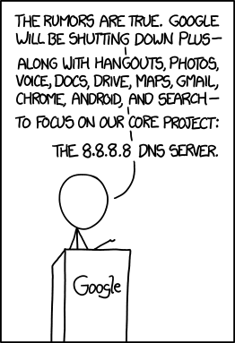

# Network

## Services

### DNS

Rule 53: If you can think of it, someone's done it in the DNS



#### Public DNS

A list of public DNS Servers

| Provider                                                                     | IPv4                              | IPv6                                                    | DNS over HTTPS & TLS                                                                                       |
|------------------------------------------------------------------------------|-----------------------------------|---------------------------------------------------------|------------------------------------------------------------------------------------------------------------|
| [AliDNS](https://alidns.com/)                                                | 223.5.5.5 / 223.6.6.6             |                                                         | [HTTPS](https://dns.alidns.com/dns-query), [TLS](tls://9999.alidns.com):                                   |
| [Alternate DNS](https://alternate-dns.com/)                                  | 198.101.242.72 / 23.253.163.53    | 2602:fcbc::ad / 2001:4800:780e:510:a8cf:392e:ff04:8982  | [HTTPS](https://dns.alternate-dns.com/dns-query), [TLS](tls://dns.alternate-dns.com)                       |
| [Cisco OpenDNS FamilyShield](https://www.opendns.com/cisco-opendns/)         | 208.67.222.123 / 208.67.220.123   | 2620:119:35::123 / 2620:119:53::123                     | [HTTPS](https://doh.familyshield.opendns.com/dns-query)                                                    |
| [Cisco OpenDNS Standards](https://www.opendns.com/cisco-opendns/)            | 208.67.222.222 / 208.67.220.220   | 2620:119:35::35 / 2620:119:53::53                       | [HTTPS](https://doh.opendns.com/dns-query)                                                                 |
| [CleanBrowsing Adult](https://cleanbrowsing.org/guides/)                     | 185.228.168.10 / 185.228.169.11   | 2a0d:2a00:1::1 / 2a0d:2a00:2::1                         | [HTTPS](https://adult-filter-dns.cleanbrowsing.org)                                                        |
| [CleanBrowsing Family](https://cleanbrowsing.org/guides/)                    | 185.228.168.168 / 185.228.169.168 | 2a0d:2a00:1:: / 2a0d:2a00:2::                           | [HTTPS](https://family-filter-dns.cleanbrowsing.org)                                                       |
| [CleanBrowsing Security](https://cleanbrowsing.org/guides/)                  | 185.228.168.9 / 185.228.169.9     | 2a0d:2a00:1::2 / 2a0d:2a00:2::2                         | [HTTPS](https://security-filter-dns.cleanbrowsing.org)                                                     |
| [Cloudflare](https://developers.cloudflare.com/1.1.1.1/)                     | 1.1.1.1 / 1.0.0.1                 | 2606:4700:4700::1111 / 2606:4700:4700::1001             | [HTTPS](https://1dot1dot1dot1.cloudflare-dns.com)                                                          |
| [Comodo DNS](https://securedns.dnsbycomodo.com/support/)                     | 8.26.56.26 / 8.20.247.20          | N/A                                                     | N/A                                                                                                        |
| [Comodo Secure Internet Gateway](https://securedns.dnsbycomodo.com/support/) | 8.26.56.10 / 8.20.247.10          | N/A                                                     | N/A                                                                                                        |
| [ControlD](https://controld.com) Uncensored                                  | 76.76.2.5 / 76.76.10.5            | 2606:1a40::5 / 2606:1a40:1::5                           | [HTTPS](https://freedns.controld.com/uncensored), [TLS](uncensored.freedns.controld.com)                   |
| [ControlD](https://controld.com) Filter                                      | 76.76.2.4 / 76.76.10.4            | 2606:1a40::4 / 2606:1a40:1::4                           | [HTTPS](https://freedns.controld.com/family), [TLS](family.freedns.controld.com)                           |
| [Digital Courage](https://digitalcourage.de/support/zensurfreier-dns-server) | 5.9.164.112 / 46.182.19.48        | 2a02:2970:1002::18                                      | [HTTPS](https://dns3.digitalcourage.de)                                                                    |
| [dns.watch](https://dns.watch/)                                              | 84.200.69.80 / 84.200.70.40       | 2001:1608:10:25::1c04:b12f / 2001:1608:10:25::9249:d69b | [HTTPS](https://resolver2.dns.watch/dns-query)                                                             |
| [Dyn DNS](https://help.dyn.com/internet-guide-setup/)                        | 216.146.35.35 / 216.146.36.36     | N/A                                                     | N/A                                                                                                        |
| [FreeDNS](https://freedns.zone)                                              | 172.104.237.57 / 37.235.1.177     | N/A                                                     | N/A                                                                                                        |
| [Google](https://developers.google.com/speed/public-dns/docs/using)          | 8.8.8.8 / 8.8.4.4                 | 2001:4860:4860::8888 / 2001:4860:4860::8844             | [HTTPS](https://dns.google), [TLS](tls://dns.google)                                                       |
| [Hurricane Electric](https://dns.he.net/)                                    | 74.82.42.42                       | 2001:470:20::2                                          | N/A                                                                                                        |
| [OpenNIC](https://servers.opennic.org/)                                      | 69.195.152.204 / 23.94.60.240     | N/A                                                     | N/A                                                                                                        |
| [Quad9](https://www.quad9.net/service/service-addresses-and-features/)       | 9.9.9.9 /  149.112.112.112        | 2620:fe::fe / 2620:fe::9                                | [HTTPS](https://dns11.quad9.net/dns-query), [TLS](tls://dns11.quad9.net)                                   |
| [UncensoredDNS](https://blog.uncensoreddns.org/dns-servers/)                 | 91.239.100.100 / 89.233.43.71     | 2001:67c:28a4:: / 2a01:3a0:53:53::                      | [HTTPS](https://anycast.uncensoreddns.org/dns-query), [HTTPS](https://unicast.uncensoreddns.org/dns-query) |
| [Yandex.DNS Standard](https://dns.yandex.com/)                               | 77.88.8.8 / 77.88.8.1             | N/A                                                     | N/A                                                                                                        |
| [Yandex.DNS Safe](https://dns.yandex.com/)                                   | 77.88.8.88 / 77.88.8.2            | N/A                                                     | N/A                                                                                                        |
| [Yandex.DNS Family](https://dns.yandex.com/)                                 | 77.88.8.7 / 77.88.8.3             | N/A                                                     | N/A                                                                                                        |

#### DDNS service

- [DuckDNS](https://www.duckdns.org/)
- [Cloudflare Tunnels](https://www.cloudflare.com/products/tunnel/)

#### DNS root zones

A list of [DNS root zones](https://www.iana.org/domains/root/servers):

| Hostname           | IPv4           | IPv6                | Operator                                                         |
|--------------------|----------------|---------------------|------------------------------------------------------------------|
| a.root-servers.net | 198.41.0.4     | 2001:503:ba3e::2:30 | Verisign Inc.                                                    |
| b.root-servers.net | 199.9.14.201   | 2001:500:200::b     | University of Southern California Information Sciences Institute |
| c.root-servers.net | 192.33.4.12    | 2001:500:2::c       | Cogent Communications                                            |
| d.root-servers.net | 199.7.91.13    | 2001:500:2d::d      | University of Maryland                                           |
| e.root-servers.net | 192.203.230.10 | 2001:500:a8::e      | NASA (Ames Research Center)                                      |
| f.root-servers.net | 192.5.5.241    | 2001:500:2f::f      | Internet Systems Consortium Inc.                                 |
| g.root-servers.net | 192.112.36.4   | 2001:500:12::d0d    | US Department of Defense (NIC)                                   |
| h.root-servers.net | 198.97.190.53  | 2001:500:1::53      | US Army (Research Lab)                                           |
| i.root-servers.net | 192.36.148.17  | 2001:7fe::53        | Netnod                                                           |
| j.root-servers.net | 192.58.128.30  | 2001:503:c27::2:30  | Verisign Inc.                                                    |
| k.root-servers.net | 193.0.14.129   | 2001:7fd::1         | RIPE NCC                                                         |
| l.root-servers.net | 199.7.83.42    | 2001:500:9f::42     | ICANN                                                            |
| m.root-servers.net | 202.12.27.33   | 2001:dc3::35        | WIDE Project                                                     |

#### More Services

DNS Services

- <https://www.rethinkdns.com/>
- [DNS toys](https://www.dns.toys) offers some handy utilites (time, conversions, weather)
- [NextDNS API](https://nextdns.github.io/api/)

DNS Provider

- <https://www.publicdns.xyz/>
- <https://public-dns.info/>
- <https://dns.google/>

Other Lists

- ISPs per country <https://www.nirsoft.net/countryip/>
- Root zones: <https://www.internic.net/domain/root.zone>
- Root Servers: <https://root-servers.org/>
- <https://www.numprotocol.com/>
- Rule 53: <https://github.com/pgl/rule53>


### NTP

```txt
.'`~~~~~~~~~~~`'.
(  .'11 12 1'.  )
|  :10 \|   2:  |
|  :9   @   3:  |
|  :8       4;  |
'. '..7 6 5..' .'
 ~-------------~ 
```

List of NTP Servers:

| Service                     | URL                            |     |
|-----------------------------|--------------------------------|-----|
| apple                       | time.apple.com                 |     |
| apple                       | time.euro.apple.com            |     |
| apple                       | time1.apple.com                |     |
| apple                       | time2.apple.com                |     |
| apple                       | time3.apple.com                |     |
| apple                       | time4.apple.com                |     |
| apple                       | time5.apple.com                |     |
| apple                       | time6.apple.com                |     |
| apple                       | time7.apple.com                |     |
| AWS                         | time.aws.com                   |     |
| berkeley                    | ntp1.net.berkeley.edu          |     |
| berkeley                    | ntp2.net.berkeley.edu          |     |
| cenam                       | cronos.cenam.mx                |     |
| Chinese Academy of Sciences | ntp.ntsc.ac.cn                 |     |
| cloudflare                  | time.cloudflare.com            |     |
| colby                       | ntp.colby.edu                  |     |
| colorado                    | utcnist2.colorado.edu          |     |
| columbia                    | gnomon.cc.columbia.edu         |     |
| dianacht                    | ntp.dianacht.de                |     |
| edu.cn                      | ntp.neu.edu.cn                 |     |
| ehu                         | ntp.i2t.ehu.eus                |     |
| esa                         | time.esa.int                   |     |
| esa                         | time1.esa.int                  |     |
| EWETel                      | ntp0.ewetel.de                 |     |
| EWETel                      | ntp1.ewetel.de                 |     |
| facebook                    | time.facebook.com              |     |
| facebook                    | time1.facebook.com             |     |
| facebook                    | time2.facebook.com             |     |
| facebook                    | time3.facebook.com             |     |
| facebook                    | time4.facebook.com             |     |
| facebook                    | time5.facebook.com             |     |
| fau                         | ntp1.fau.de                    |     |
| fau                         | ntp2.fau.de                    |     |
| Freenet                     | ntp0.freenet.de                |     |
| Freenet                     | ntp1.freenet.de                |     |
| fu-berlin                   | time.fu-berlin.de              |     |
| fu-berlin                   | zeit.fu-berlin.de              |     |
| gatech                      | navobs1.gatech.edu             |     |
| Georgia State University    | ntp.gsu.edu                    |     |
| google                      | time.google.com               |     |
| google                      | time1.google.com               |     |
| google                      | time2.google.com               |     |
| google                      | time3.google.com               |     |
| google                      | time4.google.com               |     |
| gum                         | tempus1.gum.gov.pl             |     |
| gum                         | tempus2.gum.gov.pl             |     |
| he                          | clock.nyc.he.net               |     |
| he                          | clock.sjc.he.net               |     |
| hea                         | ntp-galway.hea.net             |     |
| Hetzner                     | ntp1.hetzner.de                |     |
| Hetzner                     | ntp2.hetzner.de                |     |
| Hetzner                     | ntp3.hetzner.de                |     |
| iiss                        | asynchronos.iiss.at            |     |
| in.ua                       | ntp.time.in.ua                 |     |
| in.ua                       | ntp2.time.in.ua                |     |
| in.ua                       | ntp3.time.in.ua                |     |
| inrim                       | ntp1.inrim.it                  |     |
| inrim                       | ntp2.inrim.it                  |     |
| INTERNET MULTIFEED CO.      | ntp1.jst.mfeed.ad.jp           |     |
| INTERNET MULTIFEED CO.      | ntp2.jst.mfeed.ad.jp           |     |
| INTERNET MULTIFEED CO.      | ntp3.jst.mfeed.ad.jp           |     |
| isc                         | clock.isc.org (prev ntp.isc.o  | rg) |
| isi                         | timekeeper.isi.edu             |     |
| Kantonsschule Zug           | ntp0.as34288.net               |     |
| Kantonsschule Zug           | ntp1.as34288.net               |     |
| layer42                     | gps.layer42.net                |     |
| lcf                         | ntp.lcf.mx                     |     |
| liu                         | timehost.lysator.liu.se        |     |
| microsoft                   | time.windows.com               |     |
| mobatime                    | ntp.mobatime.ru                |     |
| MSK-IX                      | ntp.ix.ru                      |     |
| mta                         | ntp.atomki.mta.hu              |     |
| Nat Morris                  | ntp.nat.ms                     |     |
| neel                        | ntp.neel.ch                    |     |
| netbone-digital             | ntpstm.netbone-digital.com     |     |
| Netnod                      | ntp.se                         |     |
| Netnod Göteborg             | gbg1.ntp.se                    |     |
| Netnod Göteborg             | gbg2.ntp.se                    |     |
| Netnod Malmö                | mmo1.ntp.se                    |     |
| Netnod Malmö                | mmo2.ntp.se                    |     |
| nic                         | ntp.nic.cz                     |     |
| nict                        | ntp.nict.jp                    |     |
| nict                        | ntp.nict.jp                    |     |
| nist                        | time-a-b.nist.gov              |     |
| nist                        | time-a-g.nist.gov              |     |
| nist                        | time-a-wwv.nist.gov            |     |
| nist                        | time-b-b.nist.gov              |     |
| nist                        | time-b-g.nist.gov              |     |
| nist                        | time-b-wwv.nist.gov            |     |
| nist                        | time-c-b.nist.gov              |     |
| nist                        | time-c-g.nist.gov              |     |
| nist                        | time-c-wwv.nist.gov            |     |
| nist                        | time-d-b.nist.gov              |     |
| nist                        | time-d-g.nist.gov              |     |
| nist                        | time-d-wwv.nist.gov            |     |
| nist                        | time.nist.gov                  |     |
| nist                        | utcnist.colorado.edu           |     |
| nist                        | utcnist2.colorado.edu          |     |
| nrc                         | time.nrc.ca                    |     |
| NSU                         | ntp.nsu.ru                     |     |
| NTP Pool                    | 0.amazon.pool.ntp.org          |     |
| NTP Pool                    | 0.android.pool.ntp.org         |     |
| NTP Pool                    | 0.arch.pool.ntp.org            |     |
| NTP Pool                    | 0.asia.pool.ntp.org            |     |
| NTP Pool                    | 0.askozia.pool.ntp.org         |     |
| NTP Pool                    | 0.centos.pool.ntp.org          |     |
| NTP Pool                    | 0.debian.pool.ntp.org          |     |
| NTP Pool                    | 0.dragonfly.pool.ntp.org       |     |
| NTP Pool                    | 0.europe.pool.ntp.org          |     |
| NTP Pool                    | 0.fedora.pool.ntp.org          |     |
| NTP Pool                    | 0.freebsd.pool.ntp.org         |     |
| NTP Pool                    | 0.gentoo.pool.ntp.org          |     |
| NTP Pool                    | 0.netbsd.pool.ntp.org          |     |
| NTP Pool                    | 0.openbsd.pool.ntp.org         |     |
| NTP Pool                    | 0.opensuse.pool.ntp.org        |     |
| NTP Pool                    | 0.opnsense.pool.ntp.org        |     |
| NTP Pool                    | 0.pfsense.pool.ntp.org         |     |
| NTP Pool                    | 0.pool.ntp.org                 |     |
| NTP Pool                    | 0.ru.pool.ntp.org              |     |
| NTP Pool                    | 0.smartos.pool.ntp.org         |     |
| NTP Pool                    | 1.amazon.pool.ntp.org          |     |
| NTP Pool                    | 1.android.pool.ntp.org         |     |
| NTP Pool                    | 1.arch.pool.ntp.org            |     |
| NTP Pool                    | 1.asia.pool.ntp.org            |     |
| NTP Pool                    | 1.askozia.pool.ntp.org         |     |
| NTP Pool                    | 1.centos.pool.ntp.org          |     |
| NTP Pool                    | 1.debian.pool.ntp.org          |     |
| NTP Pool                    | 1.dragonfly.pool.ntp.org       |     |
| NTP Pool                    | 1.europe.pool.ntp.org          |     |
| NTP Pool                    | 1.fedora.pool.ntp.org          |     |
| NTP Pool                    | 1.freebsd.pool.ntp.org         |     |
| NTP Pool                    | 1.gentoo.pool.ntp.org          |     |
| NTP Pool                    | 1.netbsd.pool.ntp.org          |     |
| NTP Pool                    | 1.openbsd.pool.ntp.org         |     |
| NTP Pool                    | 1.opensuse.pool.ntp.org        |     |
| NTP Pool                    | 1.opnsense.pool.ntp.org        |     |
| NTP Pool                    | 1.pfsense.pool.ntp.org         |     |
| NTP Pool                    | 1.pool.ntp.org                 |     |
| NTP Pool                    | 1.ru.pool.ntp.org              |     |
| NTP Pool                    | 1.smartos.pool.ntp.org         |     |
| NTP Pool                    | 2.amazon.pool.ntp.org          |     |
| NTP Pool                    | 2.android.pool.ntp.org         |     |
| NTP Pool                    | 2.arch.pool.ntp.org            |     |
| NTP Pool                    | 2.asia.pool.ntp.org            |     |
| NTP Pool                    | 2.askozia.pool.ntp.org         |     |
| NTP Pool                    | 2.centos.pool.ntp.org          |     |
| NTP Pool                    | 2.debian.pool.ntp.org          |     |
| NTP Pool                    | 2.dragonfly.pool.ntp.org       |     |
| NTP Pool                    | 2.europe.pool.ntp.org          |     |
| NTP Pool                    | 2.fedora.pool.ntp.org          |     |
| NTP Pool                    | 2.freebsd.pool.ntp.org         |     |
| NTP Pool                    | 2.gentoo.pool.ntp.org          |     |
| NTP Pool                    | 2.netbsd.pool.ntp.org          |     |
| NTP Pool                    | 2.openbsd.pool.ntp.org         |     |
| NTP Pool                    | 2.opensuse.pool.ntp.org        |     |
| NTP Pool                    | 2.opnsense.pool.ntp.org        |     |
| NTP Pool                    | 2.pfsense.pool.ntp.org         |     |
| NTP Pool                    | 2.pool.ntp.org                 |     |
| NTP Pool                    | 2.ru.pool.ntp.org              |     |
| NTP Pool                    | 2.smartos.pool.ntp.org         |     |
| NTP Pool                    | 3.amazon.pool.ntp.org          |     |
| NTP Pool                    | 3.android.pool.ntp.org         |     |
| NTP Pool                    | 3.arch.pool.ntp.org            |     |
| NTP Pool                    | 3.asia.pool.ntp.org            |     |
| NTP Pool                    | 3.askozia.pool.ntp.org         |     |
| NTP Pool                    | 3.centos.pool.ntp.org          |     |
| NTP Pool                    | 3.debian.pool.ntp.org          |     |
| NTP Pool                    | 3.dragonfly.pool.ntp.org       |     |
| NTP Pool                    | 3.europe.pool.ntp.org          |     |
| NTP Pool                    | 3.fedora.pool.ntp.org          |     |
| NTP Pool                    | 3.freebsd.pool.ntp.org         |     |
| NTP Pool                    | 3.gentoo.pool.ntp.org          |     |
| NTP Pool                    | 3.netbsd.pool.ntp.org          |     |
| NTP Pool                    | 3.openbsd.pool.ntp.org         |     |
| NTP Pool                    | 3.opensuse.pool.ntp.org        |     |
| NTP Pool                    | 3.opnsense.pool.ntp.org        |     |
| NTP Pool                    | 3.pfsense.pool.ntp.org         |     |
| NTP Pool                    | 3.pool.ntp.org                 |     |
| NTP Pool                    | 3.ru.pool.ntp.org              |     |
| NTP Pool                    | 3.smartos.pool.ntp.org         |     |
| NTP Pool                    | asia.pool.ntp.org              |     |
| NTP Pool                    | europe.pool.ntp.org            |     |
| NTP Pool                    | pool.ntp.org                   |     |
| NTP Pool                    | ru.pool.ntp.org                |     |
| NTT                         | x.ns.gin.ntt.net               |     |
| NTT                         | y.ns.gin.ntt.net               |     |
| oar                         | navobs1.oar.net                |     |
| okstate                     | now.okstate.edu                |     |
| oma                         | ntp1.oma.be                    |     |
| oma                         | ntp2.oma.be                    |     |
| ona                         | ntp1.ona.org                   |     |
| planeacion                  | sesku.planeacion.net           |     |
| psu                         | otc1.psu.edu                   |     |
| ptb                         | ptbtime1.ptb.de                |     |
| ptb                         | ptbtime1.ptb.de                |     |
| ptb                         | ptbtime2.ptb.de                |     |
| ptb                         | ptbtime2.ptb.de                |     |
| ptb                         | ptbtime3.ptb.de                |     |
| QiX NTP                     | ntp.qix.ca                     |     |
| QiX NTP                     | ntp1.qix.ca                    |     |
| QiX NTP                     | ntp2.qix.ca                    |     |
| RIPE                        | ntp.ripe.net                   |     |
| roa                         | hora.roa.es                    |     |
| roa                         | minuto.roa.es                  |     |
| RSU                         | ntp.rsu.edu.ru                 |     |
| shoa                        | ntp.shoa.cl                    |     |
| Stockholm                   | sth1.ntp.se                    |     |
| Stockholm                   | sth2.ntp.se                    |     |
| stratum                     | ntp1.stratum1.ru               |     |
| stratum                     | ntp2.stratum1.ru               |     |
| stratum                     | ntp2.stratum2.ru               |     |
| stratum                     | ntp3.stratum1.ru               |     |
| stratum                     | ntp3.stratum2.ru               |     |
| stratum                     | ntp4.stratum1.ru               |     |
| stratum                     | ntp4.stratum2.ru               |     |
| stratum                     | ntp5.stratum1.ru               |     |
| stratum                     | ntp5.stratum2.ru               |     |
| stupi                       | time1.stupi.se                 |     |
| stygium                     | ntp-ca.stygium.net             |     |
| Sundsvall                   | svl1.ntp.se                    |     |
| Sundsvall                   | svl2.ntp.se                    |     |
| surfnet                     | chime1.surfnet.nl              |     |
| symmetricom                 | nist1.symmetricom.com          |     |
| T-Online                    | ntp1.t-online.de               |     |
| timegps                     | t2.timegps.net                 |     |
| TimeNL/SIDN Labs            | ntp.time.nl (ntp1.time.nl)     |     |
| Trabia                      | time-a.as43289.net             |     |
| Trabia                      | time-b.as43289.net             |     |
| Trabia                      | time-c.as43289.net             |     |
| TRC Fiord                   | ntp.fiord.ru                   |     |
| tu-berlin                   | ntps1-0.cs.tu-berlin.de        |     |
| tu-berlin                   | ntps1-1.cs.tu-berlin.de        |     |
| udel                        | mizbeaver.udel.edu             |     |
| udel                        | rackety.udel.edu               |     |
| ufe                         | time.ufe.cz                    |     |
| ufl                         | ntp-s1.cise.ufl.edu            |     |
| ufrj                        | ntps1.pads.ufrj.br             |     |
| umk                         | ntp.fizyka.umk.pl              |     |
| uni-erlangen                | ntps1-0.uni-erlangen.de        |     |
| uni-erlangen                | ntps1-1.uni-erlangen.de        |     |
| uni-stuttgart               | rustime01.rus.uni-stuttgart.de |     |
| uni-stuttgart               | rustime02.rus.uni-stuttgart.de |     |
| University of Saskatchewan  | tick.usask.ca                  |     |
| University of Saskatchewan  | tock.usask.ca                  |     |
| uregina                     | clock.uregina.ca               |     |
| US Navy                     | ntp2.usno.navy.mil             |     |
| US Navy                     | tick.usno.navy.mil             |     |
| US Navy                     | tock.usno.navy.mil             |     |
| usv                         | ntp1.usv.ro                    |     |
| usv                         | ntp3.usv.ro                    |     |
| uu                          | ntp0.nl.uu.net                 |     |
| uu                          | ntp1.nl.uu.net                 |     |
| Versatel                    | ntp1.versatel.net              |     |
| Versatel                    | ntp2.versatel.net              |     |
| Versatel                    | time.versatel.de               |     |
| VNIIFTRI                    | ntp1.niiftri.irkutsk.ru        |     |
| VNIIFTRI                    | ntp1.vniiftri.ru               |     |
| VNIIFTRI                    | ntp2.niiftri.irkutsk.ru        |     |
| VNIIFTRI                    | ntp2.vniiftri.ru               |     |
| VNIIFTRI                    | ntp21.vniiftri.ru              |     |
| VNIIFTRI                    | ntp3.vniiftri.ru               |     |
| VNIIFTRI                    | ntp4.vniiftri.ru               |     |
| VNIIFTRI                    | vniiftri.khv.ru                |     |
| VNIIFTRI                    | vniiftri2.khv.ru               |     |
| vsl                         | ntp.vsl.nl                     |     |
| Web.de                      | ntp.web.de                     |     |
| wustl                       | navobs1.wustl.edu              |     |
| YYCIX                       | ntp.yycix.ca                   |     |


## Ports

<http://www.iana.org/assignments/service-names-port-numbers/service-names-port-numbers.xhtml>
<https://en.wikipedia.org/wiki/List_of_TCP_and_UDP_port_numbers>

## Subnet

### IPv4

| CIDR | Subnet          | Addresses  | Wildcard      |
|------|-----------------|------------|---------------|
| /32  | 255.255.255.255 | 1          | 0.0.0.0       |
| /31  | 255.255.255.254 | 2          | 0.0.0.1       |
| /30  | 255.255.255.252 | 4          | 0.0.0.3       |
| /29  | 255.255.255.248 | 8          | 0.0.0.7       |
| /28  | 255.255.255.240 | 16         | 0.0.0.15      |
| /27  | 255.255.255.224 | 32         | 0.0.0.31      |
| /26  | 255.255.255.192 | 64         | 0.0.0.63      |
| /25  | 255.255.255.128 | 128        | 0.0.0.127     |
| /24  | 255.255.255.0   | 256        | 0.0.0.255     |
| /23  | 255.255.254.0   | 512        | 0.0.1.255     |
| /22  | 255.255.252.0   | 1024       | 0.0.3.255     |
| /21  | 255.255.248.0   | 2048       | 0.0.7.255     |
| /20  | 255.255.240.0   | 4096       | 0.0.15.255    |
| /19  | 255.255.224.0   | 8192       | 0.0.31.255    |
| /18  | 255.255.192.0   | 16,384     | 0.0.63.255    |
| /17  | 255.255.128.0   | 32,768     | 0.0.127.255   |
| /16  | 255.255.0.0     | 65,536     | 0.0.255.255   |
| /15  | 255.254.0.0     | 131,072    | 0.1.255.255   |
| /14  | 255.252.0.0     | 262,144    | 0.3.255.255   |
| /13  | 255.248.0.0     | 524,288    | 0.7.255.255   |
| /12  | 255.240.0.0     | 1,048,576  | 0.15.255.255  |
| /11  | 255.224.0.0     | 2,097,152  | 0.31.255.255  |
| /10  | 255.192.0.0     | 4,194,304  | 0.63.255.255  |
| /9   | 255.128.0.0     | 8,388,608  | 0.127.255.255 |
| /8   | 255.0.0.0       | 16,777,216 | 0.255.255.255 |

### IPv6

| Prefix | /48  | /56  | /64  | /127     | # Addresses |
|--------|------|------|------|----------|-------------|
| /24    | 16M  | 4G   | 1T   | 8388608Y | 16777216Y   |
| /25    | 8M   | 2G   | 512G | 4194304Y | 8388608Y    |
| /26    | 4M   | 1G   | 256G | 2097152Y | 4194304Y    |
| /27    | 2M   | 512M | 128G | 1048576Y | 2097152Y    |
| /28    | 1M   | 256M | 64G  | 524288Y  | 1048576Y    |
| /29    | 512K | 128M | 32G  | 262144Y  | 524288Y     |
| /30    | 256K | 64M  | 16G  | 131072Y  | 262144Y     |
| /31    | 128K | 32M  | 8G   | 65536Y   | 131072Y     |
| /32    | 64K  | 16M  | 4G   | 32768Y   | 65536Y      |
| /33    | 32K  | 8M   | 2G   | 16384Y   | 32768Y      |
| /34    | 16K  | 4M   | 1G   | 8192Y    | 16384Y      |
| /35    | 8K   | 2M   | 512M | 4096Y    | 8192Y       |
| /36    | 4K   | 1M   | 256M | 2048Y    | 4096Y       |
| /37    | 2K   | 512K | 128M | 1024Y    | 2048Y       |
| /38    | 1K   | 256K | 64M  | 512Y     | 1024Y       |
| /39    | 512  | 128K | 32M  | 256Y     | 512Y        |
| /40    | 256  | 64K  | 16M  | 128Y     | 256Y        |
| /41    | 128  | 32K  | 8M   | 64Y      | 128Y        |
| /42    | 64   | 16K  | 4M   | 32Y      | 64Y         |
| /43    | 32   | 8K   | 2M   | 16Y      | 32Y         |
| /44    | 16   | 4K   | 1M   | 8Y       | 16Y         |
| /45    | 8    | 2K   | 512K | 4Y       | 8Y          |
| /46    | 4    | 1K   | 256K | 2Y       | 4Y          |
| /47    | 2    | 512  | 128K | 1Y       | 2Y          |
| /48    | 1    | 256  | 64K  | 512Z     | 1Y          |
| /49    |      | 128  | 32K  | 256Z     | 512Z        |
| /50    |      | 64   | 16K  | 128Z     | 256Z        |
| /51    |      | 32   | 8K   | 64Z      | 128Z        |
| /52    |      | 16   | 4K   | 32Z      | 64Z         |
| /53    |      | 8    | 2K   | 16Z      | 32Z         |
| /54    |      | 4    | 1K   | 8Z       | 16Z         |
| /55    |      | 2    | 512  | 4Z       | 8Z          |
| /56    |      | 1    | 256  | 2Z       | 4Z          |
| /57    |      |      | 128  | 1Z       | 2Z          |
| /58    |      |      | 64   | 512E     | 1Z          |
| /59    |      |      | 32   | 256E     | 512E        |
| /60    |      |      | 16   | 128E     | 256E        |
| /61    |      |      | 8    | 64E      | 128E        |
| /62    |      |      | 4    | 32E      | 64E         |
| /63    |      |      | 2    | 16E      | 32E         |
| /64    |      |      | 1    | 8E       | 16E         |

## IP addresses

The IETF has reserved the address block of 192.0.0.0/24 for use for special purposes relating to protocol assignments. This registry contains the current assignments made by the IETF from this address block. Address prefixes listed in the Special-Purpose Address Registry are not guaranteed routability in any particular local or global context. Source: <https://www.iana.org/assignments/iana-ipv4-special-registry/iana-ipv4-special-registry.xhtml>

|        Address Block #         |                  Name #                   |                 RFC #                 | Allocation Date # | Termination Date # |
|:------------------------------:|:-----------------------------------------:|:-------------------------------------:|:-----------------:|:------------------:|
|           0.0.0.0/8            |              "This network"               |         [RFC791], Section 3.2         |      1981-09      |        N/A         |
|           0.0.0.0/32           |        "This host on this network"        |      [RFC1122], Section 3.2.1.3       |      1981-09      |        N/A         |
|           10.0.0.0/8           |                Private-Use                |               [RFC1918]               |      1996-02      |        N/A         |
|         100.64.0.0/10          |           Shared Address Space            |               [RFC6598]               |      2012-04      |        N/A         |
|          127.0.0.0/8           |                 Loopback                  |      [RFC1122], Section 3.2.1.3       |      1981-09      |        N/A         |
|         169.254.0.0/16         |                Link Local                 |               [RFC3927]               |      2005-05      |        N/A         |
|         172.16.0.0/12          |                Private-Use                |               [RFC1918]               |      1996-02      |        N/A         |
|        192.0.0.0/24 [2]        |         IETF Protocol Assignments         |        [RFC6890], Section 2.1         |      2010-01      |        N/A         |
|          192.0.0.0/29          |      IPv4 Service Continuity Prefix       |               [RFC7335]               |      2011-06      |        N/A         |
|          192.0.0.8/32          |            IPv4 dummy address             |               [RFC7600]               |      2015-03      |        N/A         |
|          192.0.0.9/32          |       Port Control Protocol Anycast       |               [RFC7723]               |      2015-10      |        N/A         |
|         192.0.0.10/32          | Traversal Using Relays around NAT Anycast |               [RFC8155]               |      2017-02      |        N/A         |
| 192.0.0.170/32, 192.0.0.171/32 |           NAT64/DNS64 Discovery           |    [RFC8880][RFC7050], Section 2.2    |      2013-02      |        N/A         |
|          192.0.2.0/24          |        Documentation (TEST-NET-1)         |               [RFC5737]               |      2010-01      |        N/A         |
|        192.31.196.0/24         |                 AS112-v4                  |               [RFC7535]               |      2014-12      |        N/A         |
|        192.52.193.0/24         |                    AMT                    |               [RFC7450]               |      2014-12      |        N/A         |
|         192.88.99.0/24         |      Deprecated (6to4 Relay Anycast)      |               [RFC7526]               |      2001-06      |      2015-03       |
|         192.168.0.0/16         |                Private-Use                |               [RFC1918]               |      1996-02      |        N/A         |
|        192.175.48.0/24         |      Direct Delegation AS112 Service      |               [RFC7534]               |      1996-01      |        N/A         |
|         198.18.0.0/15          |               Benchmarking                |               [RFC2544]               |      1999-03      |        N/A         |
|        198.51.100.0/24         |        Documentation (TEST-NET-2)         |               [RFC5737]               |      2010-01      |        N/A         |
|         203.0.113.0/24         |        Documentation (TEST-NET-3)         |               [RFC5737]               |      2010-01      |        N/A         |
|          240.0.0.0/4           |                 Reserved                  |         [RFC1112], Section 4          |      1989-08      |        N/A         |
|       255.255.255.255/32       |             Limited Broadcast             | [RFC8190]         [RFC919], Section 7 |      1984-10      |        N/A         |

Further, useful lists:

- [IPv4 Blocks](https://en.wikipedia.org/wiki/List_of_assigned_/8_IPv4_address_blocks)
- [Reserved IP Addresses](https://en.wikipedia.org/wiki/Reserved_IP_addresses)
- [IP ranges by country](https://github.com/herrbischoff/country-ip-blocks)
- [Cybercrime IP Feed](https://iplists.firehol.org/)

### IPv4 possible notations

All possible notations of the IPv4 address 8.8.8.8 ([source](https://lucb1e.com/randomprojects/php/funnip.php?ip=8.8.8.8))

- 8.8.8.8
- 134744072
- 0x8080808
- 01002004010
- 8.526344
- 8.0x80808
- 8.02004010
- 8.8.2056
- 8.8.0x808
- 8.8.04010
- 8.8.8.0x8
- 8.8.8.010
- 8.8.0x8.8
- 8.8.0x8.0x8
- 8.8.0x8.010
- 8.8.010.8
- 8.8.010.0x8
- 8.8.010.010
- 8.0x8.2056
- 8.0x8.0x808
- 8.0x8.04010
- 8.0x8.8.8
- 8.0x8.8.0x8
- 8.0x8.8.010
- 8.0x8.0x8.8
- 8.0x8.0x8.0x8
- 8.0x8.0x8.010
- 8.0x8.010.8
- 8.0x8.010.0x8
- 8.0x8.010.010
- 8.010.2056
- 8.010.0x808
- 8.010.04010
- 8.010.8.8
- 8.010.8.0x8
- 8.010.8.010
- 8.010.0x8.8
- 8.010.0x8.0x8
- 8.010.0x8.010
- 8.010.010.8
- 8.010.010.0x8
- 8.010.010.010
- 0x8.526344
- 0x8.0x80808
- 0x8.02004010
- 0x8.8.2056
- 0x8.8.0x808
- 0x8.8.04010
- 0x8.8.8.8
- 0x8.8.8.0x8
- 0x8.8.8.010
- 0x8.8.0x8.8
- 0x8.8.0x8.0x8
- 0x8.8.0x8.010
- 0x8.8.010.8
- 0x8.8.010.0x8
- 0x8.8.010.010
- 0x8.0x8.2056
- 0x8.0x8.0x808
- 0x8.0x8.04010
- 0x8.0x8.8.8
- 0x8.0x8.8.0x8
- 0x8.0x8.8.010
- 0x8.0x8.0x8.8
- 0x8.0x8.0x8.0x8
- 0x8.0x8.0x8.010
- 0x8.0x8.010.8
- 0x8.0x8.010.0x8
- 0x8.0x8.010.010
- 0x8.010.2056
- 0x8.010.0x808
- 0x8.010.04010
- 0x8.010.8.8
- 0x8.010.8.0x8
- 0x8.010.8.010
- 0x8.010.0x8.8
- 0x8.010.0x8.0x8
- 0x8.010.0x8.010
- 0x8.010.010.8
- 0x8.010.010.0x8
- 0x8.010.010.010
- 010.526344
- 010.0x80808
- 010.02004010
- 010.8.2056
- 010.8.0x808
- 010.8.04010
- 010.8.8.8
- 010.8.8.0x8
- 010.8.8.010
- 010.8.0x8.8
- 010.8.0x8.0x8
- 010.8.0x8.010
- 010.8.010.8
- 010.8.010.0x8
- 010.8.010.010
- 010.0x8.2056
- 010.0x8.0x808
- 010.0x8.04010
- 010.0x8.8.8
- 010.0x8.8.0x8
- 010.0x8.8.010
- 010.0x8.0x8.8
- 010.0x8.0x8.0x8
- 010.0x8.0x8.010
- 010.0x8.010.8
- 010.0x8.010.0x8
- 010.0x8.010.010
- 010.010.2056
- 010.010.0x808
- 010.010.04010
- 010.010.8.8
- 010.010.8.0x8
- 010.010.8.010
- 010.010.0x8.8
- 010.010.0x8.0x8
- 010.010.0x8.010
- 010.010.010.8
- 010.010.010.0x8
- 010.010.010.010

## TTL as OS identifier

There is a chance to guess the OS based on its TTL.

Here is an overview:

| OS                | Version               | Protocol     | TTL |
|-------------------|-----------------------|--------------|-----|
| *nix (Linux/Unix) |                       |              | 64  |
| AIX               | 3.2, 4.1              | ICMP         | 255 |
| AIX               |                       | TCP          | 60  |
| AIX               |                       | UDP          | 30  |
| BSDI              | BSD/OS 3.1 and 4.0    | ICMP         | 255 |
| Cisco             |                       | ICMP         | 254 |
| Compa             | Tru64 v5.0            | ICMP         | 64  |
| DEC Pathworks     | V5                    | TCP and UDP  | 30  |
| Foundry           |                       | ICMP         | 64  |
| FreeBSD           | 5                     | ICMP         | 64  |
| FreeBSD           | 3.4, 4.0              | ICMP         | 255 |
| FreeBSD           | 2.1R                  | TCP and UDP  | 64  |
| HP-UX             | 9.0x                  | TCP and UDP  | 30  |
| HP-UX             | 11                    | ICMP         | 255 |
| HP-UX             | 11                    | TCP          | 64  |
| HP-UX             | 10.2                  | ICMP         | 255 |
| HP-UX             | 10.01                 | TCP and UDP  | 64  |
| Irix              | 6.x                   | TCP and UDP  | 60  |
| Irix              | 6.5.3, 6.5.8          | ICMP         | 255 |
| Irix              | 5.3                   | TCP and UDP  | 60  |
| Linux             | Red Hat 9             | ICMP and TCP | 64  |
| Linux             | 2.4 kernel            | ICMP         | 255 |
| Linux             | 2.2.14 kernel         | ICMP         | 255 |
| Linux             | 2.0.x kernel          | ICMP         | 64  |
| MPE/IX (HP)       |                       | ICMP         | 200 |
| MacOS/MacTCP      | X (10.5.6)            | ICMP/TCP/UDP | 64  |
| MacOS/MacTCP      | 2.0.x                 | TCP and UDP  | 60  |
| NetBSD            |                       | ICMP         | 255 |
| Netgear FVG318    |                       | ICMP and UDP | 64  |
| OS/2              |                       | TCP/IP 3.0   | 64  |
| OSF/1             | V3.2A                 | TCP          | 60  |
| OSF/1             | V3.2A                 | UDP          | 30  |
| OpenBSD           | 2.6 & 2.7             | ICMP         | 255 |
| OpenVMS           | 07.01.2002            | ICMP         | 255 |
| Solaris           | 2.8                   | TCP          | 64  |
| Solaris           | 2.5.1, 2.6, 2.7, 2.8  | ICMP         | 255 |
| Solaris/AIX       |                       |              | 254 |
| Stratus           | TCP_OS (14.3+)        | TCP and UDP  | 64  |
| Stratus           | TCP_OS (14.2-)        | TCP and UDP  | 30  |
| Stratus           | TCP_OS                | ICMP         | 255 |
| Stratus           | STCP                  | ICMP/TCP/UDP | 60  |
| SunOS             | 5.7                   | ICMP and TCP | 255 |
| SunOS             | 4.1.3/4.1.4           | TCP and UDP  | 60  |
| Ultrix            | V4.2 – 4.5            | ICMP         | 255 |
| Ultrix            | V4.1/V4.2A            | TCP          | 60  |
| Ultrix            | V4.1/V4.2A            | UDP          | 30  |
| VMS/Multinet      |                       | TCP and UDP  | 64  |
| VMS/TCPware       |                       | TCP          | 60  |
| VMS/TCPware       |                       | UDP          | 64  |
| VMS/UCX           |                       | TCP and UDP  | 128 |
| VMS/Wollongong    | 1.1.1.1               | TCP          | 128 |
| VMS/Wollongong    | 1.1.1.1               | UDP          | 30  |
| Windows           | for Workgroups        | TCP and UDP  | 32  |
| Windows           | XP                    | ICMP/TCP/UDP | 128 |
| Windows           | Vista                 | ICMP/TCP/UDP | 128 |
| Windows           | Server 2008           | ICMP/TCP/UDP | 128 |
| Windows           | Server 2003           |              | 128 |
| Windows           | NT 4.0 SP6+           |              | 128 |
| Windows           | NT 4.0 SP5-           |              | 32  |
| Windows           | NT 4.0                | TCP and UDP  | 128 |
| Windows           | NT 4 WRKS SP 3, SP 6a | ICMP         | 128 |
| Windows           | NT 4 Server SP4       | ICMP         | 128 |
| Windows           | NT 3.51               | TCP and UDP  | 32  |
| Windows           | ME                    | ICMP         | 128 |
| Windows           | 98, 98 SE             | ICMP         | 128 |
| Windows           | 98                    | ICMP         | 32  |
| Windows           | 98                    | TCP          | 128 |
| Windows           | 95                    | TCP and UDP  | 32  |
| Windows           | 7                     | ICMP/TCP/UDP | 128 |
| Windows           | 2000 pro              | ICMP/TCP/UDP | 128 |
| Windows           | 2000 family           | ICMP         | 128 |
| Windows           | 10                    | ICMP/TCP/UDP | 128 |
| Windows           |                       |              | 128 |
| juniper           |                       | ICMP         | 64  |
