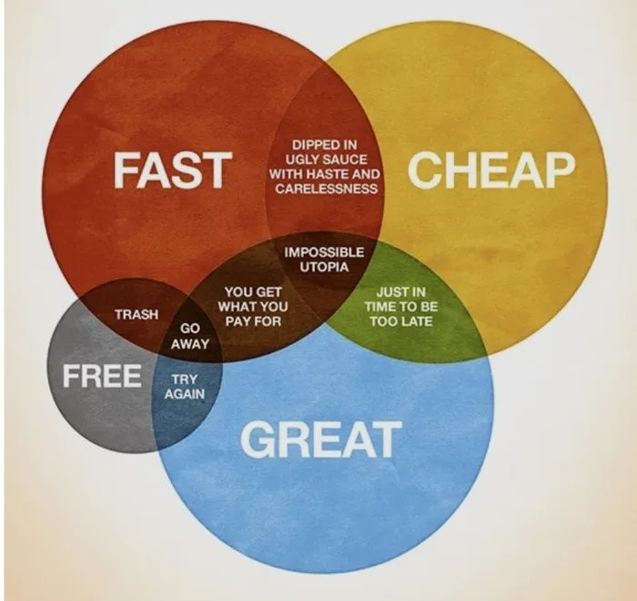
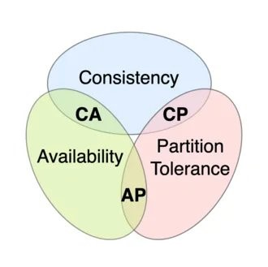
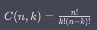
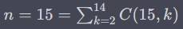

# Projects

Most of the time, there are projects that need to be done by a data and projects that need to be done to a spec. Figure out what project you are working on. Choose two of the three constraints shown below and choose the best framework that seems to fit best:

Choosing the correct project management process depends on the specific requirements of your project, team, and organization. To make the best decision, consider the following factors:

- Project complexity and scope: Assess the overall complexity and scope of your project. Waterfall works well for simpler projects with well-defined requirements, while Scrum and Kanban are better suited for more complex projects with changing requirements.
- Flexibility: Determine how flexible your project needs to be. Scrum and Kanban allow for adaptability and continuous improvement, while Waterfall follows a more rigid structure.
- Team size and skill-set: Consider the size of your team and their individual skills. Scrum works well for small to medium-sized teams with cross-functional skill-sets, while Kanban can be more suitable for larger teams or those with specialized roles.
- Time constraints: Evaluate the timeline of your project. If you have tight deadlines or need a faster time to market, Scrum or Kanban might be more suitable due to their iterative nature. Waterfall can take longer to complete due to its sequential structure.
- Stakeholder involvement: Determine the level of stakeholder involvement required for your project. Scrum encourages frequent communication and collaboration between team members and stakeholders, while Waterfall and Kanban can be more focused on individual tasks and progress.
- Communication and collaboration: Assess your team's communication and collaboration capabilities. Scrum and Kanban emphasize frequent communication, while Waterfall relies more on documentation.
- Risk management: Consider the level of risk associated with your project. Agile methods like Scrum and Kanban allow for better risk management due to their iterative approach, while Waterfall may not handle unexpected changes as effectively.
- Organizational culture: Analyze your organization's culture and its openness to change. Agile methodologies like Scrum and Kanban require a collaborative and adaptive mindset, while Waterfall might be more suitable for traditional, hierarchical organizations.

By weighing these factors, you can make a more informed decision on which project management process to adopt for your project. Keep in mind that you can also customize or combine methodologies to create a hybrid approach that best suits your needs.

## Goals and Focus

You can't have it all. Know what to focus on and be aware what you decide to make less important.

## Scrum

Scrum is an agile project management and product development framework that aims to improve collaboration, flexibility, and iterative progress in software development and other complex projects. Scrum provides a flexible, adaptive approach to project management and product development, allowing teams to respond to changing requirements, deliver value continuously, and improve their processes over time.

Scrum is based on key principles (Empiricism, Self-organization and Iterative as well as incremental progress), roles (Product Owner, Scrum Master, Development Team), artifacts (Product Backlog, Sprint Backlog, Increment) and events (Sprint Planning, Daily Scrum, Sprint Review, Sprint Retrospective). I created this overview of relevant scrum terminology to prepare for the PSM and PSPO certifications.

## OKR Model

The OKR (Objectives and Key Results) model is a goal-setting and performance-tracking framework that helps organizations and individuals align their efforts, improve communication, and focus on achieving meaningful outcomes. The OKR model consists of two main components:

- Objectives: These are high-level, qualitative statements that outline the desired outcome or vision. Objectives should be ambitious, inspiring, and clear, serving as a guide for what the organization or individual is trying to achieve.
- Key Results: Key results are specific, measurable, and time-bound indicators that help track progress towards achieving the objective. These are usually quantitative in nature, allowing for easy assessment of whether they have been met or not. Key results should be realistic, achievable, and directly linked to the objective they support.

The OKR model encourages regular check-ins and updates to ensure that teams and individuals are focused on the right priorities and making progress towards their objectives. It promotes transparency, collaboration, and agility, enabling organizations to adapt and respond quickly to changes in their environment.

## Team communication

As team size increases, so does the frequency of communication, which is essential for information exchange. However, if information can be accessed without direct interaction, this method may be favored for its simplicity over engaging in conversations, phone calls, or organizing meetings.

Not every exchange of information can or should be circumvented. Effective teamwork hinges on the ability to deliberate on views, issues, objectives, and tactics. Moreover, communication fosters team cohesion and collaborative efficiency. On the flip side, superfluous communication can overshadow necessary interactions, rendering all forms of communication monotonous and uninteresting, leading team members to view meetings as unproductive.

The challenge of managing communication becomes increasingly complex as team sizes expand and the number of communication avenues grows. To address this, the adoption of control measures, the strategic use of tools and workflows, and a focus on maintaining clear and thorough documentation can serve as effective methods to alleviate these issues. Moreover, this topic is pertinent to project organization, where the formation of smaller groups, the establishment of hierarchies, and the assignment of specific roles can contribute to efficiency. While hierarchies and defined roles can make communication more direct, they also carry the risk of obstructing essential dialogue. Effective project management, clarity in roles and responsibilities, and the appropriate use of tools can assist, though no system is flawless. It is crucial to regularly evaluate communication practices and tailor solutions to the unique needs of the team, the nature of the problem, and the context of the situation.

### Possible communication connections

This formula can be used to count the number of possible communication connections among a group of people in a team:

- C(n,k) is the number of combinations,
- n is the total number of items,
- k is the number of items to choose,
- n! denotes the factorial of n, which is the product of all positive integers up to n.

For single communications (pairs of people) k=2 because each connection involves two people. For group communications, k can range from 2 to n−1 (since a group can range from a pair to all but one of the people, with the last person being the one they are communicating with).

To calculate the sum of all possible group communications for n=15, we would sum the combinations for k from 2 to 14:

The number of all possible group sizes, from pairs to groups of 14 results in n = 15 = 2^15 − 2 = 32768−2 = 32766

Here's the completed table with the actual calculations for single communications and the formula for all possible group communications in a group of 3 to 15 people:

| People | Single Communications | All Possible Group Communications |
|--------|-----------------------|-----------------------------------|
| 3      | C(3, 2) = 3           | 2^3 - 2 = 6                       |
| 4      | C(4, 2) = 6           | 2^4 - 2 = 14                      |
| 5      | C(5, 2) = 10          | 2^5 - 2 = 30                      |
| 6      | C(6, 2) = 15          | 2^6 - 2 = 62                      |
| 7      | C(7, 2) = 21          | 2^7 - 2 = 126                     |
| 8      | C(8, 2) = 28          | 2^8 - 2 = 254                     |
| 9      | C(9, 2) = 36          | 2^9 - 2 = 510                     |
| 10     | C(10, 2) = 45         | 2^10 - 2 = 1022                   |
| 11     | C(11, 2) = 55         | 2^11 - 2 = 2046                   |
| 12     | C(12, 2) = 66         | 2^12 - 2 = 4094                   |
| 13     | C(13, 2) = 78         | 2^13 - 2 = 8190                   |
| 14     | C(14, 2) = 91         | 2^14 - 2 = 16382                  |
| 15     | C(15, 2) = 105        | 2^15 - 2 = 32766                  |
