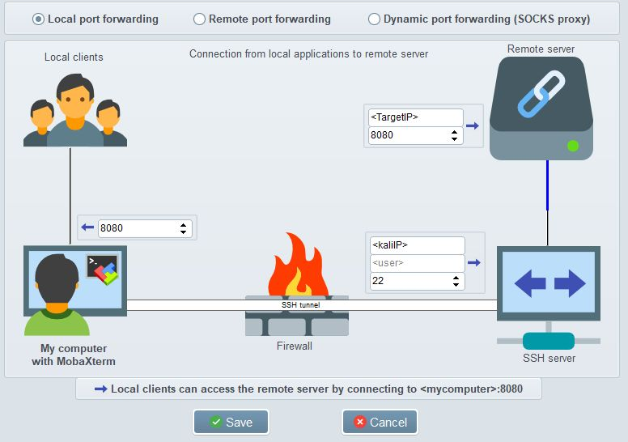

# MobaXterm

Info

| What          | Where |
|---------------|-------|
| Official Page |       |
| Source        |       |
| Download      |       |
| Install       |       |

## Port Forwarding

If you are connected to a machine via some kind of jump host it may be handy to forward ports to your work machine.

In this example we are connected to a Kali Linux VM over SSH port 22 and want to forward port 8080 presented to localhost on <TargetIP>. In case port 8080 is blocked on the localhost or some other port is desired change the port accordingly on the left side.

Remember to add the SSH key to the tunnel session if that is how you authenticated to Kali.

In case you made any changes you need to start and stop the tunnel service to be sure changes apply. You can autostart this tunnel if desired.

