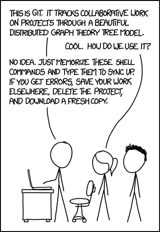

# Git

| What          | Where                           |
|---------------|---------------------------------|
| Official Page | <https://git-scm.com/>          |
| Download      | <https://git-scm.com/downloads> |
| Docs          | <https://git-scm.com/doc>       |
| Windows       | `choco install git`             |
| Ubuntu        | `sudo apt-get install git`      |



```txt
+---------------------------------------------------------------+
|      * * * PUSH REJECTED BY EVIL DRAGON BUREAUCRATS * * *     |
+---------------------------------------------------------------+
             \
              \                    ^    /^
               \                  / \  // \
                \   |\___/|      /   \//  .\
                 \  /V  V  \__  /    //  | \ \           *----*
                   /     /  \/_/    //   |  \  \          \   |
                   @___@`    \/_   //    |   \   \         \/\ \
                  0/0/|       \/_ //     |    \    \         \  \
              0/0/0/0/|        \///      |     \     \       |  |
           0/0/0/0/0/_|_ /   (  //       |      \     _\     |  /
        0/0/0/0/0/0/`/,_ _ _/  ) ; -.    |    _ _\.-~       /   /
                    ,-}        _      *-.|.-~-.           .~    ~
  *     \__/         `/\      /                 ~-. _ .-~      /
   \____(Oo)            *.   }            {                   /
   (    (..)           .----~-.\        \-`                 .~
   //___\\\\  \ DENIED!  ///.----..<        \             _ -~
  //     \\\\                ///-._ _ _ _ _ _ _{^ - - - - ~
```

## Tools and Helper

- Github quick stats: <https://github.com/arzzen/git-quick-stats>
- [tig](https://github.com/jonas/tig) helps to colorize the git output
- [grv](https://github.com/rgburke/) is nice to view repos
- [lazygit](https://github.com/jesseduffield/lazygit) is a simple terminal UI for git commands
- A collection of [.gitignore](https://github.com/github/gitignore) templates
- Game to learn git: [ohmygit](https://ohmygit.org/)

## Setup

### Basics

Set global user name and email (remove --global flag for specific repo only):

``` sh
git config --global user.name "0xfab1"
git config --global user.email "f@bi.an"
```

View current config: ```git config --global --list```

### Setup SSH login

Create new key

``` sh
ssh-keygen -t ed25519
Check if service is running and add key
eval "$(ssh-agent -s)"
ssh-add ~/.ssh/id_ed25519
ssh-add -l
```

Copy this to [github](https://github.com/settings/ssh/new)

``` sh
cat ~/.ssh/id_ed25519.pub
```

Test connection to github

``` sh
ssh -T git@github.com
```

Test to clone, commit and push on a repo

``` sh
git clone git@github.com:FullByte/git-test.git
cd git-test/
nano script.sh
chmod u+x script.sh
git add script.sh -f
git commit -m "adding script"
git push
```

## Commands

- Get all authors: ```git log | Where { $_ -match "Author" } | Select-Object -unique```
- Download a specific branch: ```git clone -b dependabot/npm_and_yarn/pug-3.0.1 https://github.com/microsoft/project-nodejs-express-webapp/```
- List all files in a folder by last commit date: ```git ls-tree --name-only HEAD foldername/ | while read filename; do echo "$(git log -1 --format="%ci " -- $filename) $filename"; done | sort -r```

Clean up

- Delete all the objects w/o references: ```git prune --progress``` add ```--dry-run``` for a test
- Aggressively collect garbage: ```git gc --aggressive```

## Remove Tags

Run this in your local repository of which you want to remove a tag/tags:

``` sh
git fetch
git tag
git tag -d {tag-name}
git push origin :refs/tags/{tag-name}
```

## Remove git history

Run this to remove the history of main:

``` sh
git checkout --orphan latest_branch
git add -A
git commit -am "fresh start"
git branch -D main
git branch -m main
git push -f origin main
```

In any other cloned repositories, to do a "forceful" pull:

``` sh
git fetch --all
git reset --hard origin/main
```

## Rename master to main

Run this to rename the repo from master to main:

``` sh
git branch -m master main
git checkout main
git push -u origin main
git push origin --delete master
```

other in the projekt need to do this:

``` sh
git checkout master
git branch -m master main
git fetch
git branch --unset-upstream
git branch -u origin/main
```

## .gitignore

Git ignores .gitignore with .gitignore in .gitignore

Init a new repository and added a `.gitignore` file containing ".gitignore" to instruct git to igntore the `.gitignore` file. Example:

``` sh
git init .
echo ".gitignore" > .gitignore
git status
```

Result:

``` txt
On branch trunk
No commits yet
nothing to commit (create/copy files and use "git add" to track)
```

A list of gitignore files based on prgramming language is [available here](https://github.com/github/gitignore).

## Pretend to be busy

Do this on a clean machine

``` sh
git config --global user.email "f@bi.an"
git config --global user.name "Busy Bee"
```

Clone an empty new repostory e.g.:

``` sh
git clone https://github.com/FullByte/git-test
cd git-test
```

Run the script to create a commit for every day... e.g. since 1999.

``` sh
nano script.sh
chmod u+x script.sh
./script.sh
```

Run this script to add a commit every day from 2018 to 2022

``` sh
for Y in {2018..2022}
do
    mkdir $Y
    cd $Y
    for M in {01..12}
    do
        mkdir $M
        cd $M
        for D in {01..28}
        do
            mkdir $D
            cd $D
            for i in {01..12}
            do
                echo "$i on $M/$D/$Y" > commit.md
                export GIT_COMMITTER_DATE="$Y-$M-$D 12:$i:00"
                export GIT_AUTHOR_DATE="$Y-$M-$D 12:$i:00"
                git add commit.md -f
                git commit --date="$Y-$M-$D 12:0$i:00" -m "$i on $M $D $Y"
            done
            cd ../
        done
        cd ../
    done
    cd ../
done
git push
```

To delete the entries run this:

``` sh
git rm -rf 20**
git commit -am "cleanup"
git push
```
