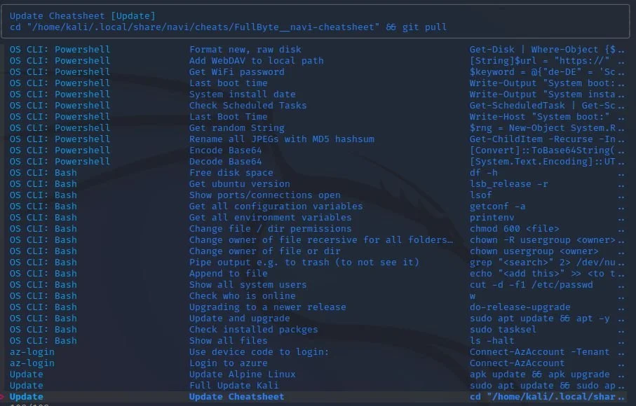

# Navi

| What          | Where |
|---------------|-------|
| Official Page |       |
| Source        |       |
| Documentation |       |

This is my [navi](https://github.com/denisidoro/navi) cheatsheet collection.

Once you ran the install script below you should find a subfolder named `FullByte__navi-cheatsheet` in your navi config-path. Run ```navi info config-path``` to get your local navi path e.g. `~/.local/share/navi/cheats`. Navi should now be ready to use.

To use navi press `control`+`g` or type `navi`.



## Install Navi + This cheatsheet

The following script will install and configure navi for bash and zsh add this repository and update the local cheatsheet on every boot:

### Install Navi

Make sure to have the latest udpates as well as cargo, git and fzf installed, then install navi:

```sh
sudo apt update && sudo apt -y upgrade
sudo apt -y install cargo fzf git
cargo install --locked navi
```

### Update profile

Add Cargo to your PATH by updating your profile ```sudo nano ~/.profile``` then add:

```sh
# Cargo
if [ -d "$HOME/.cargo/bin" ] ; then
  PATH="$HOME/.cargo/bin:$PATH"
fi
```

### Config bash

Update the .bashrc ```sudo nano ~/.bashrc``` with these entries

```sh
### NAVI ###
alias navi="~/.cargo/bin/navi"
eval "$(navi widget bash)"
```

### Config zsh

Update the .zshrc ```sudo nano ~/.zshrc``` with these entries

```sh
### NAVI ###
alias navi="~/.cargo/bin/navi"
eval "$(navi widget zsh)"
```

### Install Cheatsheet

Install this cheatsheet and update the cheatsheet on each boot (using git).

```sh
git clone "https://github.com/FullByte/navi-cheatsheet" "$(navi info cheats-path)/FullByte__navi-cheatsheet"
(crontab -l 2>/dev/null; echo "@reboot sleep 22 && cd \"$(navi info cheats-path)/FullByte__navi-cheatsheet\" && git pull") | crontab -
```
