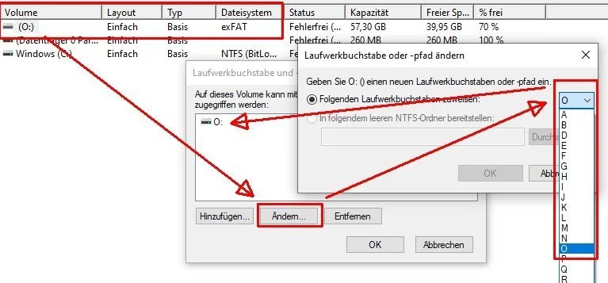
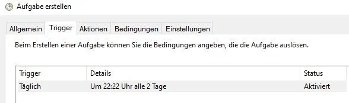
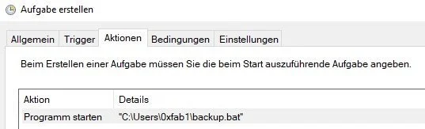
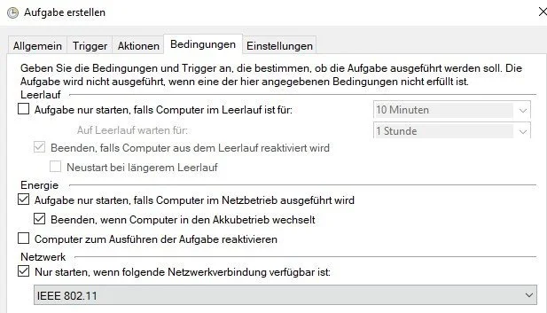
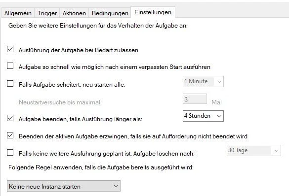

# Robocopy

The simplest way to run backups and copy jobs on Windows.

| What | Where                                                                                      |
|------|--------------------------------------------------------------------------------------------|
| Docs | <https://docs.microsoft.com/en-us/windows-server/administration/windows-commands/robocopy> |

## Example

Simple script to backup files:

```bat
@echo off
robocopy "C:\source\path" "E:\destination" /MIR /R:5 /W:5
```

The script does the following:

- `C:\source\path`: This is the source directory you want to backup.
- `E:\destination`: This is the destination directory on your USB drive.
- `/MIR`: This option mirrors the source directory to the destination. It will make the destination directory look exactly like the source by copying all necessary files and deleting any files in the destination that are not present in the source.
- `/R:5`: This option sets the number of retries on failed copies to 5. If a file cannot be copied due to an error, Robocopy will try to copy it again up to 5 times.
- `/W:5`: This option sets the wait time between retries to 5 seconds.

More options:

- Exclude files: ```Robocopy /xd excludethis```
- Ignore hidden files```Robocopy -s -h```

## Tips

### USB

If you want to copy to an USB device, it is a good idea to rename the volume e.g. to "O". This will ensure this USB device will be known as drive "O" every time it is connected.

Otherwise, if you connect the USB drive the next time an you have other devices connected, the path may be different and the backup script will refer to an invalid location or backup files to the wrong storage device.



### Windows Task Scheduler

Use the Windows Task Scheduler to run the script regularly e.g.:

Set a trigger e.g. a regular time to run the backup:



Link the bat file created earlier:



Set requirements e.g. only run if connected to power and WiFi "IEEE 802.11" can be found. This can come in handy if you are on the go (not plugged in) or at the office (no home wifi found).



Finally, make sure the script doesn't time out and will be terminated if necessary:


