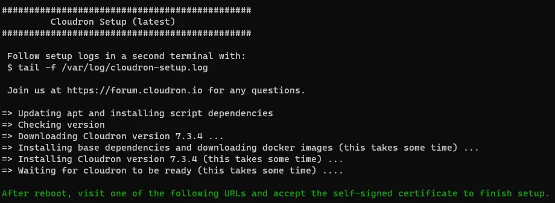

# Cloudron

| What          | Where                                       |
| ------------- | ------------------------------------------- |
| Official Page | <https://www.cloudron.io/ >                   |

Get a fresh ubuntu 22.04 and run

``` sh
wget https://cloudron.io/cloudron-setup
chmod +x cloudron-setup
sudo ./cloudron-setup
```



If you messed up the setup and you can't re-run the setup e.g. because the site is marked as already setting up or restoring run this command to start over.

``` sh
systemctl restart box
```
