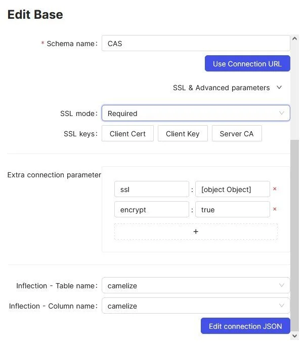
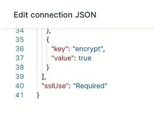

# NocoDB

In order to connect an Azure MSSQL Database with NocoDB the JSON string needs to be modified as follows:

Fill out the connection details and add an extra connection parameter "encrypt:true" as follows:



Then press "Edit connection JSON" and remove the around "quotation marks" around the true value. NocoDB creates a string where a boolean is needed.



Once done the connection test should run through smoothly.

## API

Add an API token in NOCODB: From the User (bottom left) click on "Account Settings" and navigate to "Audit Log". The URL Path should look like this: .../dashboard/#/account/tokens.

Once done, it is possible to add data to a given Datenbase using one-liners in the commandline. For this to work the view mode must be collaborative. For some examples go to a table and view Details and then API Snippets.

Here are some examples:

LINUX with CURL

```sh
curl --request POST --url 'https://domain.tld/api/v2/tables/mytableid/records?offset=0&limit=25&where=&viewId=myviewid' --header 'xc-token: mytextismypassword' --header 'Content-Type: application/json' --data '{"Title":"TitleValue", "GamePage":"InputValue"}' | jq '.'
```

WINDOWS with CURL

```sh
curl.exe --request POST --url "https://domain.tld/api/v2/tables/mytableid/records?offset=0&limit=25&where=&viewId=myviewid" --header "xc-token: mytextismypassword" --header "Content-Type: application/json" --data "{\"Title\":\"TitleValue\", \"GamePage\":\"InputValue\"}"
```

WINDOWS with PowerShell using Invoke-RestMethod

```ps1
Invoke-RestMethod -Uri "https://domain.tld/api/v2/tables/mytableid/records?offset=0&limit=25&where=&viewId=myviewid" -Method POST -Headers @{"xc-token" = "mytextismypassword"; "Content-Type" = "application/json"} -Body '{"Title":"TitleValue","GamePage":"InputValue"}'
```

WINDOWS with CMD triggering PowerShell

```ps1
powershell -Command "Invoke-RestMethod -Uri 'https://domain.tld/api/v2/tables/mytableid/records?offset=0&limit=25&where=&viewId=myviewid' -Method POST -Headers @{ 'xc-token' = 'mytextismypassword'; 'Content-Type' = 'application/json' } -Body '{\"Title\":\"TitleValue\",\"GamePage\":\"InputValue\"}'"
```
