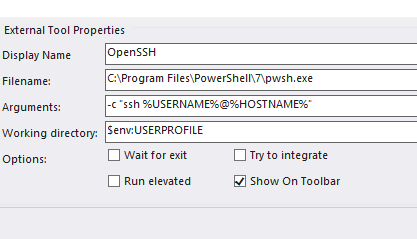

# mRemoteNG

| What          | Where |
|---------------|-------|
| Official Page |       |
| Source        |       |
| Download      |       |
| Install       |       |

## OpenSSH

Use [OpenSSH](https://github.com/PowerShell/Win32-OpenSSH/releases) instead of [PuTTYNG](https://github.com/mRemoteNG/PuTTYNG) to SSH with mRemoteNG like a pro.

Create a new external programm with the following parameters:

- Name: OpenSSH
- Path: c:\program files\powershell\7\pwsh.exe
- Paramter: -c "ssh %USERNAME%@%HOSTNAME%"
- Working directory: $env:USERPROFILE

Then select "external Programm" for your connection and choose "OpenSSH".

