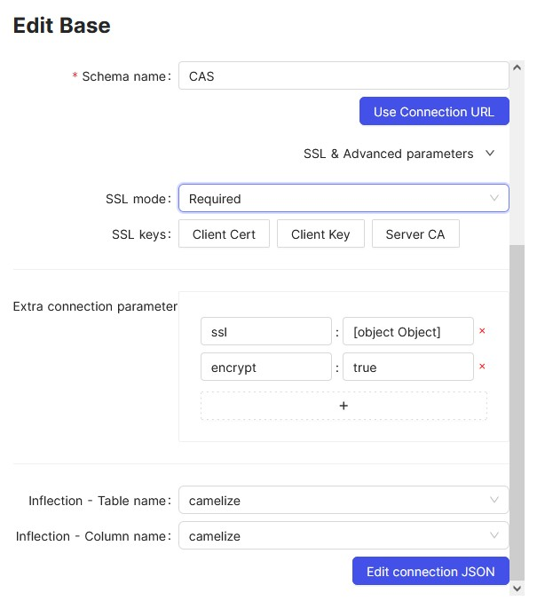
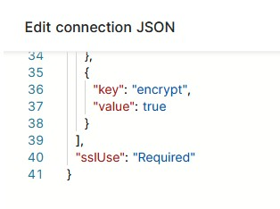

# NocoDB

In order to connect an Azure MSSQL Database with NocoDB the JSON string needs to be modified as follows:

Fill out the connection details and add an extra connection parameter "encrypt:true" as follows:

Then press "Edit connection JSON" and remove the around "quotation marks" around the true value. NocoDB creates a string where a boolean is needed.

Once done the connection test should run through smoothly.
