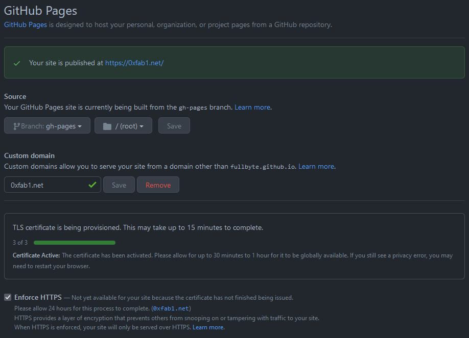

# Git

## Tools

- git quick stats: <https://github.com/arzzen/git-quick-stats>

## Setup

Set global user name and email:
(remove --global flag for specific repo only)

```sh
git config --global user.name "0xfab1"
git config --global user.email "f@bi.an"
```

Setup SSH login

Create new key

```sh
ssh-keygen -t ed25519
Check if service is running and add key
eval "$(ssh-agent -s)"
ssh-add ~/.ssh/id_ed25519
ssh-add -l
```

Copy this to github: <https://github.com/settings/ssh/new>

```sh
cat ~/.ssh/id_ed25519.pub
```

Test connection to github

```sh
ssh -T git@github.com
```

Test to clone, commit and push on a repo

```sh
git clone git@github.com:FullByte/git-test.git
cd git-test/
nano script.sh
chmod u+x script.sh
git add script.sh -f
git commit -m "adding script"
git push
```

## Commands

Get all authors:

```sh
git log | Where { $_ -match "Author" } | Select-Object -unique
```

## Pretend to be busy

Do this on a clean machine

```sh
git config --global user.email "busybee@fab1.internet"
git config --global user.name "Busy Bee"
```

Clone an empty new repostory e.g.:

```sh
git clone https://github.com/FullByte/git-test
cd git-test
```

Run the script to create a commit for every day... e.g. since 1999.

```sh
nano script.sh
chmod u+x script.sh
./script.sh
```

??? details "script.sh"
    ```sh
    for Y in {2018..2020}
    do
    mkdir $Y
    cd $Y
    for M in {01..12}
    do
        mkdir $M
        cd $M
        for D in {01..28}
        do
            mkdir $D
            cd $D
            for i in {01..12}
            do
                echo "$i on $M/$D/$Y" > commit.md
                export GIT_COMMITTER_DATE="$Y-$M-$D 12:$i:00"
                export GIT_AUTHOR_DATE="$Y-$M-$D 12:$i:00"
                git add commit.md -f
                git commit --date="$Y-$M-$D 12:0$i:00" -m "$i on $M $D $Y"
            done
            cd ../
        done
        cd ../
    done
    cd ../
    done
    git push
    #optional: delete stuff
    #git rm -rf 20**
    #git rm -rf 19**
    #git commit -am "cleanup"
    #git push
    ```

## Github

### Info

|What|Where|
|-|-|
|Official Page|<https://github.com>|
|Service Status|<https://www.githubstatus.com/>|
|Docs|<https://docs.github.com>|
|Download|<https://desktop.github.com/>|
|Install|choco install github-desktop|

### RSS Feed for Commits

Add ".atom" to a given commit link to get an RSS Reader update on a given file/folder or the entire project.

For example:

- Link: <https://github.com/FullByte/FullByte.github.io/commits/master>
- RSS Feed: <https://github.com/FullByte/FullByte.github.io/commits/master.atom>

Add the atom link to your rss feed reader to get notified on updates.

### VScode online

Press "." in any github repo to open the editor.

Add "1s" to "github" to get the VScode GUI of the github repo you selected

Example:

- Standard: <https://github.com/FullByte/FullByte.github.io/>
- VScode: <https://github1s.com/FullByte/FullByte.github.io/>

### Helper

- Smee receives payloads then sends them to your locally running application: <https://smee.io/>
- Probot automates and improves your github workflows with pre-built apps: <https://probot.github.io/>
- Search for code: <https://gowalker.org/>

### Execute Gist/Github Script

You can run remote scripts from e.g. Github (either gists or raw content):

From powershell with github raw file:

**Windows**

```PowerShell
iex ((New-Object System.Net.WebClient).DownloadString('https://raw.githubusercontent.com/FullByte/project/master/file.file'))
```

From cmd with gist link:

```cmd
PowerShell -NoProfile -ExecutionPolicy Bypass -Command "iex ((New-Object System.Net.WebClient).DownloadString('https://gist.githubusercontent.com/FullByte/000000000000000000000000000000000000/raw'))"
```

**Linux**

From bash

```bash
bash <(curl -Ls https://raw.githubusercontent.com/FullByte/scripts/master/something)
```

### Github Pages

To honor [this post](https://rakhim.org/images/honestly-undefined/blogging.jpg) (and ensure the message remains true) I will use my own website as an example and show how I configured the static web app and make it to work the way it does.

I am using [Github Pages](https://pages.github.com/) to host the content, [Mkdocs](https://www.mkdocs.org/) to create the website from markdown files as input and have own [domain](https://0xfab1.net/) for a nicer URL.

#### Github Pages Repo

I created a repo named `FullByte.github.io` (Replace "FullByte" with your github username). Enable github pages for this repo in settings page of the repo. You will by default have a page available at [FullByte.github.io](https://FullByte.github.io).

#### Custom Domain

Here is a overview of the Github Pages settings I use:



[Mkdocs](https://www.mkdocs.org/) specifically uses the branch "gh-pages" by default to build the static website that will be served.

I added a [custom domain](https://docs.github.com/en/pages/configuring-a-custom-domain-for-your-github-pages-site/managing-a-custom-domain-for-your-github-pages-site) "0xfab1.net" and added a file in the main folder of my repo called [CNAME](https://github.com/FullByte/FullByte.github.io/blob/master/CNAME) with one line containing my domain "0xfab1.net".

I added the following IPv4 DNS records (`dig 0xfab1.net +noall +answer -t A`):

```dns
0xfab1.net.             0       IN      A       185.199.108.153
0xfab1.net.             0       IN      A       185.199.109.153
0xfab1.net.             0       IN      A       185.199.110.153
0xfab1.net.             0       IN      A       185.199.111.153
```

as well as these IPv6 DNS records (`dig 0xfab1.net +noall +answer -t AAAA`):

```dns
0xfab1.net.             0       IN      AAAA    2606:50c0:8000::153
0xfab1.net.             0       IN      AAAA    2606:50c0:8001::153
0xfab1.net.             0       IN      AAAA    2606:50c0:8002::153
0xfab1.net.             0       IN      AAAA    2606:50c0:8003::153
```

and a CNAME record for www.0xfab1.net (`dig www.0xfab1.net +noall +answer -t CNAME`):

```dns
www.0xfab1.net.         0       IN      CNAME   fullbyte.github.io.
```

#### Github Actions

Every time I commit to main I want the page to re-build so that the page is up-to-date. I currently don't use branches but this could be a good method to commit changes that should not yet be published. Once ready to publish, create a pull request of your branch and merge it to main.

My [github action to build the static webpage using mkdocs](https://github.com/FullByte/FullByte.github.io/blob/master/.github/workflows/main.yml) looks as follows and is based on [this documentation](https://www.mkdocs.org/user-guide/deploying-your-docs/):

```yaml
name: mkdocs gh-deploy

on:
  push:
    branches: [master]
  pull_request:
    branches: [master]

jobs:
  build:
    name: Build and Deploy Documentation
    runs-on: ubuntu-latest
    steps:
      - name: Checkout Master
        uses: actions/checkout@v2

      - name: Set up Python 3.9
        uses: actions/setup-python@v2
        with:
          python-version: '3.9'

      - name: Install dependencies
        run: |
          python -m pip install --upgrade pip
          pip install mkdocs-material
      - name: Deploy
        run: |
          git pull
          mkdocs gh-deploy
```

Additionally, I am running a [security scan](https://slscan.io/en/latest/integrations/code-scan) on every push and check the URLs I share regularly via cron job triggered github action.

There are many other nice things that could be done here. The main important part is to trigger the markdown to static website generator as github action on new commits so that the site is automatically built whenever you commit new content.
