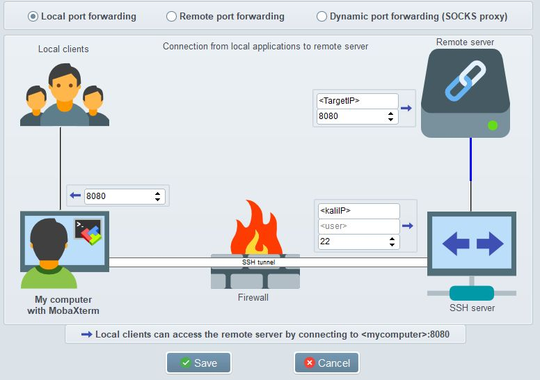
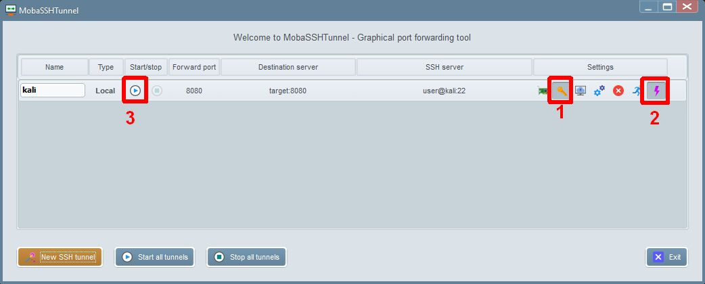

# Remote Access

## MobaXterm

Info

| What          | Where |
|---------------|-------|
| Official Page |       |
| Source        |       |
| Download      |       |
| Install       |       |

### Port Forwarding

If you are connected to a machine via some kind of jump host it may be handy to forward ports to your work machine.

In this example we are connected to a Kali Linux VM over SSH port 22 and want to forward port 8080 presented to localhost on <TargetIP>. In case port 8080 is blocked on the localhost or some other port is desired change the port accordingly on the left side.



Remember to add the SSH key to the tunnel session if that is how you authenticated to Kali.

In case you made any changes you need to start and stop the tunnel service to be sure changes apply. You can autostart this tunnel if desired.



## SSH

Info

| What          | Where |
|---------------|-------|
| Official Page |       |
| Source        |       |
| Download      |       |
| Install       |       |

### Install and Configure

Windows 10

**Install SSH**

View Options

``` ps1
Get-WindowsCapability -Online | ? Name -like 'OpenSSH*'
```

Install SSH Client and or Server

``` ps1
Add-WindowsCapability -Online -Name OpenSSH.Client~~~~0.0.1.0
Add-WindowsCapability -Online -Name OpenSSH.Server~~~~0.0.1.0
```

**Configure SSH**

``` ps1
Start-Service sshd
Set-Service -Name sshd -StartupType 'Automatic'
```

**Firewall settings**

There should be a firewall rule named "OpenSSH-Server-In-TCP", which should be enabled

``` ps1
Get-NetFirewallRule -Name *ssh*
```

If the firewall does not exist, create one

``` ps1
New-NetFirewallRule -Name sshd -DisplayName 'OpenSSH-Server-In-TCP' -Enabled True -Direction Inbound -Protocol TCP -Action Allow -LocalPort 22
```

### Login

Login to azure server "azureserver" with user "user" and private ssh keyfile "private.key". The passphrase will be queried after executing the command.

``` sh
ssh -i private.key user@azureserver.westeurope.cloudapp.azure.com
```

When you SSH into another machine using public key authentication, the key pair from either `~/.ssh/id_dsa`, `~/.ssh/id_ecdsa`, or `~/.ssh/id_rsa` is used by default. The `-i` option can be used to specify a different key pair file.

Use the `-L` flag to forward a connection to a remote server

``` sh
ssh server -L3000:localhost:3000
```

### Configuration

Edit ~/.ssh/config for multiple SSH Hops

``` sh
Host bastion
Hostname bastion.domain.com
User bastion-user

Host server
Hostname server.local.lan
User server-user
ProxyCommand ssh bastion -W %h:%p
```

Edit ~/.ssh/authorized_keys to restrict SSH User Access

``` sh
from="10.20.30.0/24,44.55.66.77",no-agent-forwarding,no-port-forwarding,no-X11-forwarding,command="/usr/local/bin/whatever" ssh-rsa [...]
```

Create Secure SSH Key

``` sh
ssh-keygen -o -a 100 -t ed25519
```

Add Key to Remote Server

``` sh
ssh-copy-id -i ~/.ssh/id_ed25519.pub username@remote
```

### SSH Escape Sequences

To see all escape sequences press `~?`.

``` txt
 ~.   - terminate connection (and any multiplexed sessions)
 ~B   - send a BREAK to the remote system
 ~C   - open a command line
 ~R   - request rekey
 ~V/v - decrease/increase verbosity (LogLevel)
 ~^Z  - suspend ssh
 ~#   - list forwarded connections
 ~&   - background ssh (when waiting for connections to terminate)
 ~?   - this message
 ~~   - send the escape character by typing it twice
(Note that escapes are only recognized immediately after newline.)
```

### Helpful commands

Examples:

- Forward Multiple Ports Over SSH: ```ssh dev@server.com -L 3000:localhost:3000 -L 9009:localhost:9009```

## OpenVPN

TODO

## Wireguard

Helpful script: <https://raw.githubusercontent.com/angristan/wireguard-install/master/wireguard-install.sh>

### Debian: Install and Configure

Install Wireguard

``` sh
sudo apt-get update && sudo apt-get upgrade
sudo apt-get install –y wireguard
```

Create SSH key-value pair

``` sh
mkdir ~/.wireguard
cd ~/.wireguard
umask 077
wg genkey | tee privatekey | wg pubkey > publickey
cat privatekey
```

Create Wireguard config file

``` sh
sudo nano /etc/wireguard/wg0.conf
```

Add the following content:

``` sh
[Interface]
Address = SERVER-IP
SaveConfig = true
ListenPort = 51820
PrivateKey = KeyWeCreatedAbove

[Peer]
PublicKey = PublicKeyFromClient
AllowedIPs = CLIENT-IP or 0.0.0.0/0
```

Set the VPN server to launch at startup:

``` sh
sudo systemctl enable wg-quick@wg0
```

Start the WireGuard service:

``` sh
sudo wg-quick up wg0
```

start wireguard as service

``` sh
sudo cp wg0.conf /etc/wireguard
sudo systemctl enable systemd-resolved.service
sudo systemctl start systemd-resolved.service
sudo ln -s /usr/bin/resolvectl /usr/local/bin/resolvconf
```

turns on VPN

``` sh
sudo wg-quick up US_NE_WG
```

show status

``` sh
sudo wg show
```

turns off VPN

``` sh
sudo wg-quick down US_NE_WG
```
